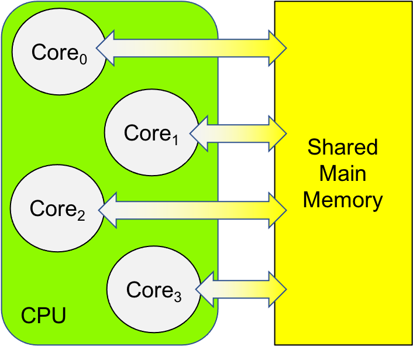
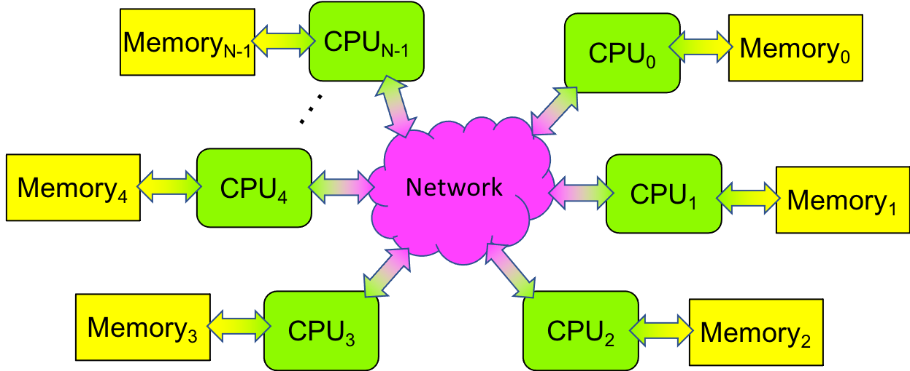
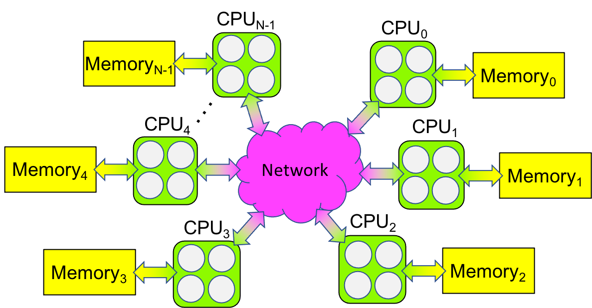

0.1 Computing Hardware
--------------------------------

The hardware component of a computer that performs a program’s statements is called the **central processing unit (CPU)**. The CPU contains the circuitry needed to perform arithmetic, logical, and other program operations. This circuitry is sometimes called the CPU’s **core**.

Prior to 2005, the CPUs in most computers had a single core, so they could only perform one program statement at a time. By default, a core performs a program’s statements one after another—as a sequence—so this kind of computing was known as **sequential computing** and the programs written for single core CPUs were **sequential programs**.

In 2005, CPU manufacturers began building CPUs with multiple cores - **multicore CPUs** - that could perform multiple statements at the same time. The first generation of these CPUs had two cores and were known as dual-core CPUs; the next generation had four cores and were known as quad-core CPUs; this evolution has continued until today, when one can buy 64- and 128-core CPUs!

A computer that can perform more than one statement at a time is called a **multiprocessor**. Today’s multicore CPUs are one kind of multiprocessor, but multiprocessors have existed since the 1960s, when some mainframe computers had multiple CPUs. In the 1970s and 80s, companies like Cray Research built multiprocessors that were the first supercomputers. In the 1990s, researchers at NASA built their own multiprocessor by taking sixteen personal computers 
and connecting them with Ethernet, a standard networking technology. The NASA researchers called their multiprocessor a **Beowulf cluster**.

Multiprocessors fall into one of three categories:

1. If a multiprocessor has multiple cores that share the same main memory, 
   then the system is called a **shared memory multiprocessor**. 
   The vast majority of today’s personal computers—desktops, laptops, tablets, 
   smartphones, and single board computers like the Raspberry Pi—have multiple cores
   that share the same main memory, making them shared memory multiprocessors.
   Figure 0-1 illustrates such a system.
 

   Figure 0-1: Shared Memory Multiprocessor Diagram

   

2. If a multiprocessor has multiple CPUs, each with its own local memory, 
   but no memory in common, then the system is called a 
   **distributed memory multiprocessor**. 
   In such a computer, the CPUs are connected via a network, 
   to facilitate communication between the CPUs. 
   The first Beowulf clusters were distributed memory multiprocessors.
   Figure 0-2 illustrates such a system. 

   Figure 0-2: Distributed Memory Multiprocessor Diagram

3. If a distributed memory multiprocessor’s CPUs are shared memory multiprocessors 
   (e.g., it has multicore CPUs), and/or they use graphics processing units GPUs) 
   to accelerate a computation, then the computer is called a 
   **heterogeneous multiprocessor** [#]_. 
   Many of today’s supercomputers are heterogeneous multiprocessors—in essence, 
   Beowulf clusters with multicore CPUs and hardware accelerators.
   Figure 0-3 illustrates how such a system differs from the others. 

   Figure 0-3: Heterogeneous Multiprocessor Diagram

In Section 0.0, we saw that *computing* involves designing, implementing, and then running a program on a computer. As we shall see next, the kind of computer on which you will be running your program affects how you design and implement the program.

.. [#] Technically, such a system is a *within-node heterogeneous multiprocessor* since each node supports different processing capabilities (e.g., CPUs and GPUs). It is also possible (but uncommon) to build an *across-node heterogeneous multiprocessor*, where different nodes provide different processing capabilities, such as CPUs by different manufacturers (e.g., ARM and Intel).

