.. Before we continue, let's define some important concepts...

.. * core 
.. * multicore vs. distributed architectures
.. * task
.. * work
.. * concurrency vs. parallel
.. * shared memory vs. message passing
.. * speedup vs efficiency

.. Here is a video that uses the Jigsaw Puzzle analogy to give readers a high level 
.. overview of some issues encountered with programming shared memory, which we 
.. will extrapolate on later this chapter:

   video:: video-jigsaw_sm
   :controls:
   :thumb: images/int_thumb.png

   https://d32ogoqmya1dw8.cloudfront.net/files/csinparallel/jigsaw_analogy_sm.mov.mov

0.3 Parallel Performance
----------------------------

Once we have written a parallel program for a given multiprocessor platform, how do we know:

1. How much faster is our parallel program than a sequential program that solves the same problem? 

2. How efficiently does our program uses its hardware? 

In this section, we explore ways to answer to these questions.

0.3.1 Measuring Performance: Timing 
^^^^^^^^^^^^^^^^^^^^^^^^^^^^^^^^^^^^

As we saw in Section 0.1, multiprocessors have existed since the 1960s, and different manufacturers used different terminologies to describe their hardware. Within the parallel computing community, the term **processing element** was adopted as a generic way to describe the number of parallel entities a parallel program is using to solve a problem on a given multiprocessor. 
The acronym **PE** is used as a shorthand for *processing element*.

To determine how much faster a parallel program is than its sequential counterpart, we must *time* the two programs, measuring how long it takes to solve the same instance of the problem. For the parallel program, there are two relevant parameters to this timing:

1. **N**: How “big” is the problem? 
2. **P**: How many PEs are we using to solve the problem?

To make all of this less abstract, suppose that our local pizza store *Penelope's Parallel Pizzeria* sells the following different sizes of pizza [#]_:

* Personal pizzas, that have 4 slices.
* Medium pizzas, that have 8 slices.
* Large pizzas, that have 12 slices.
* X-large pizzas, that have 16 slices.

Suppose also that our "problem" is to completely consume a pizza as quickly as possible. Then N, the size of the problem, is the number of slices in the pizza we must consume to finish the pizza, and P is the number of PEs (pizza-eaters) we have to help us solve the problem.

Suppose also that it takes a hungry person 2 minutes to eat a slice of pizza. Since we are studying computer science, suppose that we search the Internet for “parallel pizza eating algorithm” and find the algorithm shown in Figure 0-4, that each PE can follow
independently to solve problem:

  Figure 0-4: A Simple Parallel Pizza-Eating Algorithm

Let’s trace through this algorithm, considering some scenarios:

**Scenario 1a.** 
You visit the pizza shop by yourself and order a personal pizza to eat. 
When the pizza arrives, you start a timer, and then work through the algorithm 
shown in Figure 0-4, computing the values shown in Figure 0-5:

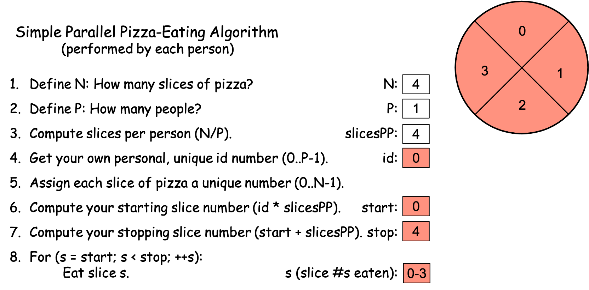
   
   Figure 0-5: The Simple Parallel Pizza-Eating Algorithm, N==4, P==1

After computing steps 1-7, you eat the pizza as specified in step 8, and stop the timer when you have finished the final slice. Suppose that it took you one minute to write down the values in steps 1-7. Since (i) it takes you 2 minutes to eat each slice, (ii) you are the only PE solving the problem (i.e., P == 1), and (iii) there are N == 4 slices, it takes you 1 minute [steps 1-7] + 4 slices × 2 minutes/slice [step 8] = 1 minute + 8 minutes = 9 minutes to eat all of the pizza slices. In the world of computing, this is the equivalent of a sequential solution to the problem, since you as the single PE [#]_ eat each of the slices of pizza, one after another. Figure 0-5 color-codes each pizza slice red, to indicate that a single PE (*you*) ate all of the slices.

**Scenario 1b**. 
You go to the shop with a friend and being poor students, you order a personal pizza to split between the two of you. In this situation, there are two PEs (P == 2, you and your friend). After the pizza arrives, you start the timer. You and your friend each work through the algorithm, computing the values shown in Figure 0-6, flipping a coin for who gets id 0 vs. 1:

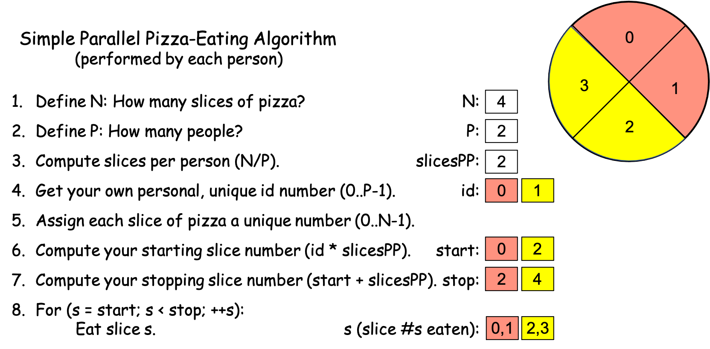

   Figure 0-6: The Simple Parallel Pizza-Eating Algorithm, N==4, P==2

The key is to see that you and your friend each follow the same algorithm independently, performing all 8 of its steps, so while you each compute the same values for N, P, and slicesPP, you each get different values for id, start, stop, and s. In the world of computing, this is a parallel solution to the problem with P == 2. To make this clear, Figure 0-6 color-codes the slices: red for the pizza slices PE 0 eats and yellow for the slices PE 1 eats.

As before, suppose that it takes both you and your friend 1 minute to work through steps 1-7. Since there are N == 4 slices to consume and there are P == 2 PEs, each person gets 2 slices. Since the two of you can eat your slices in parallel (i.e., simultaneously) and eating a slice takes 2 minutes, step 8 takes the two of you 2 slices × 2 minutes/slice = 4 minutes to actually eat the pizza. When you stop the timer, it reads 1 minute [steps 1-7] + 4 minutes [step 8] = 5 minutes, which is faster than the 9 minutes it took you to eat the pizza by yourself.

**Scenario 1c**. You go to the shop with a friend, order a personal pizza to split between the two of you, and as you are waiting, two other friends walk by and see you through the window. Since you are all poor students, you wave them in and offer to split the pizza between the four of you. Your friends enthusiastically join you, the pizza arrives, and you start the timer. You and your friends each work through the algorithm independently, calculating the values shown in Figure 0-7, drawing numbers from a hat to determine who is id 0, 1, 2, and 3: 

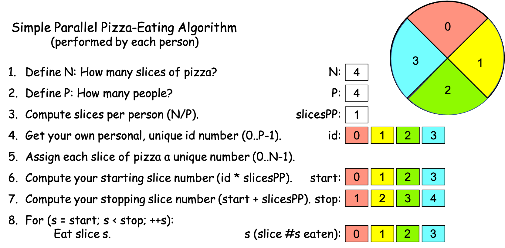

   Figure 0-7: The Simple Parallel Pizza-Eating Algorithm, N==4, P==4

As the four of you work through the algorithm, you each get the same values for 
N, P, and slicesPP, but different values for id, start, stop, and s.
In the world of computing, this is solving the problem in parallel with P == 4 PEs. As before, we have color-coded the slices in Figure 0-7 to indicate who eats which slice: red for id 0, yellow for id 1, green for id 2, and light blue for id 3. 

Suppose again that it takes you and your friends 1 minute to complete steps 1-7. There are N == 4 slices to consume and P == 4, so each person gets one slice. Since eating a slice takes 2 minutes and each person can eat their slice simultaneously, step 8 takes the 4 of you 2 minutes to actually eat the pizza. The timer thus reads 1 minute + 2 minutes = 3 minutes when the four of you finish the pizza, which is faster than the 5 minutes it took with P == 2. 

**Scenario 1d**. You go to the shop with a friend, order a personal pizza to split between the two of you, and as you are waiting, six other friends walk by and see you through the window. Since you are all poor students, you wave them in and offer to split the pizza between the eight of you. Your friends enthusiastically join you, so you ask the server to cut your personal pizza into 8 slices instead of 4. The pizza arrives, and you start the timer. You and your friends each work through the algorithm calculating the values shown in Figure 0-8, drawing numbers from a hat to determine who is id 0, 1, 2, 3, 4, 5, 6, and 7:

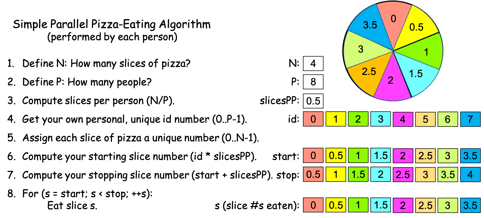

   Figure 0-8: The Simple Parallel Pizza-Eating Algorithm, N==4, P==8

Suppose again that it takes you and your friends 1 minute to complete steps 1-7. Since eating a slice takes a person 2 minutes, eating a half-slice takes 1 minute. Each person can eat their half-slice simultaneously in 1 minute, but since it took you 1 minute to perform steps 1-7, the timer reads 1 minute + 1 minute = 2 minutes when all eight of you have finished—a time that’s only slightly faster than in Scenario 1c. In the world of computing, this is solving the problem in parallel with P == 8 PEs. As before, Figure 0-8 color-codes the (half) slices so that you can see who ate what.

Since N is the same across these four scenarios, we might graph the times from Scenarios 1a-d by plotting the P values against the timer values, as shown in Figure 0-9:

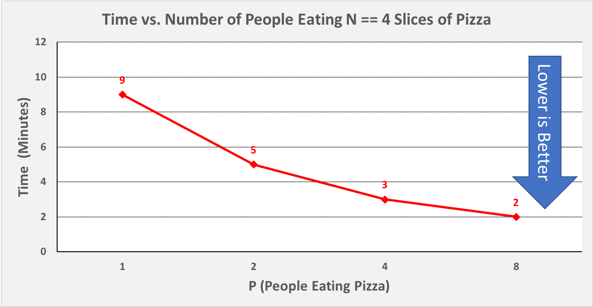

   Figure 0-9: Scenario 1, Plotting P vs. Time, N == 4

One thing to observe in Figure 0-9 is that our time decreased a fair amount from P == 1 to P == 2, and again from P == 2 to P == 4, but it did not decrease very much from P == 4 to P == 8, even though we used twice as many PEs. Put differently, the graph in Figure 0-9 shows **diminishing returns** as we double P, and in most problems of a given size N, there comes a point at which using more PEs will not let us solve the problem any faster. In Scenario 1, we are beginning to reach that point with P == 4.

Next, let’s consider a scenario in which N is larger. Suppose that you order an X-Large (16 slice) Sicilian-style (rectangular) pizza, and invite your 7 friends to come over to help you eat it. You go to the pizza shop, pick up the pizza, and return home to meet your friends. As before, let’s assume that eating a slice of pizza takes 2 minutes, that you start the timer before you begin eating, that each person follows the algorithm from Figure 0-4, that you stop the timer when the pizza is all gone, and that steps 1-7 take each of you 1 minute. To simplify our analysis, suppose that you and your friends all have "bottomless pit" stomachs that never get full.

**Scenario 2a**. 
Your friends are all busy. In this situation, you have 16 slices of pizza to consume (N == 16) and a single PE (you), so P == 1. Figure 0-10 shows the values you compute as you work through the algorithm, with the slices color-coded the same to indicate that you eat them all:

.. figure:: images/0-10.PizzaAlgorithm1e.png
   :scale: 40 %

   Figure 0-10: The Simple Parallel Pizza-Eating Algorithm, N==16, P==1

By the time you finish the pizza, it will have taken you 1 minute [steps 1-7] + 16 slices x 2 minutes/slice [step 8] = 1 minute + 32 minutes = 33 minutes.

**Scenario 2b**. All but one of your friends is busy, so a single friend joins you. 
As the two of you work through the algorithm, you flip a coin to see who is id 0 vs. id 1, and compute the values shown in Figure 0-11, where the slices are color-coded: red for id 0 and yellow for id 1:

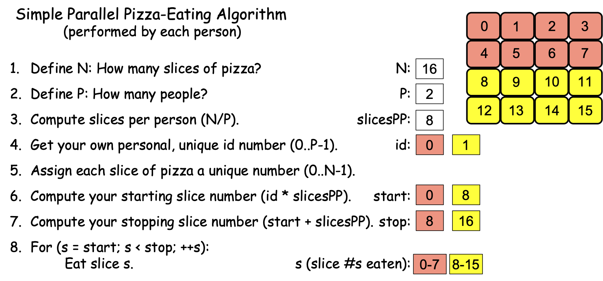

   Figure 0-11: The Simple Parallel Pizza-Eating Algorithm, N==16, P==2

You have 16 slices of pizza to consume (N == 16) and P == 2 PEs (you and your friend) to solve the problem, so you each have N / P = 16 / 2 = 8 slices to eat. Since you can eat the slices in parallel, actually eating the pizza will take the two of you 8 slices x 2 minutes/slice = 16 minutes. By the time you finish the pizza, it will have taken the two of you 1 minute [steps 1-7] + 16 minutes [step 8] = 17 minutes to finish the pizza.

**Scenario 2c**. Three of your friends are available to join you. The four of you follow the algorithm, drawing numbers from a hat to get id values, computing the values shown in Figure 0-12, in which the slices are color-coded to indicate who eats which slice:

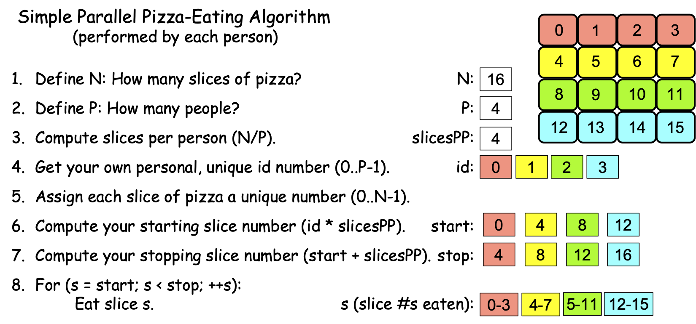

   Figure 0-12: The Simple Parallel Pizza-Eating Algorithm, N==16, P==4

You have 16 slices of pizza to consume (N == 16) and P == 4 PEs (you and your 3 friends) to solve the problem, so you each have N / P = 16 / 4 = 4 slices to eat. Eating the pizza in step 8 will thus take the four of you 4 slices x 2 minutes/slice = 8 minutes, so the timer will read 1 minute [steps 1-7] +  8 minutes [step 8] = 9 minutes when you finish the pizza.

**Scenario 2d**. All 7 of your friends are available and come to join you. You have 16 slices of pizza to consume (N == 16) and P == 8 PEs (you and your 7 friends) to solve the problem, so you proceed through the algorithm, drawing id numbers from a hat and computing the values shown in Figure 0-13, which is color-coded to indicate who eats which slice:

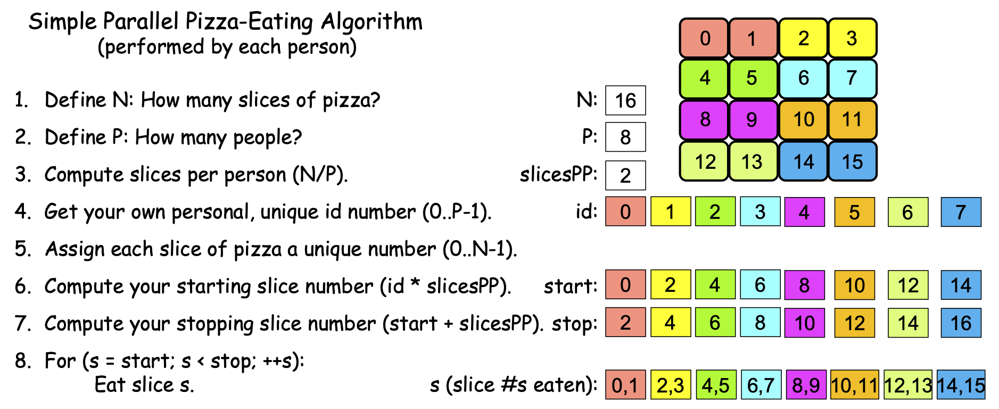

   Figure 0-13: The Simple Parallel Pizza-Eating Algorithm, N==16, P==8

You each get N / P = 16 / 8 = 2 slices to eat. Eating the pizza in step 8 of the algorithm thus takes the 8 of you 2 slices x 2 minutes/slice = 4 minutes. Then by the time you finish the pizza, it will have taken the P == 8 of you 1 minute [steps 1-7] + 4 minutes [step 8] = 5 minutes to finish the pizza. 

Since N stays the same in these four scenarios, we might graph Scenarios 2a-d by plotting the P values against the timer values, as shown in Figure 0-14:

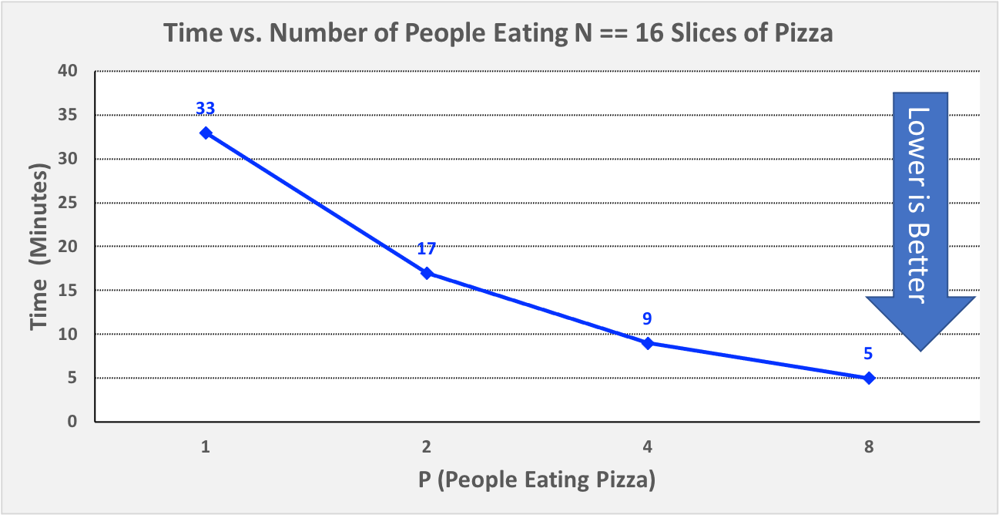

   Figure 0-14: Scenario 2, Plotting P vs. Time, N == 16

Unlike Figure 0-9, the times in Figure 0-14 continues to decrease significantly as we go from P == 4 to P == 8. This is because the larger problem size (N == 16 instead of N == 4) results in longer eating times (i.e., higher workloads) for each PE. These higher workloads help offset the time we spent performing steps 1-7 of the algorithm. If we were to keep adding PEs, we would eventually reach a point at which times no longer decreased very much, but in Scenario 2, we have not yet reached that point with P == 8.

The key point is that for a small problem size (N == 4 in this problem), using more PEs in parallel may decrease the processing time for low P values, but we quickly reach a limit (P > 4 in Scenario 1), beyond which more parallelism (increasing P) results in diminishing returns. If a problem has small enough workloads for each PE to perform, then P == 2 may result in even longer processing times than P == 1, since adding an additional PE requires some time.

However, if we can increase the size of the problem (as Scenario 2 does, with N == 16), we can employ more PEs to solve our problem (i.e., increase our P values longer) before we reach a limit. Moreover, if/when we reach that limit and we can keep increasing the problem size, then we can push the limit forward arbitrarily far. In our scenario, if we had a big party with P > 16 friends to help us solve our pizza-eating problem, we could still increase P to consume pizza faster by starting with two X-large pizzas (N == 32) or four X-large pizzas (N == 64), or eight X-large pizzas (N==128), and so on. 

Put differently, the limitation we encounter as we increase P depends on the problem size N. If we increase P and our time stops decreasing but our problem is one in which we can increase N, then if we make N larger, we can again increase P and decrease the time needed to solve the problem until we reach a new limitation, at which point we can increase N again.  

0.3.2: Calculating Speedup and Computational Efficiency
^^^^^^^^^^^^^^^^^^^^^^^^^^^^^^^^^^^^^^^^^^^^^^^^^^^^^^^^

In the world of parallel computing, the term **speedup** has the following very precise meaning:

.. math::

   Speedup_p = \frac{Time_1}{Time_p}

That is, to compute the speedup for a given value of P, we divide the time needed to solve the problem when P == 1 by the time it takes to solve the problem when using P PEs. In a perfect world, :math:`Speedup_p` would equal P, but we don’t live in a perfect world.

To illustrate, in our Scenario 1a of our pizza-eating problem, :math:`Time_1 == 9`. In Scenario 1b, :math:`Time_2 == 5`, so :math:`Speedup_2 == 9 / 5 = 1.8`, which is less than but fairly close to the ideal value 2. In Scenario 1c, :math:`Time_4 == 3`, so :math:`Speedup_4 == 9 / 3 = 3`, which is somewhat less than the ideal 4. In Scenario 1d, :math:`Time_8 == 2`, so :math:`Speedup_8 == 9 / 2 = 4.5`, which is much less than the ideal 8. 

By comparison, in Scenario 2a, :math:`Time_1 == 33`. In Scenario 2b, :math:`Time_2 == 17`, so :math:`Speedup_2 == 33 / 17 = 1.94`, which is much closer to the ideal 2 than we had in Scenario 1b. In Scenario 2c, :math:`Time_4 == 9`, so :math:`Speedup_4 == 33 / 9 = 3.67`, which is closer to the ideal of 4 than we had in Scenario 1c. In Scenario 2d, :math:`Time_8 == 5`, so :math:`Speedup_8 == 33 / 5 = 6.6`, which is much closer to the ideal 8 than we had in Scenario 1d. 

Figure 0-15 presents a graph in which we compare the speedup values for our two scenarios:

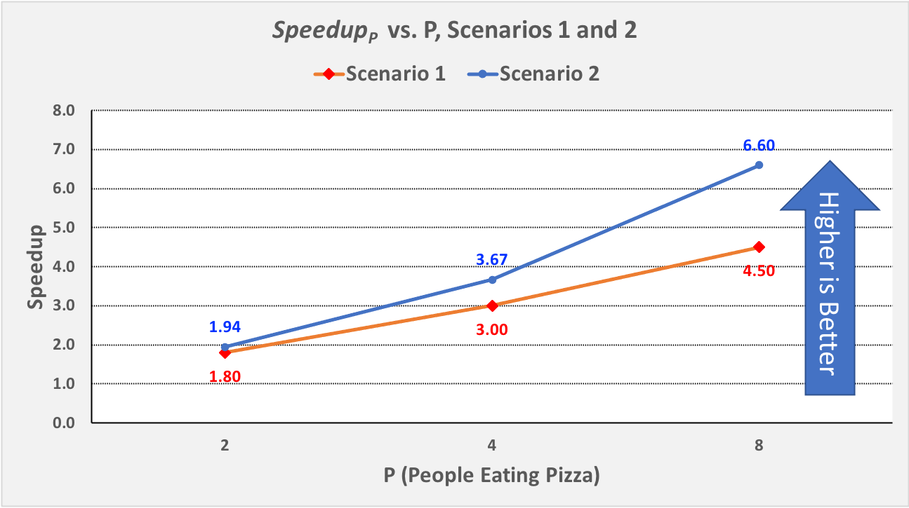

   Figure 0-15: :math:`Speedup_p` vs. P for Scenarios 1 and 2,

Note that speedup is an aspect of parallelism, so we only compute :math:`Speedup_p` for P > 1.

Note also that :math:`Speedup_p` increases in both Scenarios, but for all values of P: :math:`Speedup_p` in Scenario 2 (N == 16) is better than the :math:`Speedup_p` in Scenario 1 (N == 4). The only difference between the two scenarios is the problem size (N); it is quite common that the bigger the problem size N—the more data there is to be processed—the better :math:`Speedup_p` is for any given value of P.

Note finally that the :math:`Speedup_p` lines for Scenario 1 and Scenario 2 are diverging: the line for Scenario 2 is ascending more steeply (i.e., growing faster) than the :math:`Speedup_p` line for Scenario 1. This is also commonplace: the bigger the size of the problem, the better the increase in :math:`Speedup_p` for lower values of P. In the next section, we will see what happens as P gets larger.

**Computational efficiency** is another term that has a precise parallel computing definition:

.. math::

  Efficiency_p= \frac{Speedup_p}{P}

That is, to compute how efficient a parallel computation is for a given value of P, we divide the :math:`Speedup_p` by the value P. In a perfect world, :math:`Efficiency_p` would equal P/P == 1 (100%) for all values of P, but our world is far from perfect. Parallel practitioners often think they are doing well if they can achieve :math:`Efficiency_p > 0.6` (60%), so we will use that as an *efficiency-acceptability threshold*.

To illustrate, in Scenario 1b of our pizza-eating problem, :math:`Speedup_2 == 1.8`, so :math:`Efficiency_2 == 1.8 / 2 = 0.9` (90%), which isn’t too bad, compared to the ideal of 1. In Scenario 1c, :math:`Speedup_4 == 3`, so :math:`Efficiency_4 == 3 / 4 = 0.75` (75%), somewhat less than 1 but still very acceptable. In Scenario 1d, :math:`Speedup_8 == 4.5`, so :math:`Efficiency_8 == 4.5 / 8 = 0.56` (56%); this is below our threshold of 60%, so it is too inefficient to be acceptable.

In Scenario 2b, :math:`Speedup_2 == 1.94`, so :math:`Efficiency_2 == 1.94 / 2 = 0.97` (97%), which is fairly close to the ideal of 1. In Scenario 2c, :math:`Speedup_4 == 3.67`, so :math:`Efficiency_4 == 3.67 / 4 = 0.92` (92%), which is much better than Scenario 1c. Likewise, in Scenario 2d, :math:`Speedup_8 == 6.6`, so :math:`Efficiency_8 == 6.6 / 8 = 0.83` (83%). This is much better than Scenario 1d and still well above our 60% threshold. 

Figure 0-16 presents a graph comparing the efficiency values from our two scenarios:

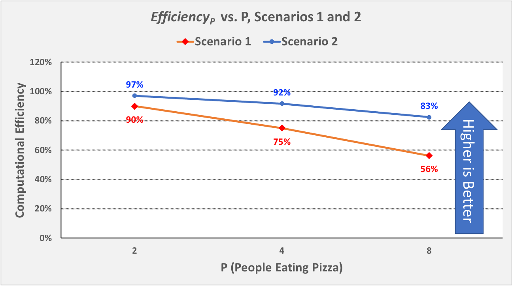

   Figure 0-16: :math:`Efficiency_p` vs. P for Scenarios 1 and 2

For parallel computations in which N is fixed, computational efficiency tends to decrease as P increases. Figure 0-16 shows this decrease for both Scenarios 1 and 2.
In Scenario 1, :math:`Efficiency_P` decreases as P increases: from 90% to 75% to 56%. 
In Scenario 2, :math:`Efficiency_P` again decreases as P increases, but more slowly than before: from 97% to 92% to 83%.

However, for any given value of P, efficiency tends to increase as we increase N. We can see this by comparing the :math:`Efficiency_P` for the corresponding P values in Scenarios 1 and 2: 

- When P is 2, increasing N from 4 to 16 increases :math:`Efficiency_p` from 90% to 97%
- When P is 4, increasing N from 4 to 16 increases :math:`Efficiency_p` from 75% to 92%
- When P is 8, increasing N from 4 to 16 increases :math:`Efficiency_p` from 56% to 83%

It is typically the case that the larger the size of the problem N, the higher the efficiency of a parallel solution.

0.3.3: Scalability
^^^^^^^^^^^^^^^^^^^^
An important parallel computing topic related to speedup is **scalability**, which is how well a parallel computation’s speedup increases as the number of PEs increases. There are some computations for which :math:`Speedup_p` increases *linearly* as we increase P. These are commonly called **embarrassingly parallel computations**, not because there is anything embarrassing about the problem or computation, but because the problem is so amenable to parallelization, it would be embarrassing to solve the problem in any other way! For an embarrassingly parallel computation, :math:`Speedup_p` is always approximately P, :math:`Efficiency_p` is always approximately 1, and we say the computation *scales perfectly*. For that reason, some people prefer to call these **perfectly parallel problems**, and we will use that terminology here.

To illustrate, if we were to compute steps 1-7 of our algorithm while waiting for our pizza, we could then start the timer when the pizza arrives and only time step 8. If we only record the time required to actually eat the pizza, then step 9 scales perfectly, so long as the number of people P ≤ the number of pizza-slices N. In that situation, the total time to consume the pizza is 2 minutes/slice x N slices / P people ≈ 2 x N /P. 

As we shall see, many (and probably most) problems are not perfectly parallel problems—there are usually some steps of the algorithm that have to be performed sequentially to set things up before we can begin taking advantage of parallelism (which steps 1-7 model in our simple pizza-eating algorithm). For such problems, if we analyze the scalability of a computation that solves the problem, we may be able to identify the optimal number of PEs to use for that problem. For example, in our pizza problem, when the pizza was a Personal pizza (N == 4), our :math:`Efficiency_p` dropped below 60% for P = 8; so when N == 4, we should fewer than 8 PEs. However, when the pizza was an X-large pizza (N == 16), our :math:`Efficiency_p` remained reasonably high for P values of 4 and 8. Our algorithm thus scaled fairly well for N == 16 and P values 2 through 8 (and will likely continue to scale well until P reaches at least 16).

0.3.4: Amdahl’s Law
^^^^^^^^^^^^^^^^^^^^^

Gene Amdahl was one of the pioneers of computing. In 1967, he devised a formula that we might express as follows:

.. math::

   Speedup_P= \frac{Time_1}{Time_p} = \frac{1}{seqPct + parPct/p} → \frac{1}{seqPct}

In this formula:
- *parPct* is the percentage of a computation's runtime spent in activities that benefit from parallelization, 

- *seqPct* is the percentage of the runtime spent in activities that do not benefit from parallelization (i.e., that must be performed sequentially), and 

- the numerator :math:`Time_1` is the time when P == 1, normalized to the percentage 1.0. (Think of this as the percentage value 100%).

The key point is that regardless of the value of *parPct*, as P → ∞, the fraction *parPct/P* → 0, leaving the fraction on the right.
This formula has come to be known as **Amdahl’s Law**. 

To illustrate its implications, let’s revisit Scenario 1 of our pizza-eating problem. In Scenario 1a, eating the pizza took us 9 minutes, of which the parallelizable part (eating the pizza) took us 8 minutes. The parallelizable percentage *parPct* is thus 8 / 9 = 0.89 (89%), which means the sequential percentage *seqPct* is 1.0 – 0.89 = 0.11 (11%). Plugging 0.11 into Amdahl’s Law for *seqPct*, we get 1 / 0.11 = 9 as the upper bound on :math:`Speedup_p` for Scenario 1. To illustrate this, Figure 0-8 shows :math:`Speedup_p` for Scenario 1 as P increases from 2 through 2,048 people:

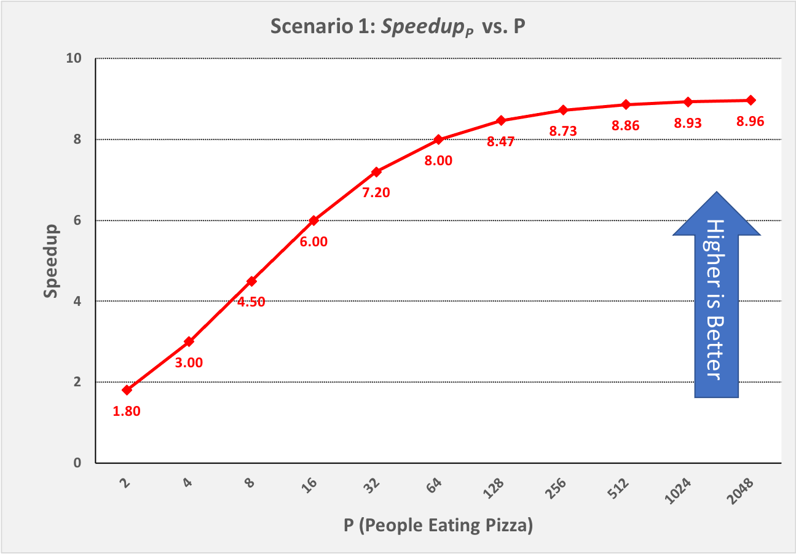

   Figure 0-17: Scenario 1: Reaching Amdahl’s Limit as P Becomes Large

That is, as P approaches infinity, :math:`Speedup_p` approaches 9. No matter how many PEs we use to try to speed up our solution to this problem, 9 is an absolute upper bound on the :math:`Speedup_p` for Scenario 1, where N==4.

Next, let’s apply Amdahl’s Law to Scenario 2. In Scenario 2a, eating the pizza ourself took 33 minutes, of which the parallelizable part (eating the pizza) took us 32 minutes. The parallelizable percentage of the program *parPct* is thus 32 / 33 = 0.97 (97%), which means the sequential percentage *seqPct* is 1.0 - 0.97 = 0.03 (3%). Plugging 0.03 into Amdahl’s Law for *seqPct*, we get 1 / 0.03 = 33 as the upper bound on :math:`Speedup_p` for Scenario 2. To illustrate this, Figure 0-18 shows :math:`Speedup_p` for Scenario 2, as P increases from 2 through 16,384 people:

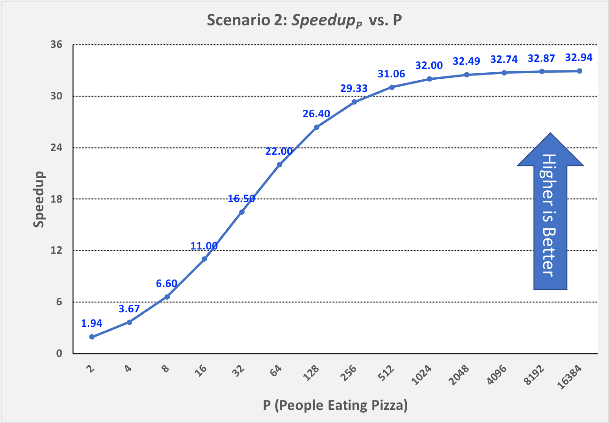

   Figure 0-18: Scenario 2: Reaching Amdahl’s Limit as P Becomes Large

As long as it takes us 1 minute to work through steps 1-7 of our algorithm sequentially, :math:`Speedup_p` can never exceed 33 in Scenario 2, no matter how many friends we invite to help us eat the 16 slices. Put differently, 33 is the **asymptotic limit** for :math:`Speedup_p` in Scenario 2.

0.3.5: The Gustafson-Barsis Law
^^^^^^^^^^^^^^^^^^^^^^^^^^^^^^^^^

Amdahl’s law seems somewhat pessimistic, in the sense that it defines a limit on the amount of speedup a parallel application can expect to achieve. However, as we can see by comparing Scenario 1 vs Scenario 2, the particular limit on :math:`Speedup_p` that Amdahl’s Law defines is for a given problem-size N. If you always order a 4-slice pizza, your speedup limit is 9, no matter how many friends help you eat it. If you always order a 16-slice pizza, your speedup limit is 33.

In 1988, the computer scientists John Gustafson and Edwin Barsis published an “answer” to Amdahl’s Law that is now known as the **Gustafson-Barsis Law** (or sometimes just Gustafson’s Law): if P remains the same but N is increased, then:

.. math::

  Speedup_p= P + seqPct \times (1 - P)

Gustafson and Barsis noted that if the sequential portion of the program stays the same when we increase the problem size N, a higher percentage of the time will be spent in the parallel portion of the program. When this is the case, 
as :math:`N → ∞`, :math:`seqPct → 0`, the rightmost term :math:`seqPct \times (1 - P) → 0`, and :math:`Speedup_p → P`, the ideal value!

In practice, the Gustafson-Barsis Law tells us that if we keep P fixed but increase N and this causes the *seqPct* to decrease, then the :math:`Speedup_p` will increase. Figure 0-19 shows how this can be seen in our two scenarios:

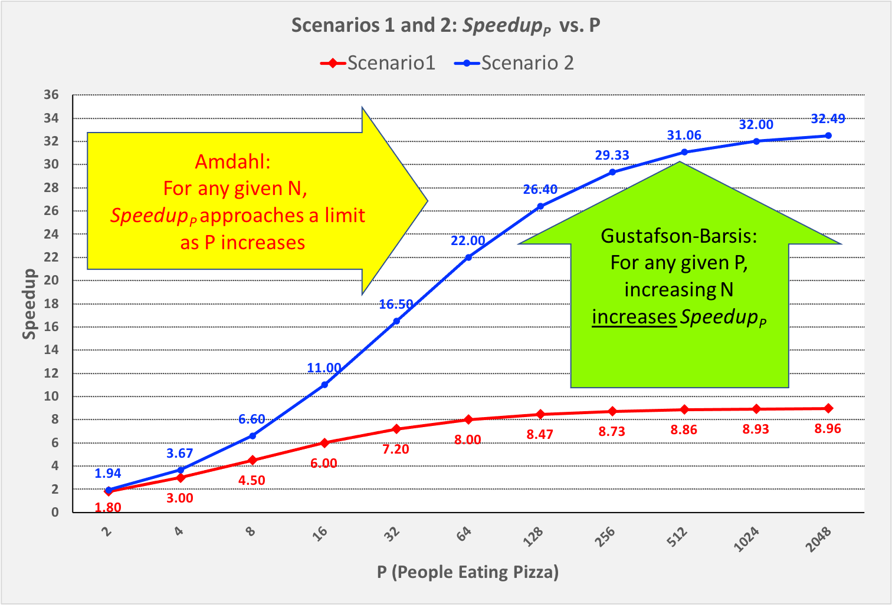

   Figure 0-19: Comparing Amdahl’s and Gustafson’s Laws, Scenario 1 vs. Scenario 2

In Figure 0-19, as we move from left to right and follow the :math:`Speedup_p` line for either scenario, we approach the asymptotic limit predicted by Amdahl's Law for that scenario. 

However, if we choose any particular P value on the horizontal axis and move vertically from Scenario 1 to Scenario 2 (increasing N from 4 to 16), we see an increase in :math:`Speedup_p` as the Gustafson-Barsis Law predicts. For any given value of P, if we were to continue increasing N, then as N → ∞, the :math:`seqPct → 0` and :math:`Speedup_p → P`.

The Gustafson-Barsis Law thus "rescues" us from Amdahl's Law, provided the time to perform the sequential part of the algorithm remains the same as we increase the problem-size N. 

.. [#] In this pizza-eating analogy, the pizza represents a data set, a piece of pizza represents a chunk of the data, and a person eating a piece of pizza represents a computer program running on a CPU-core that processes a chunk of data.

.. [#] PE == Pizza Eater!

