0.4 Parallel Programming Strategies
----------------------------------------

The parallel pizza-eating algorithm we used in the preceding section works, but did you notice that it has a flaw? What happens in this algorithm if the number of slices of pizza (N) is not evenly divisible by the number of pizza-eaters (P)? 
Figure 0-20 shows the result using N == 16 and P == 6:

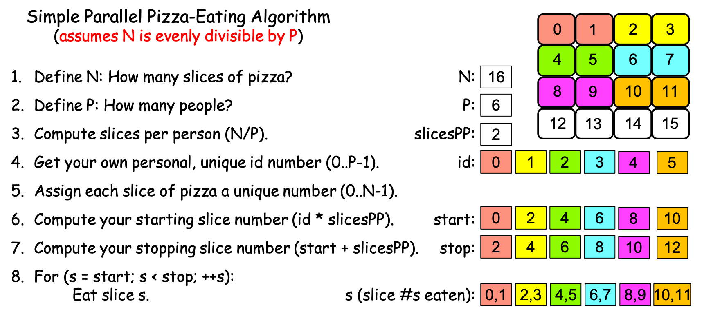

  Figure 0-20: The Simple Parallel Pizza-Eating Algorithm, N==16, P==6

Do you see the problem?

After each PE computes their start and stop values, and then uses those values to eat slices of pizza, slices 0-11 get eaten but slices 12-15 remain uneaten—the simple algorithm fails to assign these 'remnant' slices to anyone to eat. Our problem is to consume the entire pizza quickly, but this algorithm only solves the problem correctly if N is evenly divisible by P! Put differently, the simple parallel pizza-eating algorithm has a *precondition*: N must be evenly divisible by P in order for this algorithm to correctly solve the problem.

In the next section, we will see two different ways of overcoming this limitation.

0.4.0: Parallel Loop Strategies
^^^^^^^^^^^^^^^^^^^^^^^^^^^^^^^^^
To overcome the limitation, we need an algorithm that will correctly solve the problem regardless of the values of N and P. Figure 0-21 presents a modified version of the ‘simple’ algorithm that accomplishes this:

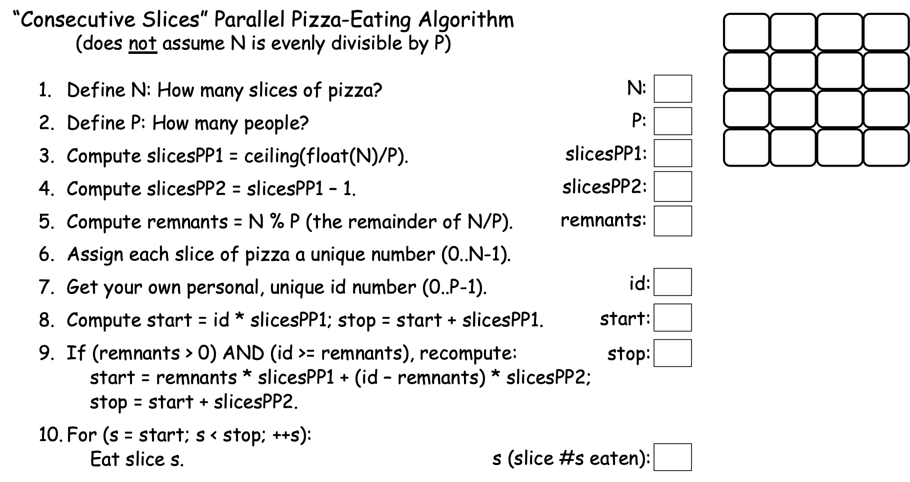

  Figure 0-21: The 'Consecutive Slices' Parallel Loop

Where our simple algorithm left 'remnant' slices uneaten when N was not evenly divisible by P, the algorithm in Figure 0-21 uses some tricks to distribute those remnant slices across the first few PEs. 
Figure 0-22 shows how this algorithm works, using N==16 and P==6:

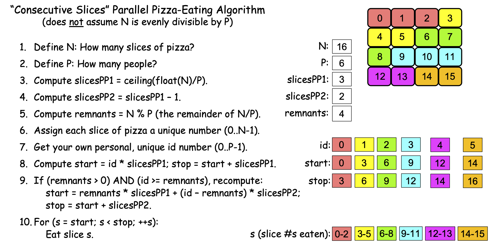

  Figure 0-22: The 'Consecutive Slices' Parallel Loop, N==16, P==6

This algorithm’s first trick happens in step 3:

  | *3. Compute slicesPP1 = ceiling(float(N)/P).*

In this step, the algorithm first uses *float(N)* to convert the integer *N* to a real value, so that *float(N) / P* will perform real-number (decimal) division instead of the integer division N/P performed by our simple algorithm. If N is evenly divisible by P, this division will still produce a whole number, but if N is not evenly divisible by P, it produces a fractional number. For example, for N == 16 and P == 4, *float(N)/P* produces the whole number 4.0; but if N == 16 and P == 6, *float(N)/P* produces the fractional number 2.6666… 

The result produced by *float(N)/P* is passed as an argument to the *ceiling()* function.  Given a whole number, *ceiling()* returns that same number as an integer, but given a fractional number, it returns the next integer larger than the fractional number. To illustrate, *ceiling(4.0)* returns 4, but *ceiling(4.1)*, *ceiling(4.2)*, *ceiling(4.5)*, and *ceiling(4.6)* all return 5. Likewise, *ceiling(2.6666…)* returns 3. More generally, when N is evenly divisible by P, *ceiling(float(N)/P)* produces the same result as the integer division N/P, but when N is not evenly divisible by P, *ceiling(float(N)/P)* produces N/P + 1. When N is evenly divisible by P, this algorithm thus sets *slicesPP1* to the *slicesPP* value from the simple algorithm, but when N is not evenly divisible by P, this algorithm sets *slicesPP1* to the simple algorithm's *slicesPP*+1. If we use *slicesPP1* as the number of slices for our first few PEs, we will be giving each of those PEs one more slice, effectively distributing the remnant pieces across those PEs. That is the first trick.

In step 4, this algorithm computes *slicesPP2* as *slicesPP1*-1. If there are no remnants, we won’t use this value, but if there are remnants, then *slicesPP2* will equal *slicesPP* from our simple algorithm, in which case we want all PEs *except* the first few to eat that many slices. To illustrate, when N == 16 and P == 6, *slicesPP1* == 3 and *slicesPP2* == 2; we want our first four PEs to each eat three slices of pizza to consume the four remnants, and want the remaining PEs to each consume two slices.

To make that happen, we need to know the number of remnant pieces, which we find in step 5:

  | *5. Compute remnants = N % P.*

In C-family languages, the **%** operator performs the **modulus operation**, which divides N by P using integer division and returns any *remainder* from that division. To illustrate, if N == 16 and P == 4, then the quotient P/N == 4 and the remainder P % N == 0 (because 4 goes into 16 four times with a remainder of zero). But if N == 16 and P == 6, then the quotient P/N == 2 and the remainder P % N == 4 (because 6 goes into 16 two times with a remainder of four). The expression N % P thus computes the number of remnant slices we need to distribute across our first few PEs. If there are R remnant slices, then we can consume all the remnants by having the first R PEs (0..R-1) each eat one extra slice.
Steps 6 and 7 perform the same actions as the previous algorithm so we’ll skip past them here.

Step 8 is a bit tricky. If there are no remnants, then *slicesPP1* == *slicesPP* from the 'simple' algorithm, so this will compute the same *start* and *stop* values as before, AND we want all of our PEs to use those *start* and *stop* values. However, if there are R remnants, then *slicesPP1* == *slicesPP* + 1 from the 'simple' algorithm, so we only want our first R PEs to use these values.

How do we know which PEs we want to use these values? Let’s consider some cases:

- If there is 1 remnant, let’s have PE 0 eat it. (Someone has to!)
- If there are 2 remnants, we will have PEs 0 and 1 each eat one.
- If there are 3 remnants, we will have PEs 0, 1, and 2 each eat one.
- If there are 4 remnants, we will have PEs 0, 1, 2, and 3 each eat one.
- …
- If there are R remnants, we want PEs 0..R-1 to each eat one.

We thus want the first R PEs (0..R-1) to each eat one remnant, and we want all PEs for whom id >= R to eat zero remnants. Put differently, we want the first R PEs to eat *slicesPP1* slices, and everyone else to eat *slicesPP2* slices. In Step 8, all PEs have already computed their *start* and *stop* values using *slicesPP1*, so those already-existing *start* and *stop* values will be correct for the first R PEs. All the other PEs will need to recompute their *start* and *stop* values, which we do next, in step 9.

Step 9 is where the algorithm is the trickiest. First, consider the If statement:

  | *9. If (remnants > 0 AND id >= remnants), recompute:*

This condition is true if (a) there are any remnants AND (b) a PE’s id >= R, the number of remnants (i.e., the PE’s id is not one of 0..R-1). When the condition is false because *remnants* == 0, then the body of the If statement is skipped and all PEs continue using their current *start* and *stop* values, which are correct because there are no remnants. When there are remnants, the second part of the condition *id >= remnants* is false for the first R PEs—the ones across whom we are distributing the remnant slices—so PEs 0..R-1 will proceed using the already-computed *start* and *stop* values from step 8. 

However, when *remnants* > 0, the entire condition is true for the PEs for whom *id >= remnants*, so those PEs will perform the body of the if, which then computes the new *start* and *stop* values for them. Taking these one at a time:

  |     *start = remnants * slicesPP1 + (id - remnants) * slicesPP2.*

When there are R > 0 remnants, the first expression *remnants * slicesPP1* computes the number of the first slice that comes after the group of slices eaten by the first R PEs. For example, if N == 16 and P == 6, *slicesPP1* == 3, and *remnants* == 4. Then the first four PEs are eating slices 0-11, and *remnants * slicesPP1* == 12, the number of the first slice following the slices being eaten by the first four PEs.

The second part of that expression *(id - remnants) * slicesPP2* computes the number of a given PE’s first slice as an offset from the end of the first R PEs’ slices. To illustrate, when N == 16 and P == 6, *slicesPP1* == 3, *slicesPP2* == 2, and *remnants* == 4, so for the PE whose id == 4, *(id - remnants) * slicesPP2* == (4-4) * 2 == 0 * 2 == 0, so that PE computes *start* == 12+0 == 12. By contrast, for the PE whose id == 5, *(id - remnants) * slicesPP2* == (5-4) * 2 == 1 * 2 == 2 so that PE computes *start* == 12+2 == 14.

After all but the first R PEs have recomputed their *start* values, the final step of the If statement in step 9 recomputes the *stop* values for each of PE whose id ≥ R:

  |     *stop = start + slicesPP2.*

In our scenario where N == 16 and P == 6, the PE whose id == 4 recomputes its *stop* value as 12+2 = 14; the PE whose id == 5 recomputes its *stop* value as 14+2 == 16.

When step 9 is finished, each PE has its correct *start* and *stop* values. The For loop in step 10 then has each PE use those values to eat its range of consecutive pieces of pizza, the same as step 8 in our simple algorithm:

  | *10. For (s = start; s < stop; ++s):*
  |           *Eat slice s.*

When there are R > 0 remnants, this new algorithm thus has the first R PEs each eat one extra slice of pizza, and has the remaining PEs eat the same number of slices as before. Having the PEs for whom *id > remnants* eat one fewer slice than the others is reasonable, because they must take the time to recompute their *start* and *stop* values in step 9. By contrast, the first R PEs (for whom step 9’s If-condition is false) can proceed directly to step 10 and begin eating; they have one more slice to eat than the other PEs.

Note that when there are no remnants, this new algorithm has each person eat the same slices as the simple algorithm. Figure 0-23 illustrates this, using Scenario 2c (N==16, P==4):

.. figure:: images/0-23.PizzaAlgorithm2c.png
  :scale: 40 %

  Figure 0-23: The 'Consecutive Slices' Parallel Loop, N==16, P==4

If you compare Figures 0-23 and 0-12, you’ll see that each PE is eating the same slices in both algorithms. This new algorithm also causes each PE to eat the same slices as before in Scenarios 2a (P==16, N==1) and 2b (P==16, N==2) but don’t take our word for it; use these values and work through the steps of this new algorithm on your own and verify that it works correctly.

Recall that we have been using the ''problem'' of eating pizza as an analogy for processing data. Since this new algorithm solves the problem the problem of processing a collection of N data items using P PEs, regardless of whether or not N is evenly divisible by P, the algorithm shown in Figures 0-21 through 0-23 provides a general solution to the problem of processing N data items using P PEs, so long as P < N.
As a result, it has a special name: **the Parallel Loop** strategy. 
Each PE follows this strategy to divide the data as evenly as possible into P 'chunks' of consecutive items, and then uses a For loop to process its 'chunk.' 
If N is evenly divisible by P, each PE’s chunk of data consists of exactly N/P consecutive items, as can be seen in Figure 0-23. 
If N is not evenly divisible by P (i.e., there are R remnants), the first R PEs get a chunk whose size is N/P + 1, and the remaining PEs get a chunk of whose size is N/P, as we saw in Figure 0-22.
Regardless of the situation, this strategy gives each PE a chunk of consecutive items, and the maximum difference in size between any two PEs’ chunks is 1.

There is also a different, much simpler Parallel Loop strategy, shown in Figure 0-24:

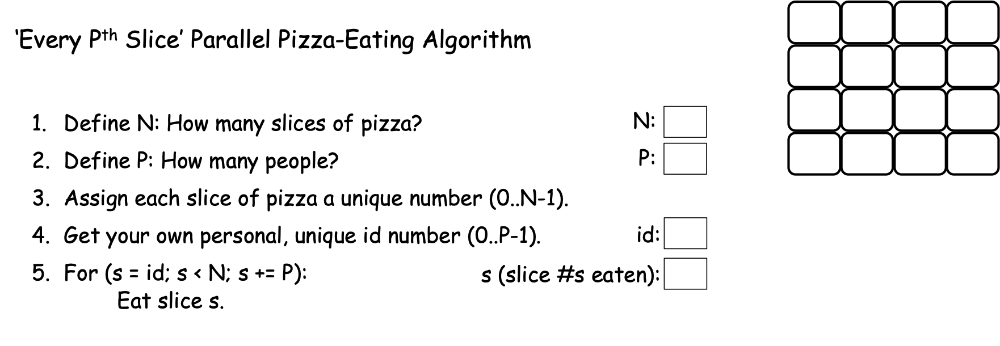

  Figure 0-24: The 'Every P\ :sup:`th` Slice' Parallel Loop

In the algorithm shown in Figure 0-24, we have seen steps 1-4 of the algorithm before, but instead of computing *start* and *stop* values to control its 'eat the pizza' loop, this approach uses a PE’s id value, N, and P to control the loop:

  | *5. For* ( *s =* **id**; *s <* **N**; *s +=* **P** ):
  |	     *Eat slice s.*

For Scenario 2a (N==16, P==1), Figure 0-25 shows the behavior of this algorithm:

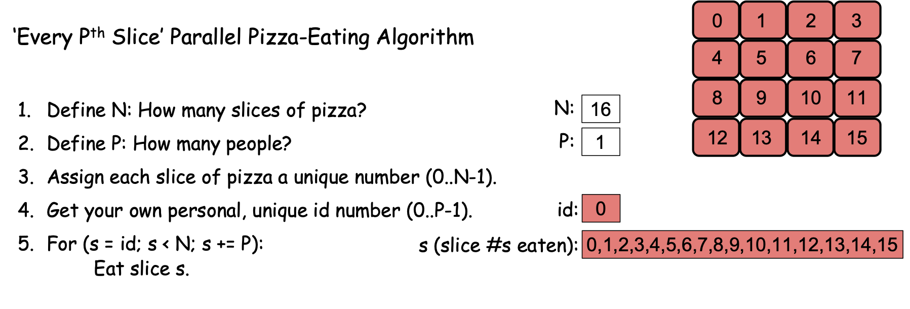

  Figure 0-25: The 'Every P\ :sup:`th` Slice' Parallel Loop, N==16, P==1

Since we have one PE, P == 1 and id == 0. The For loop in step 5 starts by setting s to 0 and then checks the condition s < N (0 < 16). Since the condition is true, the body of the loop executes, and PE 0 eats slice 0. At the end of the loop, s+= P adds P (1) to s, changing its value from 0 to 1. The condition s < N (1 < 16) is then rechecked and since it is true, PE 0 eats slice 1, after which s += P changes the value of s from 1 to 2. This behavior continues until s == 15, at which point PE 0 eats slice 15, and s += P changes the value of s from 15 to 16. The condition s < N (16 < 16) is then rechecked, found to be false, and the loop terminates, with all the pizza having been consumed. If you compare Figures 0-25 and 0-10, you can see that when P==1, this new algorithm cases PE 0 to consume the same slices of pizza (and in the same order) as the 'Consecutive Slices' algorithm.

However, what happens when we have more than one PE? Let’s apply this new algorithm to Scenario 2c, where N == 16 and P == 4. Figure 0-26 shows the result:

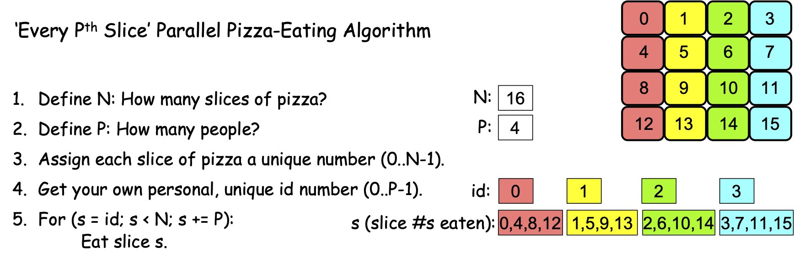

  Figure 0-26: The 'Every P\ :sup:`th` Slice' Parallel Loop, N==16, P==4

There are four PEs, with id values 0, 1, 2, and 3. When each PE reaches the loop in step 5, each initializes s to its (different) id value (0, 1, 2, or 3), checks the condition, finds that it is true, and so performs the body of the loop, eating slices 0, 1, 2, and 3 respectively. 
At the end of the loop, each PE performs the increment step s += P, and since P == 4, this adds 4 to each PE’s value of s, changing the four PEs’ s-values to 4, 5, 6, and 7, respectively. 
The loop condition is still true for each PE, so they eat slices 4, 5, 6, and 7, respectively. 
The s += P step then changes their s-values to 8, 9, 10, and 11, respectively, and since the loop’s condition is still true, the PEs eat slices 8, 9, 10, and 11. 
The s += P step changes their s-values to 12, 13, 14, and 15, the loop’s condition is still true, so the PEs eat slices 12, 13, 14, and 15. 
The step s += P then changes their s-values to 16, 17, 18, and 19, at which point the loop’s condition becomes false for all PEs, the loop terminates, the algorithm ends, and the pizza has been consumed.

If you compare Figures 0-26 to Figure 0-23 (or 0-12), you’ll see that this new algorithm does not behave the same as either of our previous algorithms when P==4. 
Where both of the preceding algorithms had each PE eat consecutive slices of pizza, this new algorithm has a PE eat every P\ :sup:`th` slice of pizza. 

Does this algorithm correctly solve the problem if N is not evenly divisible by P? Figure 0-27 shows its execution when N == 16 and P == 6:

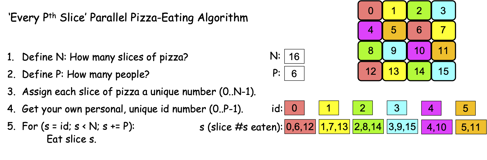

  Figure 0-27: The 'Every P\ :sup:`th` Slice' Parallel Loop, N==16, P==6

There are six PEs, with id values 0, 1, 2, 3, 4, and 5. When they reach the For loop in step 5, each PE initializes s to its id-value, and since the loop condition is true for all of them, they eat slices 0, 1, 2, 3, 4, and 5. Each performs the statement s += P, and since P == 6, their s-values change to 6, 7, 8, 9, 10, and 11, respectively. The loop condition s < N is still true for all PEs, so each eats slice s, and slices 6, 7, 8, 9, 10 and 11 are consumed. Each PE performs s += P, changing their s-values to 12, 13, 14, 15, 16, and 17, at which point something interesting happens: The PEs whose ids are 0, 1, 2, and 3 have s-values of 12, 13, 14, and 15, so the loop’s condition s < N is true for them, and they eat slices 12, 13, 14, and 15, respectively. But the PEs whose ids are 4 and 5 have s-values of 16 and 17, so the loop’s condition s < N is false for them, so these PEs’ loops terminate and their part in the algorithm is done. But the PEs whose ids are 0, 1, 2, and 3 are still active, so when they finish eating, they perform the step s += P, changing their s-values to 18, 19, 20, and 21. At that point, the loop condition s < N is false for those four PEs, their loops terminate, and they are done. All PEs are now done and all slices of the pizza have been consumed, so this simpler parallel loop correctly solves our pizza-eating problem when N is not evenly divisible by P!

We thus have two different Parallel Loop strategies that correctly solve our problem, regardless of whether or not N is evenly divisible by P [#]_:

  1. A 'consecutive slices' loop in which each PE consumes a “chunk” of adjacent slices, 
  and all the chunks are approximately the same size. For this reason, this is sometimes 
  called the 'equal chunks' Parallel Loop.

  2. A simpler 'every P\ :sup:`th` slice' loop in which each PE starts by 
  eating the slice whose number is its id and then jumps forward P positions 
  to get to its next slice, repeating this until it has jumped beyond the final slice. 
  From the perspective of “chunks”, this approach has each PE process chunks of size 1, 
  so it is sometimes called the 'chunk-size 1' Parallel Loop.

These two Parallel Loops have different strengths and weaknesses, depending on the nature of the problem being solved:

- **Memory locality**. 
  The 'consecutive slices' Parallel Loop has each PE loop through a 'chunk' 
  of consecutive slice numbers. 
  If those slice numbers correspond to memory locations (e.g., the entries in an array), 
  the 'consecutive slices' Parallel Loop has each PE access memory locations that are 
  physically adjacent to one another, as shown in Figure 0-28. 
  Computer scientists describe this behavior as *exhibiting good memory locality*:

  .. figure:: images/0-28.ArrayConsecutive.png
    :scale: 40 %

  Figure 0-28: Applying the 'Consecutive Slices' Parallel Loop to an Array, N==16, P==6

  By contrast, the 'every P\ :sup:`th` slice' Parallel Loop jumps from location to 
  location in memory, 
  skipping over P slices each iteration. 
  If the slices correspond to locations in the computer’s memory, 
  then this Parallel Loop exhibits poor memory locality because 
  each PE jumps from location to location in memory. 
  Figure 0-29 shows this memory access pattern for the different PEs:

  .. figure:: images/0-29.ArrayNonConsecutive.png
    :scale: 40 %

  Figure 0-29: Applying the 'Every P\ :sup:`th` Slice' Parallel Loop to an Array, N==16, P==6

  For reasons we will see shortly, solutions that employ good memory locality 
  are often much faster than those that do not, 
  so for problems that involve processing values stored in arrays, 
  the 'consecutive slices' Parallel Loop is usually faster. 

- **Cache Awareness**.
  Memory locality is important because each core in a modern CPU 
  has a high-speed local memory called its **cache**. 
  When a PE on that core tries to access a location in memory, 
  the hardware first looks for the value of that location in the cache. 
  If it is there, that cached value is used; 
  otherwise, the hardware fetches the value *from that location 
  plus the values of the next several locations*, 
  anticipating that they are likely to be accessed next. 
  Figure 0-30 illustrates how this is beneficial 
  for the 'consecutive slices' Parallel Loop:

  .. figure:: images/0-30.CacheAwareness.png
    :scale: 40 %

  Figure 0-30: Cache-Awareness of the 'Consecutive Slices' Parallel Loop for an Array, N==16, P==6

  When each PE accesses its first value, the hardware caches that value 
  and the next few values, which are the values a PE following the 'consecutive slices' 
  algorithm will access. 
  Since the cache is much speedier than main memory, those subsequent accesses to the 
  cached values will proceed much faster than if those values had to be retrieved 
  from main memory. 
  Taking advantage of the cache this way is called **cache-aware behavior**.

  By contrast, the 'every P\ :sup:`th` slice' Parallel Loop is not so good 
  for processing array entries, as shown in Figure 0-31:

  .. figure:: images/0-31.CacheObliviousness.png
    :scale: 40 %

  Figure 0-31: Cache-Obliviousness of the 'Every P\ :sup:`th` Slice' Parallel Loop for an Array, N==16, P==6

  As each PE accesses its first value from main memory (e.g., a[0] for PE 0), 
  the hardware will read and cache that value and the array entries of other PEs, 
  rather than those of that PE. 
  Then, when the PE tries to read its next value (e.g., a[4] for PE 0), 
  that value is not present in its cache, so the value must be fetched from main memory, 
  which is much slower than if that value was present in the cache. 
  Each array entry a given PE accesses will not be found in the cache, 
  so it will have to be read from memory, making this approach 
  much slower than the 'consecutive slices' approach. 
  An algorithm like this, that does not take advantage of the hardware’s 
  cache mechanism is sometimes described as *cache-unaware* or **cache-oblivious**.

  In our pizza-eating scenarios, imagine that each PE has a plate (analogous to the cache) 
  that can hold 4 slices of pizza. 
  The 'consecutive slices' algorithm lets each PE move the four consecutive slices 
  she will eat from the pizza box onto her plate *in one action*, 
  and then eat them without needing to return to the pizza box. 
  By contrast, if we use the 'every P\ :sup:`th` slice' algorithm, 
  a PE cannot grab her four slices in one action, 
  because the slices she will eat are not adjacent to one another, 
  as we saw in Figures 0-27 and 0-29. 

- **Simplicity**.
  The 'every P\ :sup:`th` slice algorithm is much simpler than the 'consecutive slices' 
  algorithm. 
  When it comes to programming and maintaining software, simplicity is often a virtue.

  For example, suppose that solving a problem requires a function f(x) to be applied to 
  all of the integers x from the range 0 to 1,000,000 and summing those results. 
  Solving this problem requires no array, and the f(x) values can be summed in any order, 
  so the 'every P\ :sup:`th` slice' Parallel Loop offers a much simpler way 
  to solve the problem than the 'consecutive slices' Parallel Loop.
 
- **Load Balancing**.
  In our pizza-eating scenarios, we assumed that it would take every PE 
  the same amount of time to eat a piece of pizza. 
  Put differently, we assumed the time required to process a data item is *uniform*. 
  When this assumption is true, the 'consecutive slices' Parallel Loop is usually 
  preferred for problems that involve array accesses, 
  as it offers better memory locality and cache awareness than the 
  'every P\ :sup:`th` slice' Parallel Loop. 

  However, suppose you and your friends have two 8-slice pizzas to eat, 
  and we number the two pizzas as shown in Figure 0-32. 
  Suppose also that the first pizza is a thin-crust plain pizza 
  but the second pizza is a double-crust, triple-toppings, deep-dish pizza:

  .. figure:: images/0-32.TwoDifferentPizzas.png
    :scale: 40 %

  Figure 0-32: Two Different Pizzas (Non-Uniform Processing Times)

  Given the differences in the two pizzas’ crusts, toppings, and thickness, 
  can you imagine that eating a slice of the second pizza might take *longer* 
  than eating a slice of the first pizza? 
  When this is the case, the time to “process” a slice of pizza is non-uniform. 

  If we revisit Scenario 2c (N==16, P==4) with this pair of pizzas, 
  what happens when we use the “consecutive slices” algorithm of Figure 0-23? 
  Using this algorithm, PEs 0 (red) and 1 (yellow) are assigned 
  all of the thin-crust plain slices to eat, 
  while PEs 2 (green) and 3 (blue) are assigned all of the slices from the second pizza, 
  as shown in Figure 0-33:

  .. figure:: images/0-33.TwoDifferentPizzas-a.png
    :scale: 40 %

  Figure 0-33: Two Different Pizzas, Consecutive Slices, N==16, P==4

  That is, when using the 'consecutive slices' algorithm, 
  PEs 0 and 1 will finish their four slices relatively quickly, 
  but PEs 2 and 3 will take much longer to finish their four slices, 
  because the algorithm assigned them all of the time-consuming slices to eat. 
  Moreover, after PEs 0 and 1 finish their slices, 
  the algorithm will have those two PEs sit idle while PEs 2 and 3 eat, 
  when they could be helping to solve our problem! 
  (Remember: the goal is to eat the pizzas as quickly as possible.)

  By contrast, what happens if the PEs use the 'every P\ :sup:`th` slice' algorithm 
  to eat these two pizzas? 
  PE 0 (red) will eat slices 0, 4, 8, and 12; 
  PE 1 (yellow) will eat slices 1, 5, 9, and 13; 
  PE 2 (green) will eat slices 2, 6, 10, and 14; 
  PE 3 (blue) will eat slices 3, 7, 11, and 15, 
  as shown in Figure 0-34.

  .. figure:: images/0-34.TwoDifferentPizzas-b.png
    :scale: 40 %

  Figure 0-34: Two Different Pizzas, Every P\ :sup:`th` Slice, N==16, P==4

  The 'every P\ :sup:`th` slice' algorithm assigns each PE two slices of the thin pizza 
  and two slices of the double-crust pizza, 
  so this algorithm divides the thick and thin slices evenly among the PEs. 
  With the “processing” spread evenly, no PE will sit idle 
  while other PEs are still eating—the PEs will all finish eating at about the same time. 

  When the processing times for different data items are not uniform, 
  the 'every P\ :sup:`th` slice' Parallel Loop often does a better job 
  of balancing the PE’s workloads (i.e., **load-balancing**) 
  than the 'consecutive slices' Parallel Loop.

The two Parallel Loop strategies thus have different strengths and weaknesses: 
When solving a problem involves processing values that are stored in an array, 
the 'consecutive slices' loop is usually faster, 
due to its better locality and cache awareness. 
When different data items have significantly different (non-uniform) processing times, 
the 'every P\ :sup:`th` slice' loop may be faster, 
as it tends to balance the computational workloads more evenly among the different PEs. 

0.4.3: The Leader-Worker Strategy
^^^^^^^^^^^^^^^^^^^^^^^^^^^^^^^^^

The two Parallel Loop strategies offer one way to solve the pizza-eating problem, 
but both algorithms depend on our being able to assign each slice of pizza a number. 
What if—for some reason—there was no good way for us to number the pizza slices [#]_?  
Figure 0-35 presents an algorithm we might use in this situation, 
using an approach we will call the **Leader-Worker Strategy**:

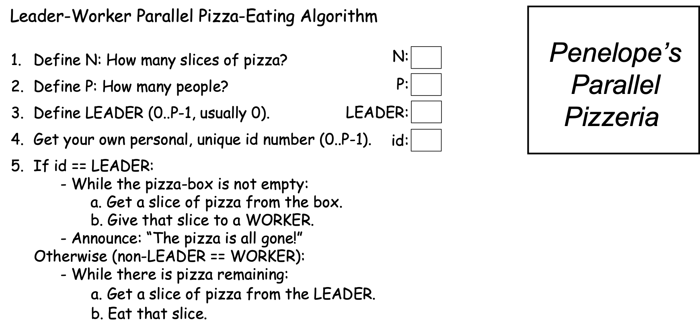

  Figure 0-35: The Leader-Worker Strategy

In this approach, one PE—usually the PE with id==0—is designated the **leader**, while all of the other PEs are **workers**. 
In our problem, the leader hands out pizza-slices for the workers to eat. 
Each worker repeatedly: (a) gets a slice of pizza from the leader, and (b) eats that slice, until the pizza is all gone. 
Figure 0-36 shows how this approach might work in Scenario 2c (N==16 and P==4):

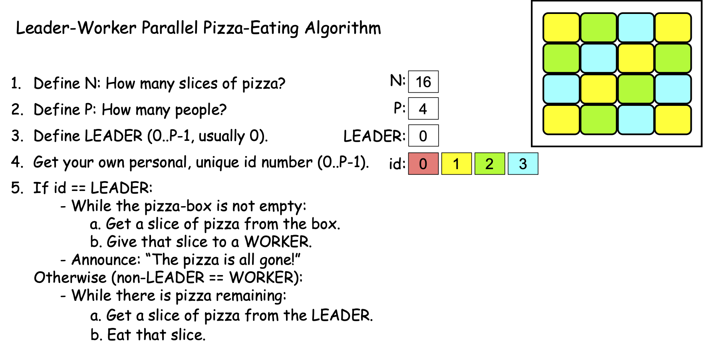

  Figure 0-36: The Leader-Worker Strategy, N==16, P==4

Note that Figure 0-36 shows the slices the worker PEs would consume if the workers happen to acquire their slices in 1-2-3 order. There is no guarantee that this particular ordering will occur; the workers could just as easily get their slices in 1-3-2, 2-1-3, 2-3-1, 3-2-1, or 3-1-2 order. The order doesn’t matter, so long as the pizza gets eaten.

In the Leader-Worker strategy, an If statement like the one shown in step 5 is used to separate the leader’s behavior from the worker’s behavior:

| *If id == LEADER:*
|  	*performLeaderBehavior*
| *Otherwise:*
|	*performWorkerBehavior*

In addition to giving the workers tasks to perform, it is common in parallel computing for the leader to handle any input and output needed to solve the problem.

0.4.2: The Shared Queue (with Leader-Worker + Barrier) Strategy
^^^^^^^^^^^^^^^^^^^^^^^^^^^^^^^^^^^^^^^^^^^^^^^^^^^^^^^^^^^^^^^^

You may have noticed that in the Leader-Worker strategy shown in Figure 0-36, the leader (PE 0) eats none of the pizza slices—the leader’s sole role is to give slices of pizza to the workers to eat. 
This raises some potential issues:

- What if there are no workers (i.e., P==1)? 
  As written, the algorithm in Figure 0-35 will fail, 
  since it doesn’t account for this situation. 
  One way to remedy this is to revise step 5 of the algorithm 
  by adding an If statement to step 5, 
  to have the leader perform the role of a worker when there are no workers:

    | *5. If id == LEADER:*
    |      *While the pizza box is not empty:*
    |           *Get a slice of pizza from the box.*
    |           **If P > 1:**
    |                 *Give that slice to a worker (who is not eating).*
    |           **Otherwise:**
    |                 **Eat that slice.**
    |      *Announce: “The pizza is all gone!”*
    |   *Otherwise (worker):*
    |      *While there is pizza remaining:*
    |           *Get a slice of pizza from the LEADER*
    |           *Eat that slice.*

- Suppose there are only a few workers and eating a slice of pizza is time-consuming (e.g., the pizza is a double-crust, triple-toppings, deep-dish pizza). Then the leader may well be idle much of the time, as the (few) workers eat their slices. When this occurs, the leader’s capabilities are being wasted, since s/he could be helping to eat the pizza. 

One way to remedy both of these issues is to adjust this algorithm as shown in Figure 0-37, which introduces two new strategy-concepts—the **Shared Queue** and the **Barrier**:

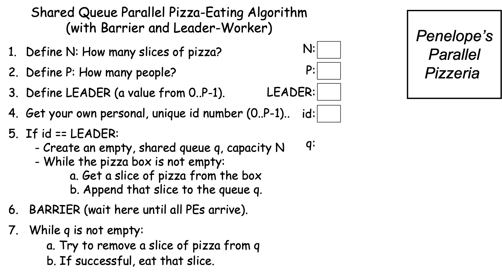

  Figure 0-37: The Shared Queue (with Leader-Worker and Barrier) Strategy

As its name suggests, this strategy relies on a data structure called a **queue** that all PEs share. In step 5, the leader creates this queue and then loads it with the pizza slices. In step 7, each PE (including the leader) acts as a worker, repeatedly removing a slice of pizza from the queue and eating that slice, until the queue is empty.

If we want to ensure that our leader has a chance to participate in eating the pizza, then we need to prevent any worker from starting step 7 before the leader finishes loading the queue. Step 6 accomplishes this using a special parallel computing construct called a **barrier**. When any PE reaches the barrier, it is forced to wait until *all* the PEs have reached it; when the last PE reaches the barrier, all of the PEs are released to proceed past it. The barrier in step 6 thus *synchronizes* all of the PEs by forcing the workers to wait at the barrier until the leader has finished loading the queue and joins them. 

As soon as the last PE reaches the barrier in step 6, all the PEs can proceed to step 7, where they begin removing slices of pizza from the queue and eating them. It is worth mentioning that since multiple PEs may be trying to get slices from the queue at the same time, the shared queue must be *parallel-safe*, by which we mean it only allows one PE at a time to perform its operations (i.e., appending an item, removing an item, checking its empty-state, etc.). A parallel-safe queue will prevent any two PEs from getting the same slice of pizza from the queue.

Figure 0-38 shows how this strategy might work with N==16 slices and P==4 PEs:

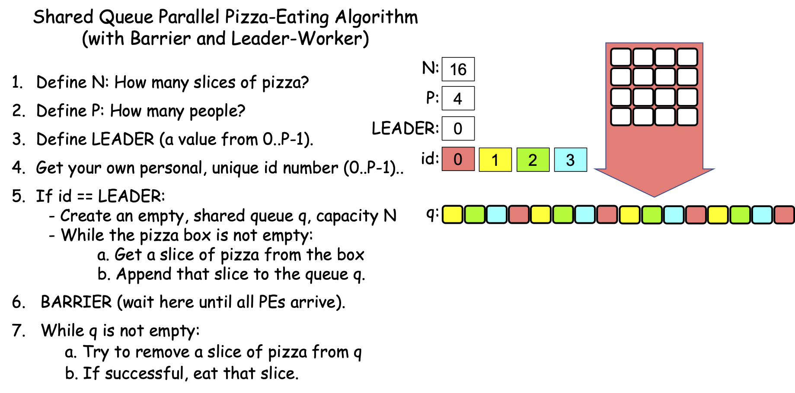

  Figure 0-38: The Shared Queue (with Leader-Worker and Barrier) Strategy, N==16, P==4

In Figure 0-38, PE 1 gets the first slice, PE 2 gets the second slice, PE 3 gets the third slice, PE 0 gets the fourth slice, PE 1 gets the fifth slice, PE 2 gets the sixth slice, PE 3 gets the seventh slice, PE 0 gets the eighth slice, and so on. However, it is important to see that this is just one possible ordering. Because of the BARRIER in step 6, each PE has an equal chance of being the first to reach the loop in step 7, so PEs 3, 2, 1, and 0 all have equal chances of getting the first slice. After that, each remaining PE has an equal chance of getting the second slice, and so on.

Figure 0-38 shows how the algorithm might work with N==16 slices and P==4 PEs, where N is evenly divisible by P. This same strategy also solves the problem correctly if N is not evenly divisible by P. It also automatically load-balances the work if some slices take longer to eat than others, since the PEs eating the time-consuming slices will just eat fewer slices, while the PEs eating the “faster” slices will eat more slices. Remember: The goal is to consume the pizza quickly; it doesn’t matter if some PEs eat more slices than others.

The main drawbacks to this Shared Queue strategy are:

- N-1 of the PEs wait at the barrier in step 6 while the leader fills the queue in step 5. 
  Since the leader fills the queue sequentially, this increases the algorithm’s seqPct 
  with respect to both Amdahl’s Law and the Gustafson-Barsis Law. 
  In theory, filling the queue in step 5 could be parallelized, but in practice, 
  it is usually faster to just have one PE perform that step, 
  because (i) the queue must be parallel-safe—only one item can be appended to it 
  or removed from it at a time, and (ii) appending an item to a queue 
  is generally a quick operation, so having the leader fill it won’t waste that much time.

  Note that we cannot safely remove the barrier (step 6). 
  If we did, then one or more workers could reach step 7 
  before the leader has begun filling the queue. 
  Such workers would find the queue to be empty and (blindly following the algorithm) 
  then finish prematurely. The barrier prevents this situation from occurring.

- All PEs must be able to access the queue—it must be *shared* among the PEs. 
  Since the queue is stored in main memory, this Shared Queue strategy 
  *is only useable on shared-memory multiprocessors* (see Section 0.1). 
  Put differently, this strategy cannot be used on distributed-memory multiprocessors,
  because the CPUs on those platforms have no shared memory between them.
 
  On those distributed-memory platforms, the Leader-Worker strategy 
  (with the If-Else logic to handle the case where P==1) can be used instead: 
  each worker just sends the leader a “Give me work to do” message 
  whenever it is ready to process an item 
  (usually containing the result of the last item it processed); 
  the leader sends that worker a message containing the next item to be processed, 
  or a “No more items—time to quit!” message. 

These drawbacks aside, the Share Queue and/or Leader-Worker approaches are parallel strategies that can be used in situations where the Parallel Loop strategies cannot, making them useful in many situations.

0.4.3: The Reduction Strategy
^^^^^^^^^^^^^^^^^^^^^^^^^^^^^

When devising a parallel solution to a problem, it is fairly common to reach a point where each PE has a solution to its part of the problem (i.e., a partial solution), and these partial solutions must be combined in order to solve the overall problem.

To illustrate, suppose that instead of eating the pizza as quickly as possible, our problem is to determine the amount of cheese Penelope’s Parallel Pizzeria puts on one of their typical 16-slice pizzas—the weight of the cheese—as quickly as possible. (Perhaps there is a competing pizzeria nearby and we want to find out which store uses more cheese, in which case we would follow this same procedure with pizzas from both shops and compare the results). 

To solve this problem, we can remove the cheese from each slice of the pizza and weigh it. To solve the problem quickly, we might use parallelism to distribute the pizza’s slices among our available PEs as before, using one of the Parallel Loops or a Leader-Worker strategy. But instead of eating the slices, each PE removes the cheese from their slices, and weighs the resulting cheese. That parallelizes the work of “processing” each slice of pizza among our PEs, but each PE then knows a fraction of the total weight of the pizza’s cheese—each PE has a partial solution to our problem. How do we combine these partial solutions into a total solution? 

To make this a bit more concrete, suppose that we have a 16-slice pizza (N==16) and 8 friends (P==8), so that each PE has two slices to process. Suppose further that each PE has determined the weights of the cheese (in grams) on their two slices as follows:

.. raw:: html

  <table border="1" style="text-align:center">
   <tr>
    <th style="width:150px;text-align:center">PE</th>
    <th style="width:50px;text-align:center">0</th>
    <th style="width:50px;text-align:center">1</th>
    <th style="width:50px;text-align:center">2</th>
    <th style="width:50px;text-align:center">3</th>
    <th style="width:50px;text-align:center">4</th>
    <th style="width:50px;text-align:center">5</th>
    <th style="width:50px;text-align:center">6</th>
    <th style="width:50px;text-align:center">7</th>
    </tr>
   <tr>
    <td>Cheese Weight</td>
    <td>44</td>
    <td>40</td>
    <td>43</td>
    <td>43</td>
    <td>40</td>
    <td>41</td>
    <td>44</td>
    <td>41</td>
   </tr>
  </table>
  

Assuming P > 1, one approach might be to use a Leader-Worker strategy like the following:

  |  Write down :math:`Total_{id}`:, followed by the weight of the cheese from your slices.
  |  If id == LEADER:
  |     For each value i in 1..P-1:
  |          Ask “:math:`PE_i`, what is :math:`Total_i`?" 
  |          Listen for :math:`Total_i` from :math:`PE_i`.
  |          Add that number to the current value of :math:`Total_{LEADER}`”
  |  Otherwise:
  |     Wait until LEADER asks for your :math:`Total_{id}`.
  |     Answer with your :math:`Total_{id}`.

If we apply this approach to the weights shown above, the leader is PE 0, and the leader performs the additions by hand (i.e., with pencil and paper), then when the algorithm ends, the leader might produce a page of calculations something like the black text shown in Figure 0-39, to which we have added red number-labels and blue timing steps:

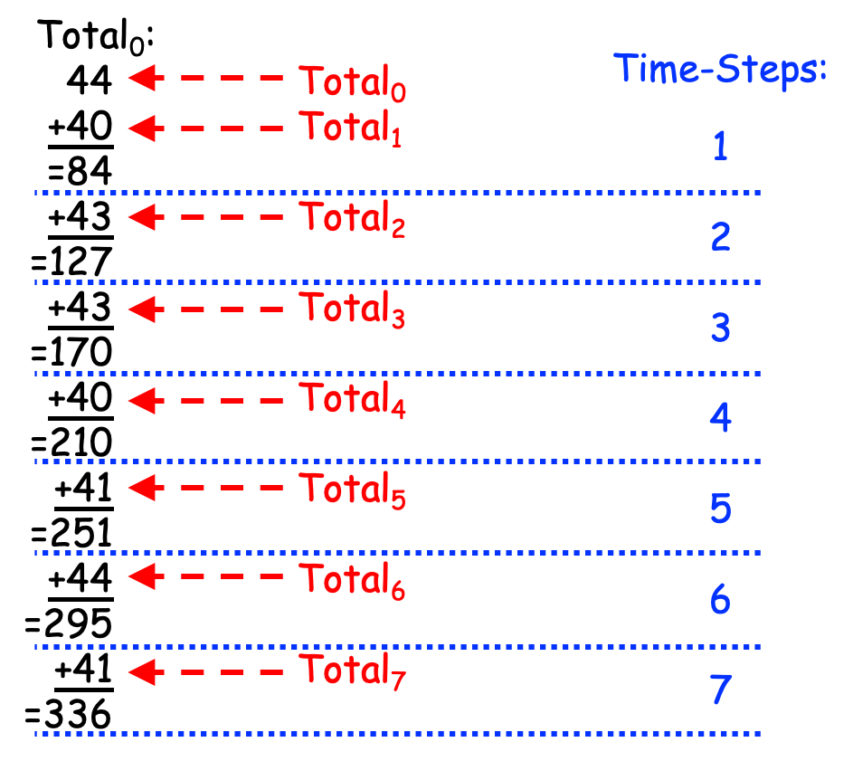

  Figure 0-39: Reducing Partial Results (with Addition) Linearly

As can be seen in Figure 0-39, this approach takes 7 time-steps to combine the 8 partial solutions into a total solution. More generally, if we have P PEs, this approach requires P-1 time-steps, or *linear time*. Since this approach "reduces" the P partial solutions to a single overall solution and takes linear time to do so, it is called a 
**Linear Reduction** strategy.

The Linear Reduction strategy solves our problem of combining the partial results into a total result, but it has a key drawback: most of the workers sit idle most of the time; the leader is doing nearly all of the work. Since we have P PEs, can we take advantage of parallelism somehow to spread out the work, and hopefully improve the time?

Consider this alternative approach:

  |  Write down :math:`Total_{id}`:, followed by the weight of the cheese from your slices.
  |  For each value i in the range 1 .. :math:`log_{2}(P)`:
  |     If your id is evenly divisible by :math:`2^i`:
  |         Let partner = id + :math:`2^{i-1}`
  |         Ask “:math:`PE_{partner}`, what is your :math:`Total_{partner}` value?" 
  |         Listen for :math:`Total_{partner}` from :math:`PE_{partner}`.
  |         Add that number to the current value of :math:`Total_{id}`”
  |     Otherwise:
  |         Let partner = id - :math:`2^{i-1}`
  |         Wait until :math:`PE_{partner}` asks for your :math:`Total_{id}`.
  |         Answer with your :math:`Total_{id}` value.
  |         Quit!

Let’s see how this approach works, using our previous example where P==8. In step 0, every PE writes down their partial results in their :math:`Total_{id}` variables, as follows:

.. raw:: html

  <table border="1" style="text-align:center">
   <tr>
    <th style="width:150px;text-align:center">PE</th>
    <th style="width:50px;text-align:center">Total0</th>
    <th style="width:50px;text-align:center">Total1</th>
    <th style="width:50px;text-align:center">Total2</th>
    <th style="width:50px;text-align:center">Total3</th>
    <th style="width:50px;text-align:center">Total4</th>
    <th style="width:50px;text-align:center">Total5</th>
    <th style="width:50px;text-align:center">Total6</th>
    <th style="width:50px;text-align:center">Total7</th>
    </tr>
   <tr>
    <td>Cheese Weight</td>
    <td>44</td>
    <td>40</td>
    <td>43</td>
    <td>43</td>
    <td>40</td>
    <td>41</td>
    <td>44</td>
    <td>41</td>
   </tr>
  </table>
  

Since P==8 and the :math:`log_{2}(8)` == 3, the For loop in step 1 will iterate through the values 1, 2, and 3. 

In the first iteration of the For loop, i == 1 and :math:`2^1` == 2, 
so the even numbered PEs (0, 2, 4, 6) perform steps a-c under the If, 
while the odd numbered PEs (1, 3, 5, 7) perform steps a-d under the Otherwise. 

The loop variable i==1, so :math:`2^{i-1}` == :math:`2^0` == 1. 
In step a, the even-numbered PEs (0, 2, 4, 6) then calculate their partner as id+1 
(i.e., 1, 3, 5, 7, respectively), and 
the odd-numbered PEs compute their partner as id-1 (i.e., 0, 2, 4, 6, respectively). 
In steps b and c, each even-numbered PE gets the Total value from its partner 
(:math:`PE_{id+1}`) and adds it to its Total, 
causing their Total values to change as highlighted below:

.. raw:: html

  <table border="1" style="text-align:center">
   <tr>
    <th style="width:150px;text-align:center">PE</th>
    <th style="width:50px;text-align:center">Total0</th>
    <th style="width:50px;text-align:center">Total1</th>
    <th style="width:50px;text-align:center">Total2</th>
    <th style="width:50px;text-align:center">Total3</th>
    <th style="width:50px;text-align:center">Total4</th>
    <th style="width:50px;text-align:center">Total5</th>
    <th style="width:50px;text-align:center">Total6</th>
    <th style="width:50px;text-align:center">Total7</th>
    </tr>
   <tr>
    <td>Cheese Weight</td>
    <td><strong>84</strong></td>
    <td>40</td>
    <td><strong>86</strong></td>
    <td>43</td>
    <td><strong>81</strong></td>
    <td>41</td>
    <td><strong>85</strong></td>
    <td>41</td>
   </tr>
  </table>
  

PEs 1, 3, 5, and 7 then quit, leaving PEs 0, 2, 4, and 6 active.

In the second iteration, i == 2 and :math:`2^2` == 4, 
so the PEs whose id values are evenly divisible by 4 (i.e., 0 and 4) 
perform the steps under the If, 
while the remaining PEs who have not quit (i.e., 2 and 6) 
perform the steps under Otherwise. 
Since i == 2, :math:`2^{i-1}` == :math:`2^1` == 2, 
so in step a, PEs 0 and 4 calculate their partners as id+2, 
producing 2 and 6 as their respective partners, 
while PEs 2 and 6 calculate their partners as id-2, 
producing PEs 0 and 4 as their respective partners. 
In steps b and c, PEs 0 and 4 each get the current Total value from their partner 
and add it to their Total value, changing their Total values as highlighted below:

.. raw:: html

  <table border="1" style="text-align:center">
   <tr>
    <th style="width:150px;text-align:center">PE</th>
    <th style="width:50px;text-align:center">Total0</th>
    <th style="width:50px;text-align:center">Total1</th>
    <th style="width:50px;text-align:center">Total2</th>
    <th style="width:50px;text-align:center">Total3</th>
    <th style="width:50px;text-align:center">Total4</th>
    <th style="width:50px;text-align:center">Total5</th>
    <th style="width:50px;text-align:center">Total6</th>
    <th style="width:50px;text-align:center">Total7</th>
    </tr>
   <tr>
    <td>Cheese Weight</td>
    <td><strong>170</strong></td>
    <td>40</td>
    <td>86</td>
    <td>43</td>
    <td><strong>166</strong></td>
    <td>41</td>
    <td>85</td>
    <td>41</td>
   </tr>
  </table>
  

PEs 2 and 6 then quit, leaving PEs 0 and 4 active.

In the third and final iteration, i == 3, so :math:`2^i` == 8. 
The only PE whose id is evenly divisible by 8 is the leader (PE 0), 
so it performs the steps under the If. 
The only other PE who is still active is PE 4, 
so it performs the steps below Otherwise. 
In step a, PE 0 calculates its partner as id + :math:`2^2` == 0 + 4 == 4, 
while PE 4 computes its partner as id – :math:`2^2` == 4 – 4 == 0, 
so in steps b and c, PE 0 gets :math:`Total_4` from PE 4 
and adds it to :math:`Total_0`, 
changing its Total value as highlighted below:

.. raw:: html

  <table border="1" style="text-align:center">
   <tr>
    <th style="width:150px;text-align:center">PE</th>
    <th style="width:50px;text-align:center">Total0</th>
    <th style="width:50px;text-align:center">Total1</th>
    <th style="width:50px;text-align:center">Total2</th>
    <th style="width:50px;text-align:center">Total3</th>
    <th style="width:50px;text-align:center">Total4</th>
    <th style="width:50px;text-align:center">Total5</th>
    <th style="width:50px;text-align:center">Total6</th>
    <th style="width:50px;text-align:center">Total7</th>
    </tr>
   <tr>
    <td>Cheese Weight</td>
    <td><strong>336</strong></td>
    <td>40</td>
    <td>86</td>
    <td>43</td>
    <td>166</td>
    <td>41</td>
    <td>85</td>
    <td>41</td>
   </tr>
  </table>
  

PE 4 then quits, and since that was the final iteration of the loop, PE 0 leaves the loop, after which it (PE 0, the leader) has the total solution to the problem in :math:`Total_0`, which it can then report as desired.

Figure 0-40 summarizes this behavior, adding red arrows and blue time-steps:

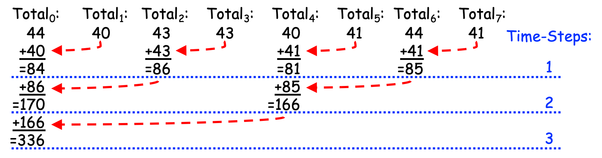

  Figure 0-40: Reducing Partial Results (with Addition) in Parallel

Since it reduces the partial solutions to a total solution using parallelism, this strategy is called a **Parallel Reduction**. 
If you count the total number of additions, this approach still performs 7 total additions.

However, unlike the Linear Reduction of Figure 0-39, in which PE 0 performed all of the additions sequentially, this approach spreads those seven additions across different PEs so that they are performed in a parallel, scalable way. 
Where the Linear Reduction in Figure 0-39 required P-1 time-steps, the Parallel Reduction in Figure 0-40 requires :math:`log_{2}(P)` time-steps, or *logarithmic time*. 
(Since 8 == :math:`2^3`, the :math:`log_{2}(8)` is 3.) 
Note that:

- if P were 16, this approach would only require *4* time-steps 
  (since 16 == :math:`2^4`, :math:`log_{2}(16)` is 4); 

- if P were 32, this approach would require *5* time-steps 
  (since 32 == :math:`2^5`, :math:`log_{2}(32)` is 5); 

- …

- if P were 1,024, this approach would require *10* time-steps 
  (since 1024 == :math:`2^{10}`, :math:`log_{2}(1024)` is 10); 

- … 

- if P were 4,096, this approach would require just *12* time-steps 
  (since 4096 == :math:`2^{12}`, :math:`log_{2}(4096)` is 12); 

- …

- if P were 1,048,576, this approach would require just *20* time-steps 
  (since 1048576 == :math:`2^{20}`, :math:`log_{2}(1048576)` is 20)! 

Thanks to the logarithmic time of this strategy, we can double the value of P and only add 1 to the number of time-steps required by the Parallel Reduction.

The Parallel Reduction is thus potentially much faster than the Linear Reduction, and the larger the value of P, the greater the advantage the Parallel Reduction provides over the Linear Reduction.

0.4.4: The Single Program, Multiple Data (SPMD) Strategy
^^^^^^^^^^^^^^^^^^^^^^^^^^^^^^^^^^^^^^^^^^^^^^^^^^^^^^^^^

The Parallel Loop, Leader-Worker, and Reduction strategies described in the preceding sections are all parallel algorithmic strategies within a more general approach to parallel computing called the *Single Program, Multiple Data* (SPMD) strategy. 
The SPMD approach lets a parallel software developer write a single program (the *SP* part of SPMD) that, when performed by multiple processing elements (PEs), causes those PEs to process different data items (the *MD* part of SPMD). 
Given a problem of size **N** to solve, the SPMD approach relies on two key capabilities:

  1. The ability to determine **P**, the number of PEs. 
     The above-mentioned strategies all seek to divide the work of 
     solving the problem into pieces, such that (other factors being equal) 
     each PE performs roughly N/P pieces of the work.

  2. The ability to determine **id**, the identity of a given PE, 
     that results in each PE getting a different unique value from the range 0..P-1. 
     The above-mentioned strategies use this id value in two different ways 
     to determine which pieces of the work a given PE will perform:

     - The Parallel Loop strategies use the id value to determine 
       which iterations of the loop this PE will perform. 
       To illustrate, in Figures 0-21 and 0-24, 
       a PE’s id value directly controls which pieces of the data that PE processes.

     - The Leader-Worker strategies use the id value to determine 
       whether a given PE is the leader or a worker. 
       In Figures 0-35 and 0-37, a PE’s id value directly controls 
       whether it is the leader or a worker, but for a worker, 
       it does not directly control which pieces of the work that PE performs.

     - The Parallel Reduction strategy uses the id value to determine each PE’s role 
       in a given iteration of the For loop, and to identify the “partner” PE 
       whose Total value a given PE will be adding to its Total value. 

    Parallel strategies thus use the id value to divide up the work, 
    either directly or indirectly.

The SPMD approach thus lets a parallel software developer write a single program that correctly solves a problem of size N using P PEs, for P ≥ 1. When P == 1, the program solves the problem sequentially, but when P > 1, the PEs use their id and P values to divide up the work to be performed, typically using a Parallel Loop and/or Leader-Worker strategy.

0.4.5: Data Decomposition vs. Task Decomposition
^^^^^^^^^^^^^^^^^^^^^^^^^^^^^^^^^^^^^^^^^^^^^^^^^^^^^^^^^

Now that we have seen some different approaches to parallel problem solving, let’s define some over-arching concepts. 
In parallel computing, **decomposition** is the act of dividing up the work that needs to be performed in order to solve a problem. 
There are different approaches that can be used to divide this work; two of the most common approaches are *data decomposition* and *task decomposition*, which we explore in the rest of this section.

**Data Decomposition**. 
When solving a problem involves processing a large set of data items, if each item can be processed independently of the others using a loop, then a Parallel Loop can be used to distribute that loop’s iterations across multiple PEs. 
By doing so, the data set is decomposed into pieces (i.e., contiguous chunks or non-contiguous slices) that the PEs process in parallel. 
If necessary, any partial solutions the PEs produce can be combined into a total solution to the problem using a Reduction strategy.

In our pizza-eating example, the pizza slices represented the data items being processed; the slice-numbers represented index values when the data items are stored in an array. 
The solutions shown in Figures 0-21 and 0-24 use data decomposition approaches;
Figures 0-22 and 0-27 illustrate how the two Parallel Loop strategies “decompose the data” when N==16 and P==6.

**Task Decomposition**. 
A different way to divide up and parallelize the solution to a problem is to: (i) identify the functional tasks that must be performed to solve the problem, (ii) build a dependency graph to identify any dependencies that exist among those tasks, and (iii) map tasks that are independent (i.e., have no interdependencies) to PEs, to have the PEs perform those tasks in parallel. 

When there are only a few independent tasks, those tasks can be directly assigned to specific PEs, but when there are many independent tasks, then a Leader-Worker strategy may be used: the leader creates a queue containing the tasks, after which each worker repeatedly gets a task from the queue (via the leader if using a distributed memory multiprocessor) and performs that task, until the queue is empty. 
If the workers produce partial solutions, a Reduction may be used to combine those partial results into a total solution.

In our pizza-eating example, Figures 0-36 and 0-38 illustrate the use of Task Decomposition, where the tasks to be performed are all the same: “Eat a slice of pizza”. We might envision the relationships between the tasks involved in eating an N-slice pizza as shown in Figure 0-41:

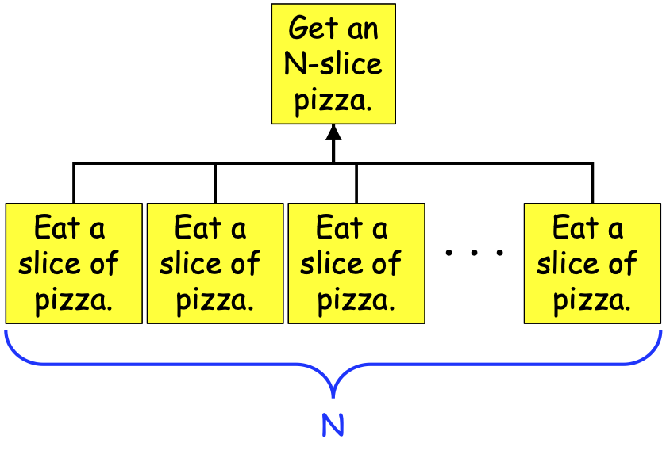

  Figure 0-41: A Task-Dependency Graph for Eating an N-Slice Pizza

As can be seen in Figure 0-41, the problem of consuming an N-slice pizza can be broken down into N+1 tasks: one Get-a-pizza task, and N Eat-a-slice tasks. The Eat-a-slice tasks are dependent on the Get-a-pizza task (you can’t eat a slice of pizza without a pizza!), so an arrow runs from each Eat-a-slice task to the Get-a-pizza task. But those Eat-a-slice tasks are independent of one another—no lines connect them to one another—so they can be performed in parallel.

Not all problems have tasks that can be performed so independently. To illustrate, consider the following pseudocode program:

  | program FunctionalTasks:
  |   Prompt and read values for: w, x, y, z;
  |   Let a = f(w),
  |       b = g(x),
  |       c = a + b,
  |       d = h(y),
  |       e = i(z),
  |       j = d + e,
  |       k = c * j;
  |   Display k;
  | end Tasks.

Figure 0-42 shows us the task-dependency graph for this program:

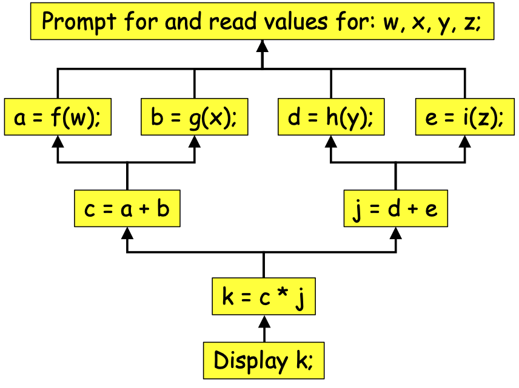

  Figure 0-42: A Task-Dependency Graph for Program FunctionalTasks

The task-dependency graph is a kind of reverse flow-chart that indicates which steps depend on which other steps. For example, we cannot compute a, b, d, or e until we have read in values for w, x, y and z, so an arrow runs from the steps that compute a, b, d, and e to the step that reads in w, x, y, and z. Likewise, we cannot compute c until values a and b have been computed; we cannot compute j until values d and e have been computed; we cannot compute k until values c and j have been computed; we cannot display k until k has been computed.

We can use the task-dependency graph to determine *how many PEs* to use to perform the tasks. The computations of a, b, d, and e are all independent of one another, so these can be performed in parallel. The computations of c and j are independent of one another, so they can be done in parallel, but the computation of c depends on the computations of a and b, and the computation of j depends on the computations of d and e. Because of those dependencies, the maximum number of independent tasks needed to perform *all* of these tasks in parallel is just *four* (i.e., the tasks that compute a, b, d, and e)—there is no benefit to using more than 4 PEs to solve this problem. That is, we can maximize the parallelism by having one PE (our leader) read in values for w, x, y, and z, and then having four PEs (our leader and three workers) compute a, b, d, and e in parallel. After this, we only need two PEs (our leader and one worker) to compute c and j; after which a single PE (our leader) can compute k and display it. The *maximum width of the task-dependency graph* (4 in this case) lets us identify the maximum number of PEs we need.

**Scalability**. 
From a scalability perspective, we could have many PEs available, but the scalability of a parallel program that uses task decomposition is limited to :math:`T_{max}`, the maximum number of tasks that can be running independently at any given point in the computation. If no more than :math:`T_{max}` tasks can ever be running independently, the maximum theoretical speedup we can expect to get from the program is at best :math:`T_{max}`, regardless of how many PEs we use.

By contrast, the scalability of a parallel program that uses data decomposition is limited by:

- P, the number of PEs, and 

- N, the number of data items to be processed, 

because each of the P PEs will process roughly N/P of the data items. As we saw when using the data decomposition approach in Section 0.3.5, for any given value of P, we can usually increase :math:`Speedup_P` by increasing N, the number of data items to be processed. 
According to Gustafson-Barsis: as N ➙∞, :math:`Speedup_P` ➙ P.

Since (i) scalability is a key motivation for parallel computing, and (ii) we are living in the "Big Data" era in which the amount of data being collected is growing at astronomical rates, this book focuses primarily on problem-solving using data decomposition, rather than task decomposition.

.. [#] There are other parallel loops besides these two, but we will limit our discussion to these two, for now.

.. [#] In the real world, solving these kinds of problems requires the completion of a set of unordered tasks—tasks that have no numbers associated with them.
