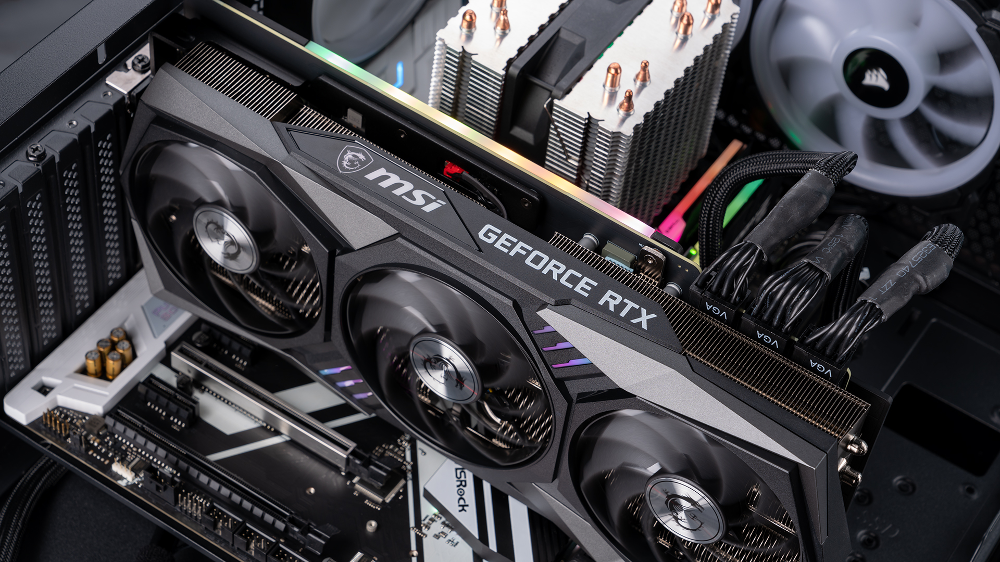

4.1 The manycore GPU device in a host
-------------------------------------

The GPU cards typically are added to a server, called a **host**, and look
something like this:

   Figure 4-1: Typical GPU card installed in a server

In general purpose GPU computing, the GPU card is called a **device**.
Inside it are thousands of small cores that tend to be slower than our
very fast CPU cores on the host server. The GPU cores share some memory
that is organized differently, yet has some similarities to our CPU
memory architecture.

Getting the code for these examples
^^^^^^^^^^^^^^^^^^^^^^^^^^^^^^^^^^^^

The code for these examples is in a `GitHub repo for the CSInParallel Project <https://github.com/csinparallel/CSinParallel>`_. The code is inside a folder called **CUDABeginners**. When you see filename paths for code shown in this chapter, they are in relation to the CUDABeginners folder.

All the code examples have a makefile in each subfolder.

Software needed: HPC SDK from NVIDIA (`download here <https://developer.nvidia.com/hpc-sdk-downloads>`_). We recommend this for Linux and Windows machines (sadly, NVIDIA seems to be unable to support Macs any longer). Find information about installing this on the `NVIDIA HPC SDK Documentation page <https://docs.nvidia.com/hpc-sdk/index.html>`_.

Discovering Information about your GPU
^^^^^^^^^^^^^^^^^^^^^^^^^^^^^^^^^^^^^^^^^^^^^

As you may have discovered by now, when you are first learning to program using a new compiler and new hardware, sometimes it helps to treat some details like a "black box" that works to get the job done. Then later you can return to some initial examples and study them with more detail. This first example is designed to be like that. You should try to run this on a machine where you have placed this code and that already has CUDA drivers and the NVIDIA HPC toolkit installed.

This following example code is a necessary part of CUDA programming, because it is essential to know some information about your particular GPU. The file called device_info.cu has a simple main function:

Filename: *1-basics/1.1-device/device_info.cu*

.. literalinclude:: code/cuda/1-basics/1.1-device/device_info.cu
  :language: c
  :linenos:
  :caption: device_info.cu main function
  :lines: 1-20

The details of the function called in main and an additional one can be found in the code file. You can choose to look at those details or treat them as a 'black box', knowing that they use CUDA library functions to obtain information about your GPU.

This is how we typically compile this code using the NVIDIA compiler, called nvcc:

.. code-block:: bash

    nvcc -arch=native -o device_info device_info.cu

.. note::  CUDA code examples have the suffix .cu.

We will discuss what the -arch flag means shortly. This creates an executable called device_info.

Here is output from a particular machine- yours will vary, depending on what GPU you have.

.. code-block:: bash

  $ ./device_info 
  Device 0: "NVIDIA RTX A5000" with Compute 8.6 capability
  Total amount of global memory:      24226 MBytes (25402343424 bytes)
  GPU device shared memory per block of threads on an SM: 49152 bytes
  GPU device total number of streaming multiprocessors: 64
  With  64 Multiprocessors (MPs), this device has 128 CUDA Cores/MP,
  for total of  8192 CUDA Cores on this device.

  Max dimension sizes of a grid (x,y,z): (2147483647, 65535, 65535)
  Max dimension sizes of a thread block (x,y,z): (1024, 1024, 64)

Now let's examine a bit about what this is telling us about our GPU by learning about the architecture of these cards. 

GPU Architecture
^^^^^^^^^^^^^^^^

The general architecture of an NVIDIA GPU card is given below in Figure 4-2. There are many different versions of their GPU cards, each often having a different number of *streaming multiprocessors* (SMs). Each SM has a certain number of cores per SM (small white and blue boxes in each SM, illustrating that current designs have different types of cores). The information given above for an RTX A5000 GPU card shows how much global memory is shared by all the SMs (white box at the bottom of Figure 4-2) and how much memory is designated for each separate SM to be shared among threads running on cores in that SM.

   Figure 4-2: Abstract view of NVIDIA GPU card architecture

NVIDIA has changed the design of their card architecture many times as they make improvements to their cards. The architectures match a particular *compute capability* (note this was displayed in the output for the device_info program above). The most recent versions of the CUDA C compiler, nvcc, let you signify that the code should be compiled to run on the architecture of the card in the machine you are compiling on by using the flag -arch=native. This is why we did this when compiling this example.

.. note:: 
  The use of the -arch flag when compiling as shown above is needed so that the code can run properly on your given card. Using the native flag is the simplest way to do this, **BUT IT DOESN'T ALWAYS WORK**.

  We can use what the device_info program provides to help us create the correct value for the -arch flag if native doesn't work. Note in the case of the example card we used above, this was reported:

    with Compute 8.6 capability
  
  In this case, we can change the flag when compiling to -arch=compute_86

The machine containing the CPU and the GPU is referred to as the **host** machine. The GPU is referred to as the **device**, which is usually connected in a PCI-e bus on the motherboard. The memory on the host machine is separate from the memory on the GPU, meaning that any data you need for computation on the GPU must be moved from the host memory to the GPU device memory before executing computations.

The main differences between a standard CPU architecture and GPU architectures is as follows:

- The CPU has a relatively small number of fast cores compared to a much larger number of slower cores (usually thousands) in a GPU.

- CPU memory is larger, whereas GPU memory has higher transfer rates between global memory and SM shared memory.

Next we will examine the programming model that goes with this NVIDIA architecture.