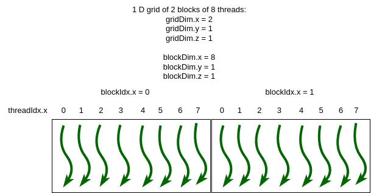
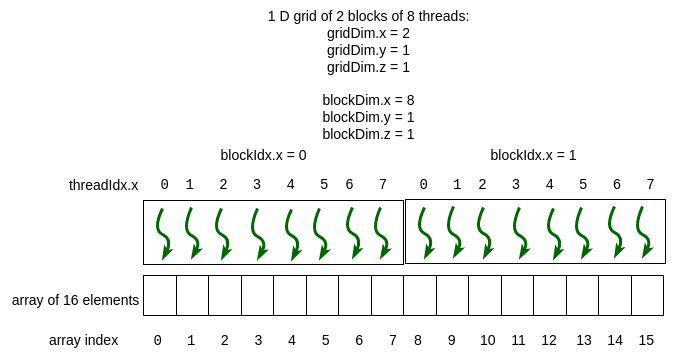

4.3 Mapping Threads to Data Elements
------------------------------------

In the last section we mentioned that the key new idea in CUDA programming is that the programmer is responsible for:

1. setting up up the grid of blocks of threads and 
2. determining a mapping of those threads to elements in 1D, 2D, or 3D arrays.

We briefly saw task 1 (setting up grids with blocks) in the previous section, through the use of the dim3 data structure. Now we will examine more examples using dim3, then combine that with task 2, which is to map the threads within the blocks within the grid to data elements in arrays.

1D grid of 1D blocks of threads
^^^^^^^^^^^^^^^^^^^^^^^^^^^^^^^^

Filename: *1-basics/1.2-dim3/dim3Demo1D1D.cu*

The following example creates a 1 dimensional grid of 2 blocks that are also 1 dimensional, containg 8 threads:

.. literalinclude:: code/cuda/1-basics/1.2-dim3/dim3Demo1D1D.cu
  :language: c
  :linenos:
  :caption: dim3Demo1D1D.cu main function
  :lines: 27-44

Build and run
=============

You can use the make command on your own machine or compile the code like this:

.. code-block:: bash

   nvcc -arch=native  -o dim3Demo1D1D dim3Demo1D1D.cu

Remember that you will need to use a different -arch flag if native does not work for you. (See note at end of section 4.1.)

You can execute this code like this:

.. code-block:: bash

   ./dim3Demo1D1D

The execution of this example program, called dim3Demo1D1D, looks like this:

.. code-block:: bash

    Grid Dimensions : {2, 1, 1} blocks. 
    Block Dimensions : {8, 1, 1} threads.
    From each thread:
    I am thread (0, 0, 0) of block (0, 0, 0) in the grid
    I am thread (1, 0, 0) of block (0, 0, 0) in the grid
    I am thread (2, 0, 0) of block (0, 0, 0) in the grid
    I am thread (3, 0, 0) of block (0, 0, 0) in the grid
    I am thread (4, 0, 0) of block (0, 0, 0) in the grid
    I am thread (5, 0, 0) of block (0, 0, 0) in the grid
    I am thread (6, 0, 0) of block (0, 0, 0) in the grid
    I am thread (7, 0, 0) of block (0, 0, 0) in the grid
    I am thread (0, 0, 0) of block (1, 0, 0) in the grid
    I am thread (1, 0, 0) of block (1, 0, 0) in the grid
    I am thread (2, 0, 0) of block (1, 0, 0) in the grid
    I am thread (3, 0, 0) of block (1, 0, 0) in the grid
    I am thread (4, 0, 0) of block (1, 0, 0) in the grid
    I am thread (5, 0, 0) of block (1, 0, 0) in the grid
    I am thread (6, 0, 0) of block (1, 0, 0) in the grid
    I am thread (7, 0, 0) of block (1, 0, 0) in the grid

Lines 8 and 9 of the code above set up a 1D grid containing 2 blocks of 8 threads. Figure 4.5 below illustrates this. Compare this to the output of the program above, where the gridDim and blockDim values are printed, then each thread is giving its position in the particular block.

   Figure 4-5: 1D grid of 1D blocks of threads

Mapping a 1D grid of 1D thread blocks to an array
^^^^^^^^^^^^^^^^^^^^^^^^^^^^^^^^^^^^^^^^^^^^^^^^^^^^^

In many cases where we have a 1 deimensional array of data values, our primary goal in CUDA programming is to have each thread work on one element of the array. The CUDA model provides a fairly straightforward way to map a thread to a unique value, beginning at 0, to use as an index into the array.

Filename: *1-basics/1.3-1DBlockPrint/print1Block.cu*

Here is a full program called print1Block.cu that illustrates how we do this:

.. literalinclude:: code/cuda/1-basics/1.3-1DBlockPrint/print1Block.cu
  :language: c
  :caption: print1Block.cu 

The output using 1 block of 16 threads is as follows:

.. code-block:: bash

    1D grid of blocks
    [b0 of 1, t0]:  Value sent to kernel function is:1
    [b0 of 1, t1]:  Value sent to kernel function is:1
    [b0 of 1, t2]:  Value sent to kernel function is:1
    [b0 of 1, t3]:  Value sent to kernel function is:1
    [b0 of 1, t4]:  Value sent to kernel function is:1
    [b0 of 1, t5]:  Value sent to kernel function is:1
    [b0 of 1, t6]:  Value sent to kernel function is:1
    [b0 of 1, t7]:  Value sent to kernel function is:1
    [b0 of 1, t8]:  Value sent to kernel function is:1
    [b0 of 1, t9]:  Value sent to kernel function is:1
    [b0 of 1, t10]: Value sent to kernel function is:1
    [b0 of 1, t11]: Value sent to kernel function is:1
    [b0 of 1, t12]: Value sent to kernel function is:1
    [b0 of 1, t13]: Value sent to kernel function is:1
    [b0 of 1, t14]: Value sent to kernel function is:1
    [b0 of 1, t15]: Value sent to kernel function is:1

.. note::
  Some other new ideas from this code are the following:

  - CUDA kernel functions that run on the device can have parameters that get passed from the host code calling it. 

  - A kernel function called from host code, which we learned was designated by the keyword __global__, can call other functions that will immediately run on the device. These functions are designated with the keyword __device__, such as the function find1DThreadNumber() given above.

If we simply change main to create a 1D grid with 2 blocks of 8 threads, we still maintain the same thread number values that can be used as indexes into an array of 16 data values. Here is the change in main:

Filename: *1-basics/1.3-1DBlockPrint/print2Blocks.cu*

.. literalinclude:: code/cuda/1-basics/1.3-1DBlockPrint/print2Blocks.cu
  :language: c
  :caption: print2Blocks.cu 
  :lines: 29-43

And here is the result when we run it:

.. code-block:: bash

    1D grid of blocks
    [b0 of 2, t0]:  Value sent to kernel function is:1
    [b0 of 2, t1]:  Value sent to kernel function is:1
    [b0 of 2, t2]:  Value sent to kernel function is:1
    [b0 of 2, t3]:  Value sent to kernel function is:1
    [b0 of 2, t4]:  Value sent to kernel function is:1
    [b0 of 2, t5]:  Value sent to kernel function is:1
    [b0 of 2, t6]:  Value sent to kernel function is:1
    [b0 of 2, t7]:  Value sent to kernel function is:1
    [b1 of 2, t8]:  Value sent to kernel function is:1
    [b1 of 2, t9]:  Value sent to kernel function is:1
    [b1 of 2, t10]: Value sent to kernel function is:1
    [b1 of 2, t11]: Value sent to kernel function is:1
    [b1 of 2, t12]: Value sent to kernel function is:1
    [b1 of 2, t13]: Value sent to kernel function is:1
    [b1 of 2, t14]: Value sent to kernel function is:1
    [b1 of 2, t15]: Value sent to kernel function is:1

This situation is depicted in Figure 4-6, where the thread numbers computed by the function *find1DThreadNumber* and printed in the output above as t0, t1, t2, etc. are mapped to indices of an array containing 16 elements. Compare the function, repeated here, to Figure 4-6.

.. literalinclude:: code/cuda/1-basics/1.3-1DBlockPrint/print2Blocks.cu
  :language: c
  :caption: Function to obtain array index using information about 1D grid of 1D blocks
  :lines: 7-17

   Figure 4-6: 1D grid of 1D blocks of threads mapped to array indexes

.. note::
  The function called *find1DThreadNumber* is sufficient to calculate an index into any length 1-dimensional array when using a 1D grid of 1D blocks. **As a programmer, you must determine the grid and block sizes from the length of the array and ensure that you don't go out of the bounds of the array.** You will see how this is done next when we look at an example of vector addition from linear algebra.

Exercises
^^^^^^^^^^^

.. qnum::
   :prefix: 4.3-
   :start: 1

.. shortanswer:: ex-4-3-1
   :optional:

    Try a few more more blocks
    Try changing the code for print2Blocks.cu to use more than 2 blocks, such as 8 (don't try too large because of all the printing that will happen). 
    What do you observe about the numbering for each thread?
  
.. mchoice:: tf-4.3-2
   :answer_a: True.
   :answer_b: False.
   :correct: a
   :feedback_a: Yes! The qualifier signifies code that gets called on a running section of device code, which can be a starting kernel function or another device function.
   :feedback_b: The qualifier signifies code that gets called from a running section of device code.

   Functions annotated with the __device__ qualifier must be called from a kernel function or another device function.

2D grid of 2D blocks of threads
^^^^^^^^^^^^^^^^^^^^^^^^^^^^^^^^

2D grids of 2D blocks of threads are useful for applications that use 2-dimensional arrays, or matrices. We will look at that in the next chapter containing applications.

