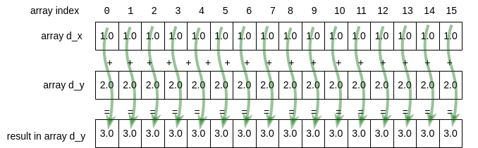

4.4 Example: Vector Addition
-----------------------------

Let's examine a relatively straightforward example that enables us to visualize the CUDA programming model and how to think when we have many cores. In linear algebra, vector addition is well-used operation, where vectors can be represented by arrays of values. 

Figure 4-7 shows how vector addition on a GPU device works for the code you will see below (we show a small number of elements, but the real code will use much larger arrays). It also shows how we should think about how we will complete the work in parallel, by having each thread perform a single addition operation and compute a single new value for the result array. The green lines represent each thread of computation running simultaneously in parallel. 

Using the CUDA programming model, we can think of having as many threads as we need to complete this type of task on larger arrays than depicted here- the system takes care of doing as much as possible in parallel with the available cores on your card, using the number of blocks you have set up in the grid, then reassigns them to do the rest; we don't need to worry about that.

   Figure 4-7: Each thread working on 1 array element

In this and the next two sections we will examine 3 versions of how we can complete this code.

First let's describe in words what the first version of the CUDA code needs to do. Here are the steps, which match comments placed in the code found below.

1. Allocate 2 arrays, x and y, on the **host** and initialize them with data.
2. Allocate 2 arrays d_x, and d_y, on the GPU **device**.
3. Copy each of the arrays from the host to the device.
4. Perform the addition on the device using a kernel function, keeping result in d_y.
5. Ensure that the device is finished with the computation.
6. Copy the resulting array d_y from the device to the host, back into array y.
7. Check that the computation ran correctly.
8. Free memory on the device and the host.

New indispensable additions to the code
^^^^^^^^^^^^^^^^^^^^^^^^^^^^^^^^^^^^^^^^^

In a previous section (4.2 near the end), we mentioned that it is useful to check for errors that could be introduced into the code. This is true for both CUDA library calls used in the host code or functions you write for the device. CUDA provides some ways to enable you to examine errors that have occurred so that you can debug them. Observe a new macro provided at the top of the following example program file, then look further on in main to observe how it is used to check for problems that code on the device might have and report information about them.

It is always useful to be able to experiment with your application by changing sizes of various attributes to observe what happens. In C we can do this with command line arguments. In the case of this code, we have introduced a function called *getArguments()* that helps us allow the user to change certain parameters. We will see this in later examples also. In this case, the block size (number of threads per block) can be changed and the number of blocks needed in a grid is computed inside the code (look for that below).

When developing our code, we also need to develop mechanisms to ensure that the computation is correct. In this case, since we are testing by knowing we have placed 1.0 in each element of the array *x* (and copied to *d_x*) and 2.0 into the array *y* (and copied into *d_y*), we can test to be certain that every element in the result contains the value 3.0. This is shown in the function called *verifyCorrect()* in the code below.

The complete example
^^^^^^^^^^^^^^^^^^^^

Filename: *2-vectorAdd/vectorAdd.cu*

.. literalinclude:: code/cuda/2-vectorAdd/vectorAdd.cu
  :language: c
  :caption: Vector Addition CUDA Program (version 1)
  :linenos: 

This code is designed to use a default block size of 256 threads and let you change it as the single command line argument. Find how this is done in the code above. Block sizes of 128, 256, or 512 are typical for many NVIDIA architectures (we will examine how this may change performance later). This is because most of today's NVIDIA cards have 128 cores per streaming multiprocessor (SM). We leave it as an exercise for you to try different block sizes.

Use array size and block size to set grid size
^^^^^^^^^^^^^^^^^^^^^^^^^^^^^^^^^^^^^^^^^^^^^^

Note line 101 above, repeated here:

.. literalinclude:: code/cuda/2-vectorAdd/vectorAdd.cu
  :language: c
  :lines: 101

Since in most code we may want to vary the size of our arrays, this illustrates the best practice for ensuring that is possible. Given a particular block size and number of elements, we can decide how many thread blocks should be in the 1D grid that will work on each data element.

Obtaining an array index for a thread
^^^^^^^^^^^^^^^^^^^^^^^^^^^^^^^^^^^^^

In the previous section, we provided this function to compute a unique value, beginning with 0, to use as an index into any array. It looks like this:

.. literalinclude:: code/cuda/1-basics/1.3-1DBlockPrint/print2Blocks.cu
  :language: c
  :caption: Function to obtain array index using information about 1D grid of 1D blocks
  :lines: 7-17

In the vectorAdd program above, we use this same concept in the vecAdd kernel function, repeated here:

.. literalinclude:: code/cuda/2-vectorAdd/vectorAdd.cu
  :language: c
  :caption: Vector Addition kernel function
  :lines: 45-54 

Convince yourself these are both obtaining indexes for arrays and that in the case of the vecAdd function each thread is now completing one addition operation and populating one element of the array.

.. note::
   An important check is being done in the above vecAdd function. We should always check that a thread id to be used as an index into an array does not point outside of the bounds of the array before we attempt the computation.

Build and run
^^^^^^^^^^^^^^^^

You can use the make command on your own machine or compile the code like this:

.. code-block:: bash

   nvcc -arch=native  -o vectorAdd vectorAdd.cu

Remember that you will need to use a different -arch flag if native does not work for you. (See note at end of section 4.1.)

You can execute this code like this:

.. code-block:: bash

   ./vectorAdd

.. code-block:: bash

   Vector addition by managing memory ourselves.
   size (N) of 1D arrays are: 33554432

   allocate vectors and copy to device
   add vectors on device using grid with 131072 blocks of 256 threads each.
   Max error: 0
   execution complete

Exercises
^^^^^^^^^

4.4-1. Try using different block sizes of 128 and 512 to be certain that the code is still correct.

4.4-2. If you are ambitious, you could try changing the command line arguments (if you are familiar with this) to include a length for the arrays.  Or more simply, change the code to change the size of the array, N, as shown early in the main function. This is useful to verify the code is still correct. Later we will see that it is useful for trying different problem sizes to see how the code performs.

