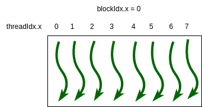
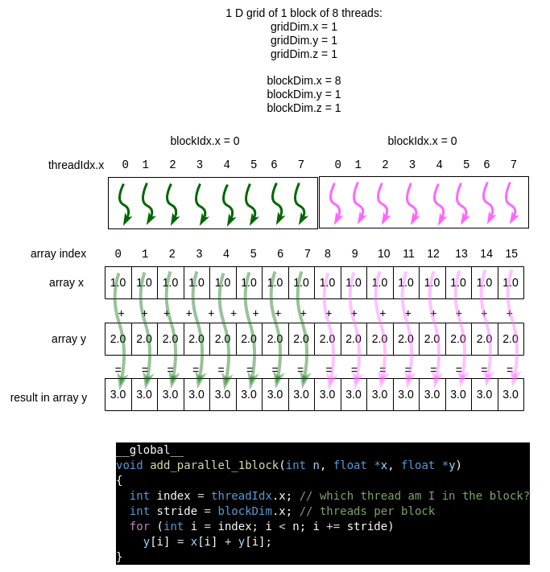
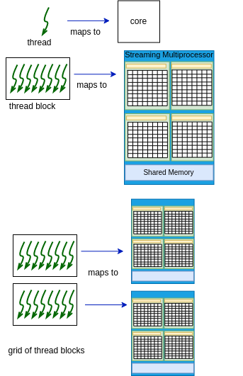
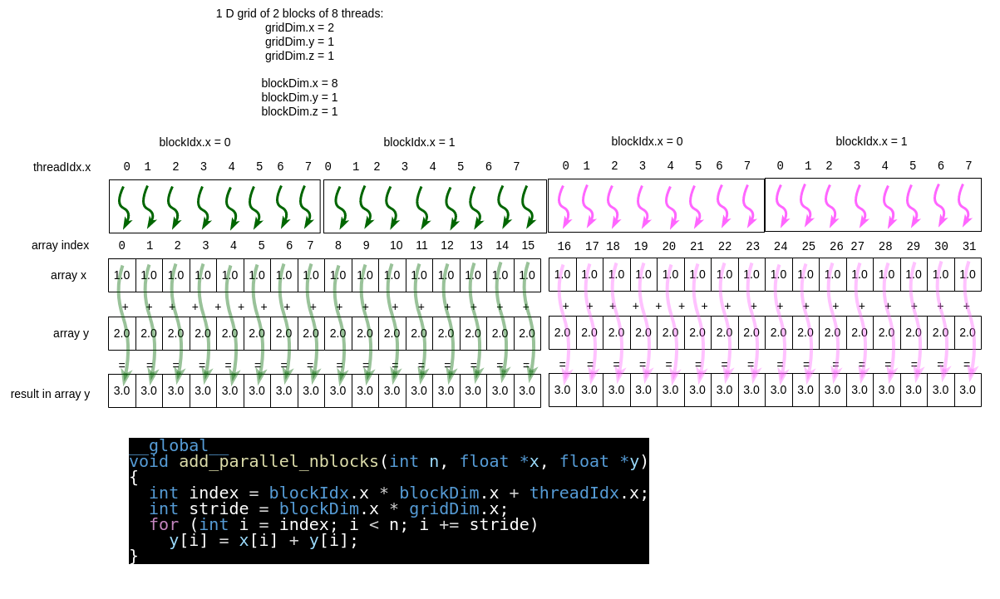
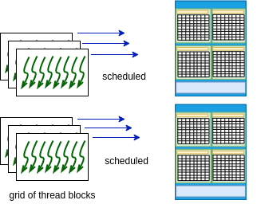
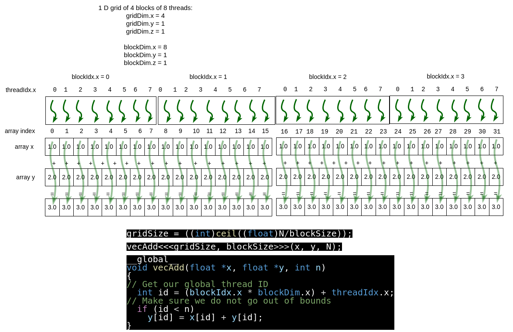

4.6 Vector Addition Example with Timing
-----------------------------------------

In this example we will look at these new aspects of CUDA coding.

- Using code timing to know how fast the code runs.
- Experiment to find out whether changes to the code affect the time and to compare running on the host CPU to running on the GPU device.
- Add a check for whether a user enters a value for threads per block that is larger than allowed.
- Demonstrate that you can run kernel code without using dim3 variables if you are only concerned with the x dimension and using 1D grids and thread blocks.
- Show a standard practice of using an additional command line argument for the size of our array.
- Show that we can run several device kernel functions, one after the other, from one main program.

The code contains experimental timings for the following conditions:

1. Running on a single thread on the host CPU.
2. Running on a single thread on the GPU device (not something we would normally do, but given to show the difference between CPU and GPU cores).
3. Running on a single block of threads (grid size 1).
4. Running on a somewhat small number of blocks, using a slightly different version of the loop to perform the addition.
5. Running on a large number of blocks, as shown in the previous example.

These cases are numbered in comments in the code shown below.

.. note::
  Taking timings and running experiments as shown here is central to the work process during PDC computing. Just as we need to make sure our code is still correct, we also want to determine the best way to run the code to get the best performance and what factors do not really affect the performance.

Using a single block of threads
^^^^^^^^^^^^^^^^^^^^^^^^^^^^^^^

In prior examples, we used one way of mapping the threads to compute each element of the array.

In this section we will explore different mappings of thread blocks in a 1D grid to a 1D array that represents vectors to be added together. We'll start by envisioning the simplest case from earlier examples, a single block of 8 threads as shown in Figure 4-8.

  Figure 4-8. A simple 1D grid with one block of 8 threads.

Suppose that we are adding an array of 16 elements to another array of 16 elements using the algorithm for vector addition. There are different ways of setting up a grid of block(s) to complete this task. The first is shown in Figure 4-9, where a single block of 8 threads can be mapped over time to complete 8 computations simultaneously. An example kernel function to do this is shown.

In this case, the block of green threads first works on the first 8 elements of the array. Then in a next larger timestep, the block of threads shown in a magenta color would complete the work.

  Figure 4-9 Using one block means less parallelism

Pay particular attention to the for loop and how index and stride are set up. Compare the code to the diagram, where the single block is repeated over the top of the array elements it will work on. For 32 elements, imagine 4 larger time steps in this loop, with 8 threads in the block 'sliding along' to work on the next 8 elements.

.. note::
  It's important to understand that the CUDA runtime system takes care of assigning the block of threads to 'slide along' your array elements. As a programmer, you are setting up the loop for this and specifying one block. This limits the overall parallelism, mainly because one block runs on one SM on the device, as shown in Figure 4-10.

Using multiple blocks of threads
^^^^^^^^^^^^^^^^^^^^^^^^^^^^^^^^^^

Using mulriple blocks of threads in a 1D grid is the most effective way to use an NVIDIA GPU card, since each block will map to a different streaming multiprocessor. Recall this figure from section 4-2:

  
  Figure 4-10 CUDA programming model

Fixed grid size method
========================

There are different ways of using multiple blocks of threads in our kernel function code. One way is to set a fixed number of blocks in the grid. Let's illustrate this with an example. Suppose that we use 2 blocks of 8 threads each when we call a kernel function. Further suppose that we have 32 elements in our arrays. This situation is shown in Figure 4-11, including a kernel function that handles this case. Note how with 2 blocks of 8 threads we can perform 16 computations in parallel, then perform 16 more.

  
  Figure 4-11 Fixed number of blocks for the grid size

Note that if we increase our array size, for example by doubling it to 64, yet keep the same grid size and block size, the picture above would need four colors to depict the computations that can happen in parallel (in theory- see the next note). 

.. note:: 
  One could argue that the above depiction is not strictly true. The CUDA block scheduler on many devices has gotten really good at making the 'stride' version of the code with a fixed grid size run as fast or faster than the following example. You will likely observe this when you run it. It may not be true for other applications, however, so you always need to check and test like we are doing here.

  The reason for this is that every core in an SM can actually run multiple threads simultaneously. So the hardware scheduler can assign blocks to run simulataneously on an SM, apparently as efficiently as if the blocks were spread across all SMs, at least for this example and for higher-end GPU cards. So our picture in Figure 4-Y is too simple for modern NVIDIA GPU devices when it comes to scheduling the running threads. The runing of the threads is more like Figure 4-12.

  Figure 4-12. CUDA schedules blocks to run simultaneously

`A technical post from NVIDIA <https://developer.nvidia.com/blog/cuda-refresher-cuda-programming-model/>`_ states this:

  One SM can run several concurrent CUDA blocks depending on the resources needed by CUDA blocks.

We provide this example because you will likely see code examples written like this as you scour the web for CUDA examples. And you may find that some applications perform just a bit better using it. The next method, however, follows what you have seen already: calculate the number of blocks in the grid based on a block size and the number of elements in the array. In theory, this enables you to scale your problem and to use as many streaming multiprocessors on your device as possible.

Variable grid size method 
=========================

As the arrays become larger or smaller for a given problem you are working on or you choose a different number of threads per block (a useful experiment to try for any card you are using), it is preferable to use the array size and the block size to compute the needed 1D grid size. 

  Though the execution time of this and the previous method may be similar, this method is a useful way to think about CUDA programs: create all the threads you need and map every thread to a particular index in the array.

For example, in the case in Figure 4-11, we looked at doubling the size of the array, but keeping the same number of blocks of threads. Now let's suppose that we compute a new grid size (blocks per 1D grid) based on the array size and number of threads per block. in this case, we would have the situation given in Figure 4-13. From this, note that we have only one color for the threads because all of the calculations can be done in parallel.

So as the problem size (lngth of the array in this case) grows, we should be able to take full advantage of the architecture.

  
  Figure 4-13 Number of blocks based on array size and block size

.. note::
  Using this method, as array sizes get very large, the grid size needed will exceed the number of SMs on your device. However, as we mentioned before, the system will take care of re-assigning cores on an SM to a new portion of the computation for you.

The complete code
^^^^^^^^^^^^^^^^^^^^^^

File: *4-UMVectorAdd-timing/vectorAdd.cu*

.. literalinclude:: ./code/cuda/4-UMVectorAdd-timing/vectorAdd.cu
  :language: c
  :caption: vectorAdd.cu example with different block and grid sizes

Look through this code carefully and answer this question.

.. qnum::
   :prefix: 4.6-
   :start: 1

.. mchoice:: mc-4.6-0
   :answer_a: It is valid and will run using a 1D grid of 128 blocks of 100 threads each.
   :answer_b: It is valid and will run using a 1D grid of 1000 blocks of 128 threads each.
   :answer_c: It is invlaid.
   :correct: b
   :feedback_a: Look at the case of one block of 256 threads.
   :feedback_b: Yes! The grid size as an integer can be used and is the first argument.
   :feedback_c: Note how two cases above do not use dim3 arguments.

   Which is true about the following kernel function call?

   vecAdd<<<1000, 128>>>(x, y, N);

Build and run
^^^^^^^^^^^^^^^^

Just as for previous examples, you can use the make command on your own machine or compile the code like this:

.. code-block:: bash

   nvcc -arch=native  -o vectorAdd vectorAdd.cu

Remember that you will need to use a different -arch flag if native does not work for you. (See note at end of section 4.1.)

You can execute this code like this:

.. code-block:: bash

   ./vectorAdd

Some typical output looks like this:

.. code-block:: bash

  This program lets us experiment with the number of blocks and the 
  number of threads per block to see its effect on running time.

  Usage:
  ./vectorAdd [num threads per block] [array_size]

  where you can specify only the number of threads per block 
  and the number of blocks will be calculated based on the size
  of the array.

  size (N) of 1D array is: 33554432

  Sequential time on host: 0.090067 seconds (90.067000 milliseconds)
  Max error: 0

  Sequential time on one device thread: 3.359815 seconds (3359.815000 milliseconds)
  Max error: 0

  Parallel time on 1 block of 256 threads: 95.871000 milliseconds
  Max error: 0

  ----------- number of 256-thread blocks: 16
  Stride loop pattern: 
  Parallel time on 16 blocks of 256 threads = 66.873000 milliseconds
  Max error: 0

  ----------- number of 256-thread blocks: 131072
  No stride loop pattern: 
  Parallel time on 131072 blocks of 256 threads = 64.726000 milliseconds
  Max error: 0

Let's consider what you see from this by answering the folowing questions.

.. mchoice:: mc-4.6-1
   :answer_a: GPU cores are faster than CPU cores.
   :answer_b: CPU cores are faster than GPU cores.
   :answer_c: The speed of CPU and GPU cores are comparable.
   :correct: b
   :feedback_a: Look carefully at the case of one device thread.
   :feedback_b: Yes! The single GPU thread case ran much slower than the single CPU thread case.
   :feedback_c: Look carefully at the case of one device thread.

   What can we infer about the speed of the CPU and GPU cores?

.. mchoice:: tf-4.6-2
   :answer_a: True.
   :answer_b: False.
   :correct: b
   :feedback_a: Look carefully at the case of one block.
   :feedback_b: Yes! The single block case ran much slower than when using multiple blocks of threads.

   Using one block of threads is a reasonable choice for this example.

For this next question, your results may vary from others, so it's useful to record your observations.

.. shortanswer:: sa-4.6-3
   :optional:

    Try running multiple times
    Now try running this example under the default conditions several times (try 5 times). What do you observe about the times for the last two cases where multiple blocks are used? (Note that differences of a few milliseconds are small.)

You can also experiment with trying a smaller or larger block size, by running like this:

.. code-block:: bash

   ./vectorAdd 128
   ./vectorAdd 512

.. note::
  An important point about the design og the NVIDIA cards is that **the block size should be a multiple of 32** and that for today's cards, experiments seem to show that **block sizes of 128, 256, or 512 are preferred choices** for the design of the hardware.

For further experimentation you could try an array size of 67108864, which is double the default, using different block sizes. The array size is a second argument, like this:

.. code-block:: bash

   ./vectorAdd 128 67108864

This case brings up an interesting observation that you can make for this particular example code. Figure it out by answering this question:

.. mchoice:: tf-4.6-3
   :answer_a: True.
   :answer_b: False.
   :correct: a
   :feedback_a: Yes! In this case, the simple algorithm is O(N), so this makes sense for the sequential version on the CPU or one GPU core. What's also useful is that it is still stue using thousands of cores, which could cause overhead, but not enough to hurt us in this case.
   :feedback_b: Try running each case with the same block size a few more times to determine if it really is true.

   When we double the size of our problem, the code takes roughly twice the time to run for each case.

Summary
^^^^^^^

This example shows that a host CPU is faster than a single core on a GPU by quite some margin. So to us GPUs effectively, you need to use as many cores as possible in parallel to complete the computation. From this example, you can see that this is possible when the mapping of cores to data elements is straightforward and the computation on each data element is simple (though this example still works well with more sophisticated mathematical calculations involving single elements of each array).

In `Araujo(2023)`_, the authors performed an extensive study to determine the affect of the block size on a variety of different benchmark code examples. They concluded that under some circumstances the block size had very small effects on the runtime, but for other cases, keeping it small or large made a considerable difference on how fast the codes ran. Here you likely will see minor effects for vector addition, but in other cases you may not, so it is best to design your code so that you can change it and run experiments. It still holds from their results that **block sizes of 128, 256, or 512 are preferred choices**.

In this same study, the authors ran their experiments 10 times for the same conditions, getting an average time. This is also a practice you will want to get into the habit of when testing out your code. You should have seen variation in your timing results as you ran the same condition multiple times.

Exercises for Further Exploration
^^^^^^^^^^^^^^^^^^^^^^^^^^^^^^^^^^^^^

1. Given this example of how the code can be timed on the host, go back and add timing to the code that did not use unified memory. The results will enable you to determine whether our assertion that using unified memory is the preferred method is true for this example.

2. Another exercise is to consider when the 5th method, using one thread id per array index and calculate the number of blocks, could fail. Though likely a rare case, it is worth thinking about. To do it, go back to the information about your device and determine the maximum number of blocks allowed in a grid.

3. For case 4, expriment with changing the fixed number of blocks. Is there any case where the time is consistently better or worse than the case where we calculate the number of blocks in the grid based on N and the block size?

4. There is an example provided in our github repository where CUDA library functions are used for timing the code instead of C timing functions on the host. If you want to explore this example, you can see how CUDA has also provided mechanisms for timing code that can sometimes be useful for adding timing to sophisticated kernel or device functions.

References
^^^^^^^^^^^

.. _Araujo(2023):

Araujo, G., Griebler, D., Rockenbach, D. A., Danelutto, M., & Fernandes, L. G. (2023). NAS Parallel Benchmarks with CUDA and beyond. Software: Practice and Experience, 53(1), 53-80.