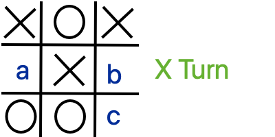
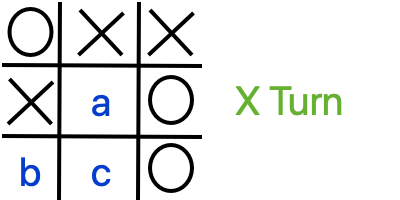
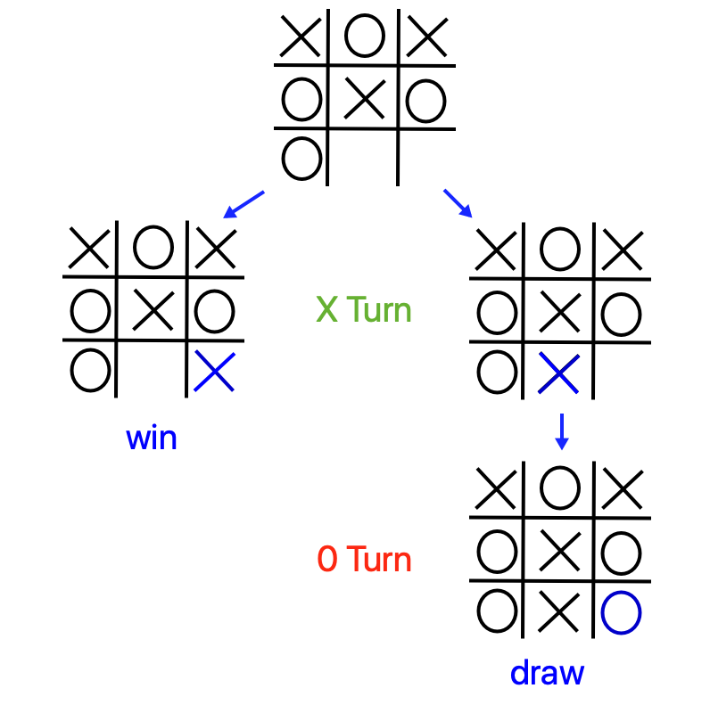
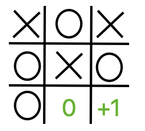
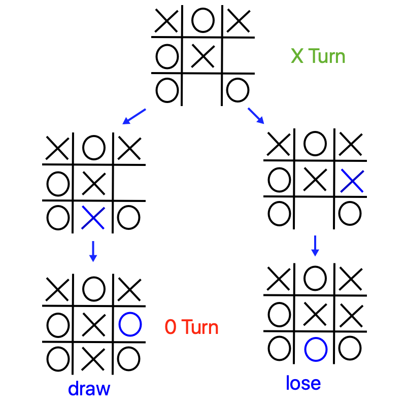
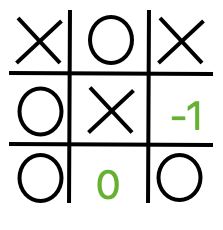
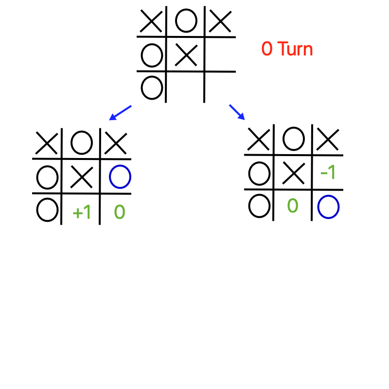
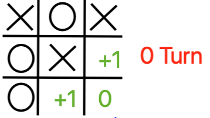
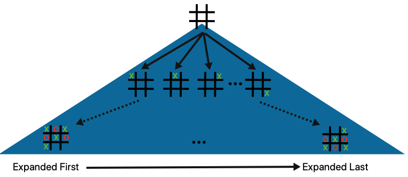
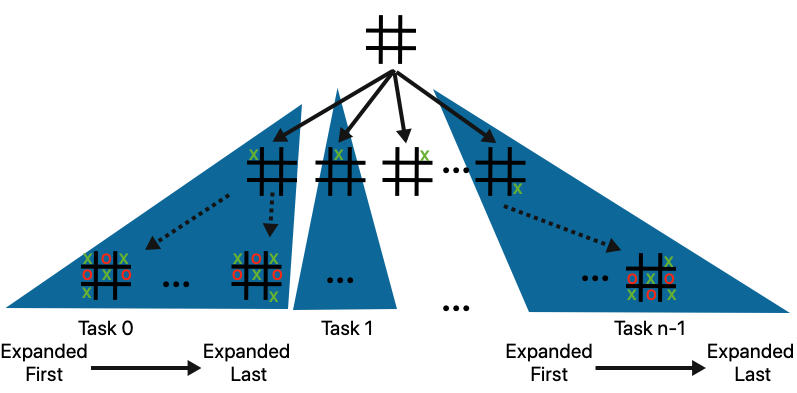

5.1 AI Applications - Minimax Algorithm
----------------------------------------
**Author**: John Rieffel, Union College

**To Cite**:

Rieffel, John. "AI Applications - Minimax Algorithm". *PDC for Beginners*, 
edited by CSinParallel. 2022. Available Online.
`https://doi.org/10.55682/AOPD4880 <https://doi.org/10.55682/AOPD4880>`_

5.1.0 Introduction
^^^^^^^^^^^^^^^^^^^

..
    Useful syntax guide: https://sublime-and-sphinx-guide.readthedocs.io/en/latest/images.html 

In many ways, the progress of Artificial Intelligence research can be measured
through the history of human-competitive game play.  In 1994, an AI called "Chinook"
defeated checkers champion Marion Tinsley. In 1997, IBM's Deep Blue defeated
Gary Kasparov in a six-game match.  In 2017, AlphaGo defeated Ke Jie, the world's 
top-ranked Go player, earning the rank of 9 dan.  

At the heart of these AI milestones is a simple algorithm called Minimax that dates back to John von Neumann (1928), although Claude Shannon (1950) is often given credit for recognizing its applications to games like chess.  Minimax is an optimal strategy for deterministic two-player zero-sum games of perfect information.  

.. note::  **Deterministic** means that there are no random events like dice that determine the state of the game.  **Zero-sum** means that there is only one winner (such that both players' final scores add up to zero).  **Perfect** **Information** means that both players can see all the pieces in play (like chess or checkers), rather than keeping some information secret (like poker).

5.1.1 Example: Tic-Tac-Toe
^^^^^^^^^^^^^^^^^^^^^^^^^^^

The game of Tic-Tac-Toe (known as Naughts and Crosses in England) involves two
players, designated by their respective marks,  "X" and "O".  Each player takes
turns placing  their mark an empty spot within a 3x3 board.  "X" typically goes
first. The first player to have three marks in a row horizontally, vertically or
diagonally wins.   A draw occurs if there are no empty spaces an no player has
won.  

Tic-Tac-Toe is determinstic because there is no element of chance.  It has
perfect information because both players can see the board at all times.  And it
is zero-sum because if one player wins, the other loses.  We can think of
winning as awarding +1 point, and losing penalizing -1 points (and so the sum of
both player's scores will always be zero).  Maximizing your score is therefore the same thing as minimizing your opponent's score.

Here's a board, let's say you're player X, where would you go to win?

.. mchoice:: ttt-ex-0
   :answer_a: a 
   :answer_b: b
   :answer_c: c
   :correct: c
   :feedback_c: Right! The best move is the lower right corner, creating 3 in a row!

   Which square should X play in to win? 

Here's another board - where should you move to maximize your score?

.. mchoice:: ttt-ex-1
   :answer_a: a 
   :answer_b: b
   :answer_c: c
   :correct: a
   :feedback_a: That's right - you can't win, but if you play in the middle square you can at least keep your opponent from winning - so forcing a draw maximizes your score.

   Which square should X play to maximize their score? 

5.1.2 Minimax Tree Search
^^^^^^^^^^^^^^^^^^^^^^^^^^^

Now let's introduce the minimax strategy using Tic-Tac-Toe.   The basic idea is to always make the move that maximizes your score (or minimizes your opponent's score).   But how do you know, at your very first move, which move will maximize your score?  You have to use *depth-first-search* to begin to explore the game tree (all possible moves in the game).  Each distinct board in the tree is called a "Node", and there are two types of nodes -- when it is X's turn to play (call these "maximizing nodes" because they are trying to maximize X's score) and when it is O's turn (call these "minimizing nodes" because they are trying to minimize X's score.  To simplify, let's call player X "Max", and player Y "Min".

Let's build this tree from the bottom up.  During depth first search, once you reach a terminal node (a board resulting a win, lose or draw), you can replace that node wih the corresponding score (1, -1, or 0).  When have explored and scored all of a non-terminal node's subtrees, you just need to pick the maximum score of its children (if a maximizing node) or the minimum score (if a minimizing node).  Once we've done this, our algorithm can "forget" the children.

.. note:: A **terminal** node is one at the bottom of the tree, like a leaf.  a **non-terminal** node is one that has children.  In the context of Tic-Tac-Toe, a winning, losing, or tied board is terminal, and all other boards are non-terminal because there are still moves that can be made.

Here for instance is a Max node, with two possible moves - one results in a win (+1), and the other in a draw (0).  Naturally Max will want to make the winning move - so we can score this board as a +1.

Here is the choice redrawn with the scores at the leaf nodes "percolated" up to the top.

Here however is another Max node with two possible moves - one results in a loss (-1) and the other a draw.  Seeking to maximize their score, Max will choose the move that produces a draw.  So we can score this board as a 0.

Again, here is the choice redrawn with the scores at the leaf nodes "percolated" up to the top.

We can now move up to the previous board - which is a Min node.  If Min has a choice between making a move that leads to a +1 node for Max and a move that leads to a 0 for Max, they'll choose the 0, because that minimizes Max's score.

And again with the scores percolated up.  Note that the maximizing node (Player X) will always pick the highest scoring move.  

Finally here's a look at how the whole game tree might be explored by a single depth-first process.   Presuming we expand moves from the left to the right from any given board, we'll also be exploring child nodes from the left to the right.

5.1.3 Minimax with Serial Depth First Search
^^^^^^^^^^^^^^^^^^^^^^^^^^^^^^^^^^^^^^^^^^^^

Now that we have the basic mechanics, we can explain the how to search the whole game tree, starting at a given move, to pick the optimal move.  This tree search is particularly amenable to recursive depth first search, because once we score a terminal node, and pass its value to the parent, we can forget about it.

The pseudocode for this algorithm (technically called Negamax) is as follows:

.. code-block::

    //assume max is player 1
    //and min is player -1
    int Minimax(node,player)
        if (node is terminal):
            return player*score(node)
        else
            score <- -inf
            for each child of node:
                childscore<- -1*Minimax(child,-1*player)
                score <- max(score,childscore)
            return score

5.1.4 Parallelizing Depth-First Search 
^^^^^^^^^^^^^^^^^^^^^^^^^^^^^^^^^^^^^^

A parallel implementation is now fairly straightforward: when it is the computer's turn we use a parallelized for loop to distribute subtrees generated by legal moves across tasks, and then each thread then performs its own recursive minimax on its respective subtrees. Each task needs its own private copy of the board.  The score and bestmove variables are shared, however, and so when each thread updates these it has to do so in a critical section. 

.. (There may be fancier ways to do this with reductions).

A diagram is shown below:

And psuedocode:

.. code-block::

    void ParallelDFS(board) 
        bestmove <- -1;
        score <- -2;
        //distribute legal move subtrees across tasks
        parallel for every legal move
            newboard <- make_move(board,move)
            //have each task do DFS on its subtree
            tempScore <- minimax(newboard)
            if(tempScore > bestscore) 
                     //assuming these variables are shared
                     bestscore <- tempScore 
                     bestmove = move

5.1.5 Programming Implementations
^^^^^^^^^^^^^^^^^^^^^^^^^^^^^^^^^^

We'll now explore the code implementations for the serial and parallel approaches.

.. note:: Links to source code for these examples is provided at the end of the chapter. 

Serial Implementation
^^^^^^^^^^^^^^^^^^^^^^^^^^^

Here's how we would implement the minimax function serially in C (download the `full code here <https://www.learnpdc.org/PDCBeginners/furtherAvenues/code/ttt-serial.c>`_).  The board is a 1x9 array of integers whose values correspond to player pieces (0 is empty).  The for loop iterates through all possible legal moves, keeping track of the best move it has found along the way.  By using the value 1 to correspond to the maximizing player, and -1 to correspond to the minimizing player allows us to negate scores when passed from a min node to a max node (and vice versa).

.. literalinclude:: code/ttt-serial.c
  :language: c
  :lines: 49-75

OpenMP Implementation
^^^^^^^^^^^^^^^^^^^^^^^^^^^

In this OpenMP implementation (`download here <https://www.learnpdc.org/PDCBeginners/furtherAvenues/code/ttt-omp.c>`_) we distribute subtrees of legal moves cyclicly across all threads.  A complication of this is that we need to make a private copy of the 9x9 board for each thread.   Dynamic scheduling allows the first idle thread to pick up the next legal move.  We need a critical section at the point where the threads compare their current move against the global best move.  

.. (This could probably also be accomplished using a reduction clause, like in the MPI implementation below). 

.. literalinclude:: code/ttt-omp.c
  :language: c
  :lines: 80-108

MPI Implementation
^^^^^^^^^^^^^^^^^^^^^^^^^^^

Our MPI implementation is very similar, although like all distributed memory applications we don't need to worry about shared variables or critical sections.

Specifically, to calculate the computer's next move we broadcast the current state of the board to all worker nodes.  If there are `p` nodes, then each node uses a for loop to iterate through every `pth` legal move, and calls minimax on the corresponding subtree.

.. are there consistent terms in the book for worker nodes, for COMM_SIZE, etc?

.. code-block::

    void computerMove(int * board, int rank, int p) {
        int move = -1;
        int score = -2;
        MPI_Bcast(board,BOARDSIZE,MPI_INT,0,MPI_COMM_WORLD);
        for(int i = rank; i < BOARDSIZE; i += p) {
            if(board[i] == 0) {
                board[i] = 1;
                int tempScore = -minimax(board, -1);
                board[i] = 0;         
                if(tempScore > score) {
                    score = tempScore;
                    move = i;
                }
            }
        }
        int local_best[2] = {score, move};
        int global_best[2];
        MPI_Reduce(local_best,global_best,1,MPI_2INT,MPI_MAXLOC,0,MPI_COMM_WORLD);
        if (rank == 0) {
            board[global_best[1]] = 1;
        }
    }
   

5.1.6 Further exploration
^^^^^^^^^^^^^^^^^^^^^^^^^^^^

Code Links:

.. * `ttt-serial.c <https://www.learnpdc.org/PDCBeginners/furtherAvenues/code/ttt-serial.c>`_
.. * `ttt-omp.c <https://www.learnpdc.org/PDCBeginners/furtherAvenues/code/ttt-omp.c>`_

* :download:`ttt-serial.c <./code/ttt-serial.c>`

* :download:`ttt-omp.c <./code/ttt-omp.c>`

.. 
    Notes:
    * figures for parallel implementation
    * visualization of what tasks are doing.
    * ask questions
    * take a look at SPMD pattern https://pdcbook.calvin.edu/PDCBeginners/sharedMemory/firststeps.html
    * look at https://pdcbook.calvin.edu/PDCBeginners/messagePassing/improve.html for scatter/gather
    * Ask questions like https://pdcbook.calvin.edu/RaspberryPi-mpi4py/03Decomposition/02parallelLoopEqualChunks.html#explore-the-code
    * include download links
