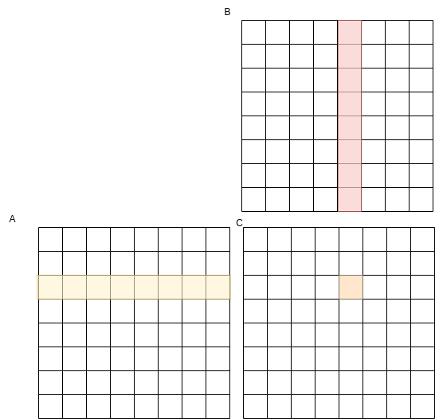
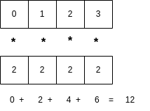
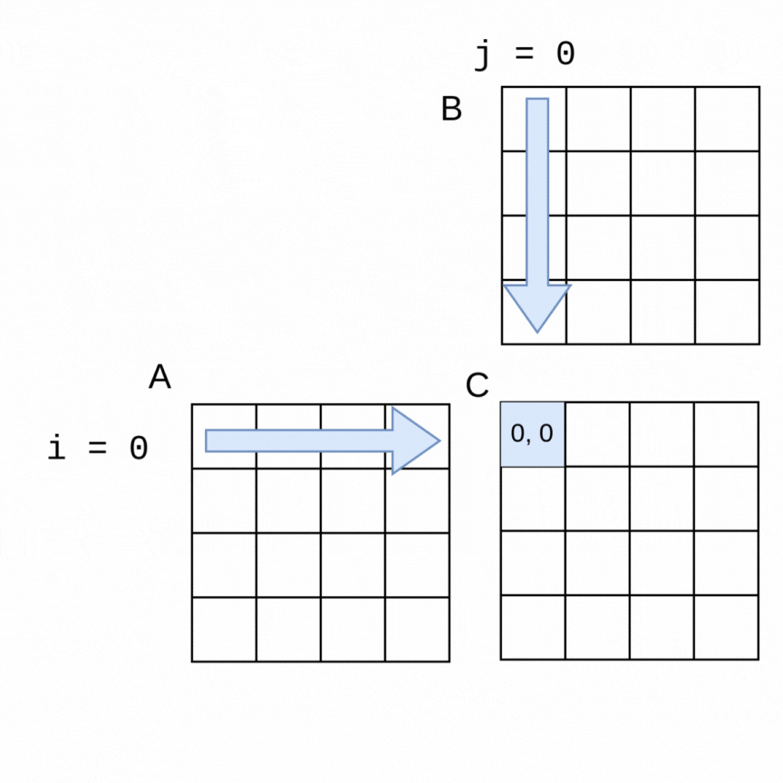
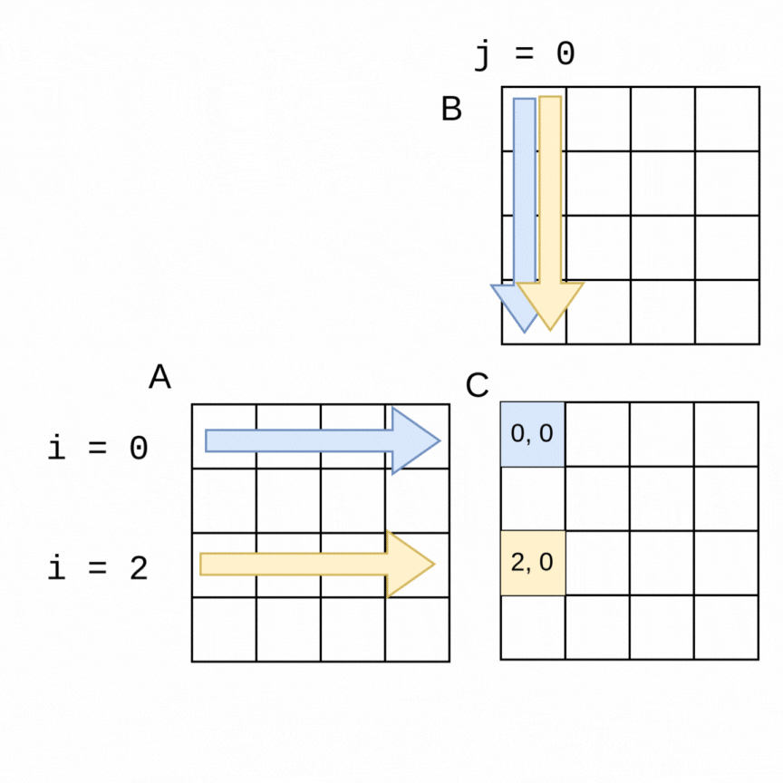
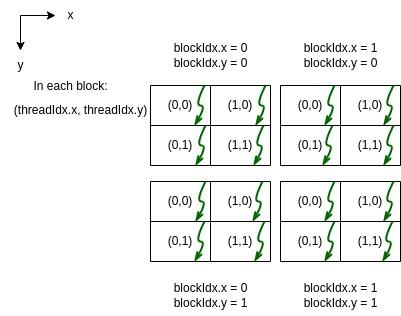
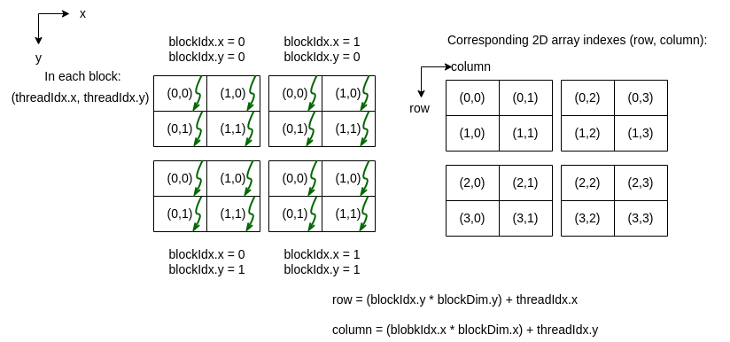
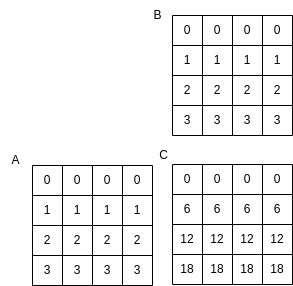

5.2 Matrix Multiplication
--------------------------

Let's look at a computationally expensive example that forms the basis of all AI deep learning applications: multiplying matrices. A matrix is a 2D data structure consisting of rows and columns. For example, here is a matrix named A with 8 rows and 8 columns:

We number the cells in a matrix with a row and column number, starting from 0, such that the upper left cell is 0,0 and the bottom right is 7,7 for the above matrix.

To understand matrix multiplication, we will now move to conceptually think in 2D with matrices like this. We use the word conceptually because we will see at the lowest level that data will be stored as 1D arrays.

Getting the code for these examples
^^^^^^^^^^^^^^^^^^^^^^^^^^^^^^^^^^^^

The code for these examples is in a `GitHub repo for the CSInParallel Project <https://github.com/csinparallel/CSinParallel>`_. The code is inside a folder called **CUDABeginners**. When you see filename paths for code shown in this chapter, they are in relation to the CUDABeginners folder.

All the code examples have a makefile in each subfolder.

Software needed: HPC SDK from NVIDIA (`download here <https://developer.nvidia.com/hpc-sdk-downloads>`_). We recommend this for Linux and Windows machines (sadly, NVIDIA seems to be unable to support Macs any longer). Find information about installing this on the `NVIDIA HPC SDK Documentation page <https://docs.nvidia.com/hpc-sdk/index.html>`_.

The problem
^^^^^^^^^^^

There is a mathematical algorithm for multiplying two matrices, A and B, and creatng a matrix C. We can picture it like this:

Where each cell in C is computed as a dot product of a row in A by a column in B.

So we can treat each row in A as a vector and each column in B as a vector. Suppose we have two vectors of length 4. The dot product produces a single value and is visualized as follows:

Multiply each element at position i in the first vector by the element at position i in the second vector, then add to an accumulated sum, creating a single value. Some example code for this dot product is a for loop like this:

.. code-block:: c

    float tmp = 0.;
    for (int k = 0; k < size; ++k) {
        tmp += A[k] * B[k];
    }

This forms the basis for the matrix multiplication algorithm, where we will perform dot products per row in matrix A and column in matrix B, placing the single result value in the cell at the row, column of matrix C.

A simple sequential algoirthm for square matrices of width and height size is as follows:

.. code-block:: c

    for (int i = 0; i < size; ++i) {   // over row of A
     for (int j = 0; j < size; ++j) {  // over column of B
       float tmp = 0.;
       for (int k = 0; k < size; ++k) {   // the dot product
          tmp += A[i][k] * B[k][j];
       }
       C[i][j] = tmp;
     }
   }

.. note::
    Look at the above example carefully. As a conventional sequential algorithm, if N is the length of the side of a square matrix (variable size above), the running time of this algorithm is O(N\ :sup:`3`).

Implementations
^^^^^^^^^^^^^^^^^^

Because this algorithm is O(N\ :sup:`3`) in the sequential case, its running time gets very long as N increases. For example, each time we double the size of the rows and columns of the input matrices, it takes 8 times as long to finish because of the three nested loops shown above. We will examine how we can use shared memory multicore parallelism and CUDA GPU programming to make this application faster.

Array storage: flattened
=========================

In C, an efficient way to store a square 2D array whose size of each row and column may vary is to dynamically allocate the space for it as a single array of length size*size.

For a deeper discussion of this, please refer to `section 2.5.2 of the Dive into Systems book <https://diveintosystems.org/book/C2-C_depth/arrays.html#_dynamically_allocated_2d_arrays>`_ (method 1 is what we will use in our code).

In all of our implementations, we therefore declare our matrices as pointer to float, like this:

.. code-block:: c

   float * A;  // input matrix
   float * B;  // input matrix
   float * C;  // output matrix

For the sequential and OpenMP versions, we create our matices as follows, with either a default size or one that the user has overidden on the command line:

.. code-block:: c

   size_t num_elements = size * size * sizeof(float);
   A = (float *)malloc(num_elements);
   B = (float *)malloc(num_elements);
   C = (float *)malloc(num_elements);

For CUDA programming, this memory layout is required and we can use managed data like this:

.. code-block:: C

    size_t num_elements = size * size * sizeof(float);
    cudaMallocManaged(&A, num_elements);
    cudaMallocManaged(&B, num_elements);
    cudaMallocManaged(&C, num_elements);
    cudaCheckErrors("allocate arrays in unified memory");

Each row is stored inside this contiguous memory array one after the other. Accessing any element at cell of row i, and column j of an array A whose row and column length is size can be done like this:

.. code-block:: C

    A[i*size + j]

Look for this method of access in the full code examples, when filling the arrays with sample data and when performing the matrix multiplication.

Sequential version
==================

Here is a visualization of the order in which rows of a 4x4 matrix A and columns of a 4x4 matrix B are used to generate each of the elements in a 4x4 matrix C:

The sequential algorithm completes the elements of C in the order shown, row by row from left to right. The sequential version of the method to perform the multiplication using *flattened* arrays for A, B and C is shown below.

Filename: *5-MatrixMultiply-CUDA/mm-serial.c*

.. literalinclude:: code/mm/mm-serial.c
  :language: c
  :caption: Matrix Multiply (serial version)
  :lines: 73-86

The full code for the sequential program will appear later, along with an explanation of running all three versions.

OpenMP version
===============

The nature of this algorithm, which calculates cell values row-by-row and idenpendently of each other, lends itself very nicely to be parallelized. The values in the rows of A and the columns of B are only being read from, and each dot product calculation can be done independently- the order of the sequential algorithm's computations is not necessary.

As an example of how we can use parallelism, suppose we chose two threads to compute the above example of the 4x4 matrices. In the following visualization, a thread 0 can be computing the blue values at the same time that thread 1 is computing the yellow values. It is easy to see how if the parallelization goes well, the work should get done in about half the time as the sequential version, with thread 0 computing the top half of the matrix C (rows 0, 1) and thread 1 computing the lower half (rows 2, 3).

The code change is quite straightforward to accomplish this with an OpenMP pragma. Note in the following code that the outer loop is the one that is looping over the rows of A, so we place the pragma just above that loop. OpenMP will split the work as shown in the above visualization. This still works with larger matrices and more threads- OpenMP will split the work into consecutive rows as evenly as possible between threads.

Filename: *5-MatrixMultiply-CUDA/mm-omp.c*

.. literalinclude:: code/mm/mm-omp.c
  :language: c
  :caption: Matrix Multiply (OpenMP shared memory version)
  :lines: 76-90

.. note::
    A key to ensuring the correctness of this example is to make certain that the variable called *tmp* is **private for each thread**. This way each thread can complete the dot product it is working on in its own copy of tmp. This is ensured by declaring this variable inside the loop.

For review of some concepts from shared memory in Chapter 1, try answering the following questions. Don't worry about whether you are right the first time- these just help you reinforce some useful concepts.

.. mchoice:: mm_mc_1
    :correct: b
    :answer_a: Task parallelism
    :answer_b: Data parallelism
    :answer_c: Neither
    :feedback_a: Incorrect. Remember that in task parallelism, each thread is performing something different. 
    :feedback_b: Correct! In this example, each thread is performing the same task on a different unit of memory.
    :feedback_c: Actually, it is one of the options listed!

    Refer back to Chapter 1, section 1.1.3 if you've forgotten what we mean by data parallelism and task parallelsim. Is this solution an example of data parallelism or task parallelism? 

.. mchoice:: mm_mc_2
    :correct: c
    :answer_a: To avoid a race condition
    :answer_b: To make the code run faster
    :answer_c: Both
    :feedback_a: This is mostly correct- each thread is writing its own value into this variable, so each thread needs its own copy instead of a shared one. However, it turns out that it is useful to use that variable for another reason: there will be fewer writes to the array C if we compute the dot product first and then write the final value once.
    :feedback_b:  In this example, each thread is writing to a different cell in array C over and over for its dot prodcut computation, so you noticed that it would be more efficient to use that tmp variable and eliminate some contention for writing to array C. However, once we use tmp like this, we then must ensure that it is private to avoid a race condition.
    :feedback_c: Yes! In this example, each thread is writing to a different cell in array C over and over for its dot prodcut computation, so it is more efficient to use that tmp variable and eliminate some contention for writing to array C. However, once we use tmp like this, we then must ensure that it is private to avoid a race condition.

    Why do we use the private variable tmp in the code above? 

CUDA version
============

As we saw in the CUDA chapter, one model for CUDA GPU programming is to use one thread for every data element you are computing. In this case, that means setting up a grid of thread blocks to match these 2D matrices. We can then envision that every cell in matrix C can be computed at the same time with different threads.

Before we delve inro the amtrix multiply example in CUDA, let's first look at a demonstration of how we can set up a 2D grid of 2D blocks of threads in CUDA.

CUDA: Setting up 2D grid of 2D blocks of threads
=================================================

The following example creates a 2 dimensional grid of blocks that are 2 dimensional:

Filename: *1-basics/1.2-dim3/dim3Demo2D2D.cu*

.. literalinclude:: code/mm/dim3Demo2D2D.cu

The execution of this example program, called dim3Demo2D2D, looks like this:

.. code-block:: bash

    Grid Dimensions : {2, 2, 1} blocks. 
    Block Dimensions : {2, 2, 1} threads.
    From each thread:
    I am thread (0, 0, 0) of block (0, 1, 0) in the grid
    I am thread (1, 0, 0) of block (0, 1, 0) in the grid
    I am thread (0, 1, 0) of block (0, 1, 0) in the grid
    I am thread (1, 1, 0) of block (0, 1, 0) in the grid
    I am thread (0, 0, 0) of block (1, 1, 0) in the grid
    I am thread (1, 0, 0) of block (1, 1, 0) in the grid
    I am thread (0, 1, 0) of block (1, 1, 0) in the grid
    I am thread (1, 1, 0) of block (1, 1, 0) in the grid
    I am thread (0, 0, 0) of block (0, 0, 0) in the grid
    I am thread (1, 0, 0) of block (0, 0, 0) in the grid
    I am thread (0, 1, 0) of block (0, 0, 0) in the grid
    I am thread (1, 1, 0) of block (0, 0, 0) in the grid
    I am thread (0, 0, 0) of block (1, 0, 0) in the grid
    I am thread (1, 0, 0) of block (1, 0, 0) in the grid
    I am thread (0, 1, 0) of block (1, 0, 0) in the grid
    I am thread (1, 1, 0) of block (1, 0, 0) in the grid

The code and the program output can be visualized as follows (z values not shown for this 2D case):

.. note::
    Note that in the program output above the output from the threads did not print in the order shown in the diagram (the upper left block of threads printed 3rd). This is an occurance you may recognize by now: there isn't a guaranteed ordering of when each thread will finish and print its results. 

CUDA: mapping the threads to a matrix of data elements
=======================================================

Now that we see how the threads in a 2D grid of 2D blocks are given values for threadIdx.x, threadIdx.y,  blockIdx.x, and blockIdx.y, we can envision mapping those threads onto a 2D array like this:

CUDA was designed so that the calculations for the row and column values for a matrix cell can be easily calculated as shown above and in the following sample code, which illustrates the mapping of a thread to a 2D array location.

Filename: *1-basics/1.4-2DArrayMapping/printThreads-to-2DArray.cu*

.. literalinclude:: code/mm/printThreads-to-2DArray.cu
    :lines: 27-58

This code forms the basis of how we will assign threads to work on each matrix of matrix multiply. Here is the output from the program:

.. code-block:: bash

    Host calls: 2x2 grid of 2x2 blocks of 4 threads each
    2D grid of blocks
    block (1, 1) thread (0, 0) maps to (2, 2) of array
    block (1, 1) thread (1, 0) maps to (2, 3) of array
    block (1, 1) thread (0, 1) maps to (3, 2) of array
    block (1, 1) thread (1, 1) maps to (3, 3) of array
    block (0, 1) thread (0, 0) maps to (2, 0) of array
    block (0, 1) thread (1, 0) maps to (2, 1) of array
    block (0, 1) thread (0, 1) maps to (3, 0) of array
    block (0, 1) thread (1, 1) maps to (3, 1) of array
    block (0, 0) thread (0, 0) maps to (0, 0) of array
    block (0, 0) thread (1, 0) maps to (0, 1) of array
    block (0, 0) thread (0, 1) maps to (1, 0) of array
    block (0, 0) thread (1, 1) maps to (1, 1) of array
    block (1, 0) thread (0, 0) maps to (0, 2) of array
    block (1, 0) thread (1, 0) maps to (0, 3) of array
    block (1, 0) thread (0, 1) maps to (1, 2) of array
    block (1, 0) thread (1, 1) maps to (1, 3) of array

Note once more that the order of completion of each thread does not map to left-to-right and top-to-bottom ordering of the 2D array indices. Since an ordering is unnecessary for correctness of this application, we will be able to use this type of mapping.

Complete Matrix Multiply code 
^^^^^^^^^^^^^^^^^^^^^^^^^^^^^^^

Each of the tabs below contain one of the three versions of the complete matrix multiply example. As you study them, note the following coding practices that are built into them:

- There is a way to print out the results to verify that the code is correct. You will want to do this with 4x4 or 8x8 matrices, but not much more. There is a description of how to do this below.

- There is also a function for verifying whether the last row of the resulting matrix C is correct, given the following particular way that Matrix A and B were filled with values: row 0 is filled with 0.0, row 2 is filled with 2.0, row 3 is filled with 3.0, etc.

- There are command line arguments for the size of the rows and columns of the square matrix, so you can experiment with different problem sizes.

- For the OpenMP version, there is a command line argument for the number of threads to use (default is 1).

- Except for the small debugging cases of 4x4 and 8x8, the CUDA version uses 16x16 blocks of 256 threads. This means that the size of the rows and columns of the square matrices need to be chosen carefully so that the size is a multiple of 16 and 256. To ensure this, we will suggest trying sizes that double starting from 256: 256, 512, 1024 2048, 4096, 8192. There is also a test to be certain that a proper size has been input on the command line.

- Timing of the code is built into each version so that we can compare them. We always want to do this when studying parallel code examples so that we can see how well our implementations are working.

.. tabbed:: tab-mm-ex

    .. tab:: Sequential version

        Filename: *5-MatrixMultiply-CUDA/mm-serial.c*

        .. literalinclude:: code/mm/mm-serial.c
            :language: c

    .. tab:: OpenMP version

        Filename: *5-MatrixMultiply-CUDA/mm-omp.c*

        .. literalinclude:: code/mm/mm-omp.c
            :language: c

    .. tab:: CUDA version 

        Filename: *5-MatrixMultiply-CUDA/mm-um.cu*

        .. literalinclude:: code/mm/mm-um.cu
            :language: c

Building the code
^^^^^^^^^^^^^^^^^

The folder called *5-MatrixMultiply-CUDA* contains three versions of the matrix multiply code:

1. mm-serial.c, the serial, or sequential version.
2. mm-omp.c, the openMP version.
3. mm-um.cu, the CUDA version that uses unified memory (managed data).

There is a Makefile included that you should be able to use by simply typing *make* when you are in the directory/folder. It's output looks like this:

.. code-block:: bash

    $ make
    gcc -std=c11 -o mm-serial mm-serial.c -fopenmp -lm
    nvcc -arch=native -o mm-cuda-um mm-um.cu 
    gcc -std=c11 -o mm-omp mm-omp.c -fopenmp -lm

Note that after this we have three executable programs for serial, openMP, and CUDA respectively:

1. mm-serial
2. mm-omp
3. mm-cuda-um

Experimenting with the programs
^^^^^^^^^^^^^^^^^^^^^^^^^^^^^^^^  

In this section we will demonstrate a "way of work" that helps us ensure correctness of our parallel applications and how we can explore how well the program **scales** when we ncrease the **problem size**. In this case, we can consider the problem size to be the number of rows and columns of the square matrix.

First, verify correctness
============================

In the CUDA chapter we introduced the concept of verifying whether the results we compute using a parallel implementation are what we expect. Sometimes we can do this by comparing the results from a sequential version known to be correct to the results from  the parallel version we are implementing, each with the same input. In the case of this example code above, we've chosen a couple of other tactics:

1. Like the CUDA chapter, there is a function called *verifyCorrect* that does a check of some of the values in the result matrix. We can do this knowing how the input matrices A and B were populated. Observe this function and convince yourself that the dot product for the last row is being calculated and compared to the value of each cell in that last row of the matrix.

2. There is a flag that can be entered on the command line so that one input matrix and the result will be printed. This is only useful when you choose small matrices. For example, here is what a matrix C should look like for the inputs A and B that are populated by filling each row with a number that is the value of the row number:

Note that each element in row 2 of C is computed using this dot product that we used before as an example:

Here is how we try verifying this small case for the sequential version:

.. code-block:: bash

    ./mm-serial 4 1

The first argument is the size of each row and column, so in this case 4 elements per row and column, which will give us A and B as shown above. The second argument is indicating that we want verbose output, so that the arrays will print. The default if this is not used is to not print the results.

The result of running this is as follows (note that it matches the picture above):

.. code-block:: bash

    size of matrix side: 4
    matrix rows, cols = 4
    matrix A after filling: 
    element [0][0] = 0.000000 
    element [0][1] = 0.000000 
    element [0][2] = 0.000000 
    element [0][3] = 0.000000 
    element [1][0] = 1.000000 
    element [1][1] = 1.000000 
    element [1][2] = 1.000000 
    element [1][3] = 1.000000 
    element [2][0] = 2.000000 
    element [2][1] = 2.000000 
    element [2][2] = 2.000000 
    element [2][3] = 2.000000 
    element [3][0] = 3.000000 
    element [3][1] = 3.000000 
    element [3][2] = 3.000000 
    element [3][3] = 3.000000 
    matrix C after MatrixMult():  
    element [0][0] = 0.000000 
    element [0][1] = 0.000000 
    element [0][2] = 0.000000 
    element [0][3] = 0.000000 
    element [1][0] = 6.000000 
    element [1][1] = 6.000000 
    element [1][2] = 6.000000 
    element [1][3] = 6.000000 
    element [2][0] = 12.000000 
    element [2][1] = 12.000000 
    element [2][2] = 12.000000 
    element [2][3] = 12.000000 
    element [3][0] = 18.000000 
    element [3][1] = 18.000000 
    element [3][2] = 18.000000 
    element [3][3] = 18.000000 

    Total omp runtime 0.000077 seconds (0.077456 milliseconds)
    max error of last row matrix C values: 0.000000

Note that the output from the *verifyCorrect* function is given in the last row of the output, telling us there was no difference between the values computed by matrix multiply and what we would expect by doing an indpendent calculation.

The OpenMP version of this code takes another command line argument as the second argument: number of threads. The third argument is now the verbose flag. To test the parallelism is correct, run this version with 2 threads like this:

.. code-block::

    ./mm-omp 4 2 1

The output should tell you that you used 2 threads and should produce the same results for matrix C.

The CUDA version is run like the sequential version, since the number of threads needed is computed within the code. Here is an example for running it:

.. code-block::

    ./mm-cuda-um 4 1

Now that we can visually see that the output is correct, we can move forward with some experiments to study how these versions perform. Note that even when we do not use the verbose flag, we are still doing the first mode of verification, using the *verifyCorrect* function for the larger problem sizes that we will now use.

Next, explore program performance
==================================

The reason for using parallelization in an application like this is so that we can run larger and larger examples in a reasonable amount of time. We call this being able to **scale** a problem. This matrix multiply problem is an ideal case for for applying parallelism to increase its scalability because:

- The sequential version is O(N\ :sup:`3`) (see note above in problem statement), making even a modest example take quite a long time (we will try this below).

- As we saw in the explanations of the OpenMP and CUDA versions, the computations of each cell value in the output matrix C are independent, so that for OpenMP, multiple threads can be working on separate cells in a set of rows, and for CUDA, as many threads as possible can be working on each cell.

Now we will illustrate how to experiment with these versions to see how they can provide scalability.

**First, verify the runtime of the sequential version.** 

Because we have timing built into these code versions, we can verify that this algorithm is indeed O(N\ :sup:`3`) for the sequential case. To do this, try these cases:

.. code-block:: bash

    ./mm-serial 256
    ./mm-serial 512
    ./mm-serial 1024

Each one of these takes 8 times longer than the previous one. Each problem size (256, 512, 1024) is twice the size of the previous one. This means that the triple-nested loop is doing O(2\ :sup:`3`), or 8 times as many computations as the previous one.

By 1024 you may already not like waiting for this program to complete. We have, however, verified the O(N\ :sup:`3`) runtime of this program by using timing as a direct experimental method.

.. note::
    Throughout our studies of parallel code implementations, taking these timings is a key component of our work. We need to be sure whether changes we make speed the code up and by how much.

**Second, examine the speedup of the OpenMP version.** 

In an ideal case, if we use 2 threads in the shared memory OpenMP implementation for a particular problem size, the time should be half of the sequential version. We can extend this idea: 4 threads should take one fourth of the time, eight threads one eighth, and so on. Another easy way to think of this is that for each set of threads 2, 4, 8, and 16, if there is little overhad and contention for resources among the threads, the time for each should be roughly half of the previous time. Let's try this out by running these cases:

.. code-block:: bash

        ./mm-omp 1024 1
        ./mm-omp 1024 2
        ./mm-omp 1024 4
        ./mm-omp 1024 8
        ./mm-omp 1024 16

The speedup for this code is computed as the sequential time, or time for one thread, divided by the parallel time. Ideally, if the threads do not contend for resources on the machine, using  2 threads would take half the time of using one, and the speedup would be 2. This follows for 4 threads: ideally its speedup would be 4, and for 8 threads, it would be 8, etc.

In this small bit of Python code below, you can enter the times in milliseconds you got for 1 thread, 2, 4, 8, and 16 into the times array. Then when you run it, the speedup for 2, 4, 8, and 16 threads will be printed in order from the speedup array in this code.

.. activecode:: mm_omp_speedup
   :language: Python
   :caption: Calculate Speedup

   #lists holding measured times (floating point)
   #TODO: Fill in array below (code will not compile otherwise!)
   #        1 2 4 8 16
   times = [ , , , , ]
   
   #compute speedup
   speedup  = [round(times[0]/times[i],2) for i in range(1,5)]

   print("speedup values:")
   print(speedup)

.. note::
    What you should observe about the ability to obtain ideal speedup is that it diminishes as the number of threads increases. On many current CPUs with 8 cores or more, it may not pay to use many more than 8 cores for a particular problem, and it may even be less than 8 cores for some problem sizes.

For practice, you could try the above exrcise with different problem sizes (smaller than 1024, like 512, and larger, like 2048, but you'll need to be patient.)

When trying these examples, you may also notice some times are not consistent. We often take several time measurements and use the mean or the average, or even throw out a high and low value when experimenting and reporting on the speedup of an implementation.

**Third, demonstrate the power of manycore computing with CUDA.** 

This matrix multiply application works amazingly well on a manycore GPU device with CUDA. You just tried the OpenMP version to see that using a few cores to compute 'stripes' of the output matrix C in parallel helped improve the time to complete. Now let's see what happens when we use the GPU.

You can run the CUDA version, which uses unified memory, like this:

.. code-block:: bash

    ./mm-cuda-um 1024
    ./mm-cuda-um 2048
    ./mm-cuda-um 4096
    ./mm-cuda-um 8192

You should see that the CUDA version is tremendously faster. Because of this, we measure the speedup in a different way than we did for openMP, where we could see if the time was near ideal speedup and see when contention caused it to be less so. In the following Python code we show the way that the performance of GPU versions are often presented with two values:

- How many times faster the CUDA version is than the sequential version for a particular problem size.

- How many times faster the CUDA version is than the fastest openMP version for a particular problem size.

Try entering times in the code below for the problem size of 1024 elements in a row and column.

.. activecode:: mm_cuda_speedup
   :language: Python
   :caption: Calculate Speedup

   #
   #TODO: Fill in values below in milliseconds for
   #  serial/sequential time for a certain problem size
   #  best openMP time (for maximum cores available)
   #  CUDA time with given code
   #
   # typical values are given- run and fill in your own.
   #
   serial_time = 8100.0
   openMP_time = 900.0
   cuda_time = 7.0
   
   #compute speedup by comparing to serial/sequential and multicore

   speedup_serial = serial_time/cuda_time
   speedup_omp    = openMP_time/cuda_time

   print("speedup of cuda over sequential version: %5.2f" % speedup_serial)
   print("speedup of cuda over openMP version: %5.2f" % speedup_omp)

Scalability is good
^^^^^^^^^^^^^^^^^^^

For problems like this that are particularly well suited to GPUs, it is common to see the CUDA version be 1000 times faster than the sequential version, and 100 times faster than the multicore version. What this means is that with the GPU we can obtain **scalability**, enabling us to run much larger problem sizes than we care to wait for, even when using multicore. 

.. note::
    The important point here about this application is that we can get instantaneous results for problems that are far larger by using parallelism to eliminate the problem with the original serial method, which in this case is its O(N\ :sup:`3`) running time.

Future Considerations
^^^^^^^^^^^^^^^^^^^^^

Many factors go into the timings you obtain, so there are different ways that implementations like this can be explored.

- The amount of memory (main and cache for CPU, global and per SM for GPU) sometimes factors into the timings, though many modern machines have enough for pretty large sizes in this case. There are possible ways to improve these versions to maximize memory usage.

- More noteworthy is that we can use compiler optimization to make both the sequential and the openMP versions run faster. We will explore this in further books about PDC and GPU computing.

- It is also possible for some applications that we would need to determine the best grid and thread block combination to produce the fastest GPU times.

We have just gotten started with what can be explored with this and other applications, but you can already see the benefits of using parallelism.
