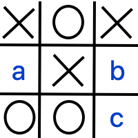
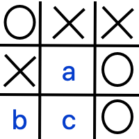

5.0 Introduction
----------------

Useful syntax guide: https://sublime-and-sphinx-guide.readthedocs.io/en/latest/images.html 

In many ways, the progress of Artificial Intelligence research can be measured
through the history of human-competitive game play.  In 1994, an AI called "Chinook"
defeated checkers champion Marion Tinsley. In 1997, IBM's Deep Blue defeated
Gary Kasparov in a six-game match.  In 2017, AlphaGo defeated Ke Jie, the world's 
top-ranked Go player, earning the rank of 9 dan.  

At the heart of these AI milestones is a simple algorithm called Minimax that dates back to John von Neumann (1928), although Claude Shannon (1950) is often given credit for recognizing its applications to games like chess.  Minimax is an optimal strategy for deterministic two-player zero-sum games of perfect information.  

.. note::  **Deterministic** means that there are no random events like dice that determine the state of the game.  **Zero-sum**ww means that there is only one winner (such that both players' final scores add up to zero).  **Perfect** **Information** means that both players can see all the pieces in play (like chess or checkers), rather than keeping some information secret (like poker).

5.1 Example: Tic-Tac-Toe
^^^^^^^^^^^^^^^^^^^^^^^^

The game of Tic-Tac-Toe (known as Naughts and Crosses in England) involves two
players, designated by their respective marks,  "X" and "O".  Each player takes
turns placing  their mark an empty spot within a 3x3 board.  "X" typically goes
first. The first player to have three marks in a row horizontally, vertically or
diagonally wins.   A draw occurs if there are no empty spaces an no player has
won.  

Tic-Tac-Toe is determinstic because there is no element of chance.  It has
perfect information because both players can see the board at all times.  And it
is zero-sum because if one player wins, the other loses.  We can think of
winning as awarding +1 point, and losing penalizing -1 points (and so the sum of
both player's scores will always be zero).  Maximizing your score is therefore the same thing as minimizing your opponent's score.

Here's a board, let's say you're player X, where would you go to win?

.. mchoice:: ttt-ex-0
   :answer_a: a 
   :answer_b: b
   :answer_c: c
   :correct: c

   Which square should X play in to win? 

Right! The best move is the lower right corner, creating 3 in a row!

Here's another board - where should you move to maximize your score?

.. mchoice:: ttt-ex-1
   :answer_a: a 
   :answer_b: b
   :answer_c: c
   :correct: a

   Which square should X play in to win? 

That's right - you can't win, but if you play in the middle square you can at
least keep your opponent from winning - so forcing a draw maximizes your score.

5.1 Minimax Tree Search
-----------------------

Now let's introduce the minimax strategy using Tic-Tac-Toe.   The basic idea is to always make the move that maximizes your score (or minimizes your opponent's score).   But how do you know, at your very first move, which move will maximize your score?  You have to use depth-first-search to begin to explore the game tree (all possible moves in the game).  Each distinct board in the tree is called a Node, and there are two types of nodes -- when it is X's turn to play (call these "maximizing nodes" because they are trying to maximize X's score) and when it is O's turn (call these "minimizing nodes" because they are trying to minimize X's score.  To simplify, let's call player X "Max", and player Y "Min".

Let's build this tree from the bottom up.  During depth first search, once you reach a terminal node (a board resulting a win, lose or draw), you can replace that node wih the corresponding score (1, -1, or 0).  When have explored and scored all of a non-terminal node's subtrees, you just need to pick the maximum score of its children (if a maximizing node) or the minimum score (if a minimizing node).  Once we've done this, our algorithm can "forget" the children.

.. note:: A **terminal** node is one at the bottom of the tree, like a leaf.  a **non-terminal** node is one that has children.  In the context of Tic-Tac-Toe, a winning, losing, or tied board is terminal, and all other boards are non-terminal because there are still moves that can be made.

Here for instance is a Max node, with two possible moves - one results in a win (+1), and the other in a draw (0).  Naturally Max will want to make the winning move - so we can score this board as a +1.

Here however is another Max node with two possible moves - one results in a loss (-1) and the other a draw.  Seeking to maximize their score, Max will choose the move that produces a draw.  So we can score this board as a 0.

We can now move up to the previous board - which is a Min node.  If Min has a choice choice between making a move that leads to a +1 node for Max and a move that leads to a 0 for Max, they'll choose the 0, because that minimizes Max's score.

5.1.3 Serial Implementation
^^^^^^^^^^^^^^^^^^^^^^^^^^^

Here's how we would implement this serially in C.

CodeLens

Note to self - CodeLens not supported for C, but can link to iframe generated by pythontutor's C visualizations.
.. code-block:: minimax_serial 
   ~~~~
   //minimax in a single recursive function
   // you call max if it is your move
   // and min if it is your opponent's move.
   int minimax(int * board, int player) {
        //How is the position like for player (their turn) on board?
        int winner = win(board);   //is the board a win?
        if(winner != 0) return winner*player; //base case

        int curbestmove = -1; //the best move possible
        int curbestscore = -2;//Losing moves are preferred to no move
        int i;
        for(i = 0; i < BOARDSIZE; ++i) {//For all moves,
            if(board[i] == 0) {//If legal,
                board[i] = player;//Try the move
                //    draw(board);
            //	    getchar();
                int thisScore = -1 * minimax(board, player*-1);
                if(thisScore > curbestscore) {
                    curbestscore = thisScore;
                    curbestmove = i;
                }//Pick the one that's worst for the opponent
                board[i] = 0;//Reset board after try
            }
        }
        if(curbestmove == -1) return 0;
        return curbestscore;
    }

5.1.4 Parallel Implementation
^^^^^^^^^^^^^^^^^^^^^^^^^^^^^

.. activecode:: minimax_omp
   :language: cpp

   ~~~~
   void computerMove(int * board, int nthreads) {
    int bestmove = -1;
    int score = -2;
    int i;
    //printf("computer move:\n");
    //draw(board);
    #pragma omp parallel num_threads(nthreads) 
    {
        int *privateboard = malloc(9*sizeof(int));
        memcpy((void *)privateboard,(void *)board,9*sizeof(int));

        #pragma omp for schedule(dynamic,1)
        for(i = 0; i < BOARDSIZE; ++i) {
            /*
           #pragma omp critical
            {
                printf("thread %d has ival %d\n",omp_get_thread_num(),i);
                draw(privateboard);
            }
            */
            if(privateboard[i] == 0) {
                privateboard[i] = 1;
                int tempScore = -minimax(privateboard, -1);
                privateboard[i] = 0;
                //i thought there was a way to do this with reductions, but not easily...
                #pragma omp critical
                if(tempScore > score) {
                     score = tempScore;
                     bestmove = i;
                }
            }
        }
    }
    //returns a score based on minimax tree at a given node.
    board[bestmove] = 1;

5.2 Further expoloration
------------------------

