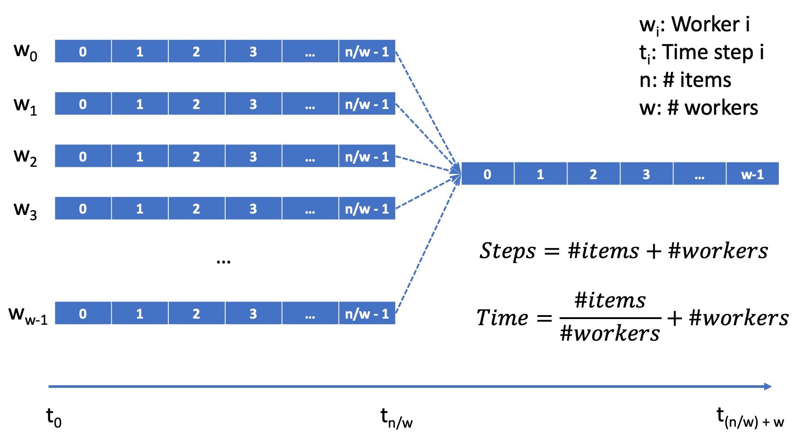
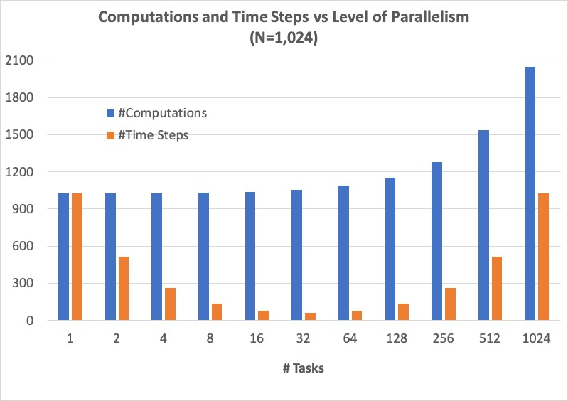

3.1 Parallel Selection
-----------------------

**Author:** Dorian Arnold, Emory University

**To Cite:**

Arnold, Dorian. "Parallel Selection". *PDC for Beginners*, edited by CSinParallel. 2022. 
Available Online. `https://doi.org/10.55682/BRPC5004 <https://doi.org/10.55682/BRPC5004>`_ 

..
  E-mail: dorian.arnold@emory.edu

3.1.1 The Selection Task
^^^^^^^^^^^^^^^^^^^^^^^^^^^^

..
  Crawling: Overview and Description

  #. Define selection problems:
     * Generalized problem definition: Finding kth element in a collection
     * Specialized version: Finding the global min (1st) or max (last) element in a collection
     * In this module, we use the specialized version for simplicity
  #. Unplugged activity video: Finding oldest coin!
  #. Conclude with a summarizing outline of the basic algorithmic steps

Have you ever had a set of items and needed to *select* a particular one based on its size or value compared to the others, for example, the tenth largest city in the world or the third richest person in a country?
Even more straightforward are versions of this problem where you are selecting an extreme value, for example,
the ripest watermelon in the patch, the carton of milk with the latest expiration date, or the oldest penny in a jar. In computing, we call this **The Selection Problem**. 

In this chapter, we focus on one specialized case of Selection, particularly *finding the smallest element*. (Hopefully, the extrapolation from smallest element to the smallest or largest :math:`k^{th}` element is readily imaginable.) After a general introduction, we formalize the problem and its serial (or sequential) solution. Then we identify opportunities to parallelize the serial solution and describe parallel solutions using two different multi-tasking approaches, namely multi-threading using OpenMP and multi-processing using MPI. We conclude the chapter with a discussion of things to consider when parallelizing an algorithm, including performance considerations.

Selection is a relevant task used for more complex nearness or proximity search tasks, like finding the shortest path between two nodes in a graph or finding the nearest neighbor of a node in a graph. Many important tasks that we perform all the time are based on proximity searches. For example, web search relies upon proximity search to identify documents that are closely related to given search terms. Proximity search is also fundamental to other applications like data compression, data mining, pattern recognition and even non-computer applications like delivery route scheduling and DNA analysis.

Serial Selection Unplugged
,,,,,,,,,,,,,,,,,,,,,,,,,,,,

The following video describes the Selection problem by walking through the example of finding the smallest marble from a jar (of unsorted marbles). We discuss the specific necessary steps as well as the problem's **time performance complexity**, which is the general concept of how long the problem takes as a function of the total number of elements (marbles in this case).

.. video:: serial_selection_unplugged
   :controls:
   :thumb: selection/selection-serial-tn.jpg

   https://www.learnpdc.org/archive/selection-serial.mov

Formal Definition
,,,,,,,,,,,,,,,,,,,

Formally in computing, the **general selection task** or problem is defined as follows: given a collection of elements, find the :math:`k^{th}` smallest (or largest) element. Selection assumes that the unique elements of the input collection form a totally ordered set. That is, for the unique elements of the input collection, there is some binary comparator, :math:`\leq`, such that for every :math:`a, b, c`:

:math:`a \leq a`

:math:`a \leq b` or :math:`b \leq a`

If :math:`a \leq b` and :math:`b \leq c`, then :math:`a \leq c`

If :math:`a \leq b` and :math:`b \leq a`, then :math:`a = b`

To find the :math:`k^{th}` element, the general selection algorithm requires that the input collection be sorted. Specialized cases of selection where :math:`k` is the smallest (or largest) element of the the collection can be solved simply by scanning the entire collection, tracking the minimum (or maximum) value observed. As already stated, we focus on one of the specialized *smallest element* cases. This will simplify our discussion of partitioning an algorithm into parallel tasks and give you hands-on experience with using task-based decomposition to parallelize a sequential program.

The formal algorithm for "simple" serial selection is:

   Input: Collection of integers

   Output: Minimum value in collection
   
   1. Set min to first element of collection
   2. Compare minimum to every other element in collection.

      2a. If element is less than minimum, set minimum to element

   3. Print/return minimum value

.. mchoice:: selection_steps_sequential
   :correct: d
   :answer_a: 4
   :answer_b: 8
   :answer_c: 12
   :answer_d: 32
   :feedback_d: Correct! Though we can do slightly better by skipping the first element.

   For a collection of 32 elements, how many steps (iterations) does the sequential selection algorithm need?

3.1.2 A Basic (Sequential) Solution
^^^^^^^^^^^^^^^^^^^^^^^^^^^^^^^^^^^^

..
   Walking: Building toward a full sequential code implementation
   #. Recall basic selection algorithm from 3.2.1
   #. Build complete basic implementation from algorithm

In the code below, we have defined an integer array, ``Collection``, with 32 random integers. In the designated space, implement the serial selection algorithm to complete the code below, such that it properly prints the smallest value in ``Collection``. Remember, you need to initialize ``min`` to the first element, then compare ``min`` to every subsequent element of the array.

.. activecode:: sequential_selection_blank
   :language: c
   :caption: Serial Selection
   :nocodelens:

   #include <stdio.h>
   #define COLLECTION_SIZE 32

   int Collection[COLLECTION_SIZE]={18, 83, 80, 12, 86, 66, 68, 41, 91, 84, 57, 93, 67, 6, 50, 75, 58, 85, 45, 96, 72, 33, 77, 48, 73, 10, 99, 29, 19, 65, 26, 25};

   int main( ) {
       int i, min;

       /* Place your solution code here */
    
       printf("The minimum value in the collection is: %d\n", min);
   }

Click "show" below to reveal the solution for the previous exercise:

.. reveal:: seq_sel

  .. activecode:: sequential_selection
     :language: c
     :caption: Serial Selection
     :nocodelens:

     #include <stdio.h>

     #define COLLECTION_SIZE 32

     int Collection[COLLECTION_SIZE]={18, 83, 80, 12, 86, 66, 68, 41, 91, 84, 57, 93, 67, 6, 50, 75, 58, 85, 45, 96, 72, 33, 77, 48, 73, 10, 99, 29, 19, 65, 26, 25};

     int main( ) {
       int min, time_steps=0;

         /* 1. Initialize min to first element of collection */
         min=Collection[0];

         /* 2. Compare minimum to each element in collection. */
         for( int i = 0; i < COLLECTION_SIZE; i++){
             /* increment time_step each computation/iteration */
             time_steps++;

             /* 2.a If element is less than minimum, set minimum to element */
             if( Collection[i] < min ){
                 min = Collection[i];
             }
         }
 
         /* 3. Print minimum value */
         printf("The minimum value in the collection is: %d\n", min);
         printf("It took %d 'time steps' to process %d elements in the collection.\n", time_steps, COLLECTION_SIZE);
     }

Our solution also prints the number of 'steps' (in this case comparison computations) required to process the collection. Unsurprisingly, the sequential algorithm requires one comparison computation per element in the collection.

3.1.3: A Parallel Selection Algorithm
^^^^^^^^^^^^^^^^^^^^^^^^^^^^^^^^^^^^^^^

..
   Jogging :-)

Parallel Selection Unplugged
,,,,,,,,,,,,,,,,,,,,,,,,,,,,,,

The serial algorithm presents a straightforward opportunity for parallelization: we can distribute the elements to be scanned or searched amongst multiple tasks that can each search their respective elements at the same time, thereby reducing the overall physical time needed to execute the task. We outline this approach in the following video and then present the parallelization strategy step-by-step.

.. video:: parallel_selection_unplugged
   :controls:
   :thumb: selection/selection-parallel-tn.jpg

   https://www.learnpdc.org/archive/selection-parallel.mov

Our parallelization strategy follows a standard approach called divide and conquer: the serial algorithm is one large loop to select the minimum, but the collection can be subdivided or partitioned and parallel (or concurrent) loops can be executed to find the minima of each sub-partition. This is called the `parallel loop pattern <https://www.learnpdc.org/PDCBeginners/introduction/4.strategies.html#parallel-loop-strategies>`_. Then a final loop can be executed to find the overall minimum from the set of sub-partition minima. This step may be referred to as a *reduction*.

Here is a formal algorithm for parallel selection:

   Input: Collection of integers

   Output: Minimum value in collection

   1. Divide the collection amongst multiple tasks
   2. Each task sets its local minimum to the first element in its sub-collection
   3. Each task compares its local minimum to each subsequent element in its sub-collection

      3a. If element is less than local minimum, update local minimum to element

   4. After all tasks complete, collect full set of local minima
   5. Find the global minimum from the set of local minima
   6. Print/return global minimum value

Parallel algorithms are most often more complicated than their sequential counterparts. So why do we use them? The answer is short and sweet: to save time! Generally, the total number of operations (steps or iterations) distributed across the parallel loops are the same (or sometimes even *greater* than) the total number of sequential operations. However, executing the parallel loops concurrently can reduce the total real execution time dramatically.

.. mchoice:: selection_steps_parallel
   :answer_a: 4
   :answer_b: 8
   :answer_c: 12
   :answer_d: 32
   :correct: d
   :feedback_d: Correct! The parallel version of the algorithm must execute the same number of steps, however the steps are distributed amongst multiple tasks.

   For a collection of 32 elements evenly distributed amongst 4 tasks, how many steps (iterations) does the parallel selection algorithm execute?

.. mchoice:: selection_time_parallel
   :answer_a: 4
   :answer_b: 8
   :answer_c: 12
   :answer_d: 32
   :correct: c
   :feedback_c: Correct! The four parallel tasks execute 8 steps to find their local minima. However, these steps execute concurrently so the total number of time steps elapsed is also 8. After the four parallel tasks complete, we need four additional steps to find the global maximum. The grand total is 12 time steps. (Contrast this with the 32 time steps the sequential version.)

   For a collection of 32 elements evenly distributed amongst 4 tasks and assuming an iteration takes one (1) unit of time to execute, how many time units does it take to execute the parallel selection algorithm? (Be sure to consider that each of the four tasks simultaneously can execute an iteration every time unit.)

In the diagram below, we illustrate how the parallel Selection algorithm's work or computations span over time, fixating on the algorithm's core in which the selection comparisons are made. Again, we assume that one comparison computation requires a single time step. For a collection or workload of :math:`N` total elements, the elements are evenly distributed among :math:`P` tasks. Executing simultaneously, each task will require :math:`N/P` time steps to select the minimum in its sub-collection. Once the :math:`P` tasks have selected their :math:`P` minima, it will require an additional :math:`P` time steps to select the global minimum from the :math:`P` local minima. In total, the total number of time steps to execute the parallel algorithm will be :math:`(N/P) + P`, where :math:`N` is the total number of elements in the collection, and :math:`P` is the total number of tasks. Recall that the total number of time steps required by the sequential algorithm was :math:`N`.

  Figure: Parallel Selection Algorithm: Workflow/Time Step Diagram

While the parallel algorithm reduces the number of time steps, it does increase the overall number of computations. In parallel, :math:`P` tasks execute :math:`N/P` operations for a sub-total of :math:`N` operations. Additionally, the final merge task requires an additional :math:`P` operations for a total of :math:`N + P` operations. Recall that the total number of computations required by the sequential task was :math:`N`.

3.1.3 A Parallel Solution using OpenMP
^^^^^^^^^^^^^^^^^^^^^^^^^^^^^^^^^^^^^^^^^^^^^^^

.. Running!

As described in `Section 1.1 <https://www.learnpdc.org/PDCBeginners/sharedMemory/firststeps.html>`_, we can parallelize a task using the `fork-join <https://www.learnpdc.org/PDCBeginners/sharedMemory/firststeps.html>`_ pattern, in which sequential code (running in a single task or thread) forks into multiple parallel codes (running in multiple tasks or threads) and the multiple parallel codes later join or merge back into the single sequential code. Also, as described in that module, OpenMP is a popular and convenient framework for fork-join task parallelization. In this section, we describe various approaches for implementing Parallel Selection using OpenMP.

OpenMP Parallel Loops (with Critical Regions)
,,,,,,,,,,,,,,,,,,,,,,,,,,,,,,,,,,,,,,,,,,,,,,,

At the beginning of an OpenMP program, the OpenMP framework is either implicitly or explicitly instructed to execute parallel sections with a certain number of tasks called threads. Multiple threads within the same program instance share the same memory and, therefore, are able to access common data structures. As we will see below, this requires some special consideration to avoid conflict issues that can arise as a result of data sharing.

Using the OpenMP ``omp parallel for`` pragma, a user can specify that a for loop be executed in parallel amongst the program's threads. In response, OpenMP will automatically divide and distribute the iterations of the loop among the parallel threads. That is, each thread will execute a different set of the loop's iterations, and together all threads will execute all of the loop's iterations.

Naively, this might appear to work for our Parallel Selection problem: each thread scans its part of the ``Collection`` array, updating the minimum value with new minima as they are encountered. However, when multiple threads update the same data simultaneously, we encounter a subtle but important data sharing problem called **race conditions**. Briefly, as different threads race to update the same data, the order in which they execute can cause a slower thread to overwrite an updated data item with older data, leading to incorrect results. In our case, imagine one thread updating the minimum value, and another thread erroneously overwriting that value with a minimum value that is actually *larger* than the one already stored. For more information on race conditions, visit `Section 1.2 <https://pdcbook.calvin.edu/pdcbook/PDCBeginners/sharedMemory/racecond.html>`_.

To avoid race conditions in OpenMP parallel loops, we must use the OpenMP ``omp critical`` pragma to specify data sharing regions that could render race conditions. OpenMP resolves these potential race conditions by executing **critical regions** sequentially. In other words, for critical regions within a parallel loop, we no longer get the benefit of multiple tasks or threads executing simultaneously.

.. activecode:: selection_omp_critical
   :language: c
   :linkargs: ['-fopenmp']
   :caption: Selection using OpenMP
   :nocodelens:

   #include <stdio.h>
   #include <omp.h>

   #define COLLECTION_SIZE 32

   int Collection[COLLECTION_SIZE]={18, 83, 80, 12, 86, 66, 68, 41, 91, 84, 57, 93, 67, 6, 50, 75, 58, 85, 45, 96, 72, 33, 77, 48, 73, 10, 99, 29, 19, 65, 26, 25};

   int main( ) {
       int i, min;

       omp_set_num_threads(4);

       /* 1. Initialize min to first element of collection */
       min=Collection[0];

       /* 2. Compare minimum to each element in collection. */
       #pragma omp parallel for
       for( i = 0; i < COLLECTION_SIZE; i++){

           /* 2.a If element is less than minimum, set minimum to element */
           #pragma omp critical
           if( Collection[i] < min ){
               min = Collection[i];
           }

       }
 
       /* 3. Print minimum value */
       printf("The minimum value in the collection is: %d\n", min);
   }

.. mchoice:: q9
    :answer_a: critical regions require additional time to set up
    :answer_b: critical regions execute sequentially and negate the concurrency we seek from parallel executions
    :answer_c: if critical regions contain code that could be executed properly in parallel, performance is impeded
    :answer_d: all of the above
    :correct: d
    :feedback_a: Yes! But are any of the other answers also true?
    :feedback_b: Yes! But are any of the other answers also true?
    :feedback_c: Yes! But are any of the other answers also true?
    :feedback_d: Yes!

    Can you think of any negative performance impact caused by the use of our critical section synchronization?

Potentially, if we are not careful, the use of a critical section can eliminate all the potential time savings we sought with the parallel solution in the first place! Indeed, our OpenMP Parallel Loop solution suffers this consequence. In fact, if you were to time its execution, you would observe that it runs even *slower* than the sequential code: it suffers all the overhead in setting up and executing parallel threads but gains none of the advantages of doing so.

Nonetheless, it is a simple, straightforward, naive solution that demonstrates how one might go about parallelizing the selection algorithm. The approach is reasonable, but the solution suffers due to practical shared data problems.

(As an additional exercise, consider extending our OpenMP Parallel Loop example to eliminate the race condition caused by simultaneous threads updating the single "min" parameter?)

OpenMP Parallel Loops (with Locks)
,,,,,,,,,,,,,,,,,,,,,,,,,,,,,,,,,,,,,,,,,,,,,,,

With shared memory programming and OpenMP, you likely will encounter a concept called **locking**. Briefly, locking is used to solve the same data sharing and race condition issues described previously. A thread that attempts to "set" a lock can only do so if the lock is free: if the lock is free, that thread is said to have acquired the lock. When a lock is set or "held" by one thread, another thread trying to acquire the lock will be blocked until the lock becomes available for that thread. In fact, locks are most often the lower-level primitive OpenMP uses to implement a critical region. Below we show another implementation of Parallel Loops, whicih sets and unsets an OpenMP lock instead of using the critical region pragma (``omp critical``). In principle, both codes take the same approach and suffer the same problem of serializing the execution of all the parallel threads.

.. activecode:: selection_omp_lock
   :language: c
   :linkargs: ['-fopenmp']
   :caption: Selection using OpenMP
   :nocodelens:

   #include <stdio.h>
   #include <omp.h>

   #define COLLECTION_SIZE 32

   int Collection[COLLECTION_SIZE]={18, 83, 80, 12, 86, 66, 68, 41, 91, 84, 57, 93, 67, 6, 50, 75, 58, 85, 45, 96, 72, 33, 77, 48, 73, 10, 99, 29, 19, 65, 26, 25};

   int main( ) {
       int i, min;

       omp_set_num_threads(4);
       omp_lock_t lck;   //declares an OpenMP lock called lck
       omp_init_lock(&lck); //initializes the lock

       /* 1. Initialize min to first element of collection */
       min=Collection[0];

       /* 2. Compare minimum to each element in collection. */
       #pragma omp parallel for
       for( i = 0; i < COLLECTION_SIZE; i++){

           /* 2.a If element is less than minimum, set minimum to element */
           omp_set_lock(&lck);
           if( Collection[i] < min ){
               min = Collection[i];
           }
           omp_unset_lock(&lck);

       }
 
       /* 3. Print minimum value */
       printf("The minimum value in the collection is: %d\n", min);
   }

Functionally, both the solution using the OpenMP ``omp critical`` pragma and the OpenMP lock work. But the synchronization at the critical section *serializes* our program by enforcing that the code within the locks is executed serially. In other words, only one thread at a time can check and execute its potential update to ``min``.

OpenMP Parallel Loops (with Reduction)
,,,,,,,,,,,,,,,,,,,,,,,,,,,,,,,,,,,,,,,,,,,,,,,

As already described, when tasks are forced to execute serially, we compromise the performance benefit of concurrent task execution. In this instance, we can avoid the performance penalty of critical region or lock-based synchronization by using OpenMP's reduction construct. OpenMP reduction creates an independent, local copy of the reduction variable for each thread thereby eliminating sharing of the reduction variable during the threads' execution. At the end of the threads' executions, the local copies are combined into a single value based on the specified reduction operation. This approach is shown in the code below.

Below we have a new version of shared memory selection using OpenMP's reduction construct:

.. activecode:: selection_omp_reduction
   :language: c
   :linkargs: ['-fopenmp']
   :caption: Selection using OpenMP
   :nocodelens:

   #include <stdio.h>
   #include <omp.h>

   #define COLLECTION_SIZE 32

   int Collection[COLLECTION_SIZE]={18, 83, 80, 12, 86, 66, 68, 41, 91, 84, 57, 93, 67, 6, 50, 75, 58, 85, 45, 96, 72, 33, 77, 48, 73, 10, 99, 29, 19, 65, 26, 25};

   int main( ) {
       int i, min;

       omp_set_num_threads(4);

       /* 1. Initialize min to first element of collection */
       min=Collection[0];

       /* 2. Compare minimum to each element in collection. */
       #pragma omp parallel for reduction(min:min)
       for( i = 0; i < COLLECTION_SIZE; i++){

           /* 2.a If element is less than minimum, set minimum to element */
           if( Collection[i] < min ){
               min = Collection[i];
           }

       }
 
       /* 3. Print minimum value */
       printf("The minimum value in the collection is: %d\n", min);
   }

.. **TODO: For all OMP coding examples, explain specifically, line by line, not just abstractly and generally.**

3.1.4 A Parallel Solution using Message Passing
^^^^^^^^^^^^^^^^^^^^^^^^^^^^^^^^^^^^^^^^^^^^^^^^^

.. Running!

.. **TODO: Describe a general MPI strategy: distribute data, parallel loops, collect local minima, find global minimum ...**

Above we have seen how to parallelize the Selection Algorithm via thread-based parallelism using OpenMP, where multiple threads within the same program instance can share the same memory and, therefore, are able to access common data structures. Another common task-based parallelization approach leverages multiple cooperating **processes**. Unlike threads, processes do not share the same memory and instead cooperate by sending and receiving data via explicit **messages**. We now detail process-based approaches for parallelizing Selection using MPI, the Message Passing Interface.

Every process of an MPI-based C program must initiate its MPI session by calling ``MPI_Init`` and should terminate the session by calling ``MPI_Finalize``. No MPI functions may be called before ``MPI_Init`` or after ``MPI_Finalize``, and each of these functions should only be called once per process. Among other things, ``MPI_Init`` establishes communication channels amongst the cooperating tasks and establishes one of these tasks as the session leader, also called the **MPI root process**. In between the session initialization and finalization, processes can cooperate to divide and conquer a larger computation.

In our Selection example, we divide and distribute the collection evenly amongst the cooperating processes. The ``MPI_Scatter`` routine is perfect for this step. As its name suggests, this routine scatters or distributes data from the root process to all others: to each process, the root sends a different segment of the message array. Upon segment receipt, each process finds its local data minimum. Then the root process collects all local minima using ``MPI_Gather``, the reciprocal to ``MPI_Scatter``. ``MPI_Gather`` assembles at the root a single array comprised of individual segments, one from every other process in the MPI session. Finally, the root process finds the global minimum, that is the minimum of all the gathered local minima. You can learn more about the Scatter and Gather constructs in MPI in `Section 2.4.2 <https://www.learnpdc.org/PDCBeginners/messagePassing/improve.html#scatter-and-gather>`_.

.. code-block:: C
   :caption: Selection using MPI

   #include <stdio.h>
   #include <mpi.h>
   #include <stdlib.h>

   #define COLLECTION_SIZE 32

   int Collection[COLLECTION_SIZE]={18, 83, 80, 12, 86, 66, 68, 41, 91, 84, 57, 93, 67, 6, 50, 75, 58, 85, 45, 96, 72, 33, 77, 48, 73, 10, 99, 29, 19, 65, 26, 25};

   int main(int argc, char **argv)
   {
       int i;
       int lsize;
       char min;
       int world_rank, world_size;

       /* PREPARATIONS */
       MPI_Init(NULL, NULL);
       MPI_Comm_rank(MPI_COMM_WORLD, &world_rank);
       MPI_Comm_size(MPI_COMM_WORLD, &world_size);
    
       /* 1. Divide Collection amongst tasks */
       /* Compute size of local collections */
       lsize = COLLECTION_SIZE / world_size;

       // For each process, create a buffer for local collection
       int *lcollection = (int *)malloc( sizeof(int) * lsize );
    
       // Scatter collection from root process to all others
       MPI_Scatter(Collection, lsize, MPI_INT, lcollection, lsize, MPI_INT, 0, MPI_COMM_WORLD);

       // 2. Initialize each task's local minimum
       min=lcollection[0];

       // 3. Each task compares its local minimum to each element in its local collection.
       for( i = 0; i < lsize; i++){
           // 3.a If element is less than minimum, set minimum to element
           if( lcollection[i] < min ){
               min = lcollection[i];
           }
       }
    
       // 4. Collect all local minima
       char *lmins = (char *)malloc(sizeof(char) * world_size);
       MPI_Allgather(&lmins, 1, MPI_LONG, lcollection, 1, MPI_LONG, MPI_COMM_WORLD);
                                                                                                                                       
       // 5. Find the global minimum from the local minima
       min=lmins[0];
       for( i = 0; i < world_size; i++){
           if( lmins[i] < min ){
               min = lmins[i];
           }
       }

       // 6. Print global minimum value */
       printf("The minimum value in the collection is: %d\n", min);

       // Clean up
       free(lcollection);
       free(lmins);
       MPI_Barrier(MPI_COMM_WORLD);
       MPI_Finalize();

       return 0;
   }

Recall from our OpenMP-based examples, we had to consider and mitigate race conditions that occur when different threads race within a critical section of code that updates common data/memory regions potentially leading to incorrect results. Since MPI processes do not share memory regions, this style of parallelization does not suffer critical sections and race conditions. Some consider explicit message passing easier to understand and program correctly compared to implicit shared memory programming. A major trade-off to consider is that explicit message passing can incur higher overheads when compared to implicit memory sharing. At the same time, tasks that cooperate via shared memory must have access to a common, shared physical memory region. Tasks that cooperate via message passing only need to be connected via a common communication network. 

An MPI Solution Using Reduction
,,,,,,,,,,,,,,,,,,,,,,,,,,,,,,,,,,,,,,,,,,,,,,,

Alternatively, as shown in the code below, we can combine the collection and processing of the local results in one step using the ``MPI_Reduce`` function. This function integrates a Scatter (as before) to compile a single array at the root but additionally reduces the array elements into a single element by applying a given Reduction operation. In the code below, the built-in MPI routine ``MPI_MIN`` is used to reduce the aggregate array to the single element with the lowest value. 

.. code-block:: C
   :caption: Selection using MPI

   #include <stdio.h>
   #include <mpi.h>
   #include <stdlib.h>

   #define COLLECTION_SIZE 32

   int Collection[COLLECTION_SIZE]={18, 83, 80, 12, 86, 66, 68, 41, 91, 84, 57, 93, 67, 6, 50, 75, 58, 85, 45, 96, 72, 33, 77, 48, 73, 10, 99, 29, 19, 65, 26, 25};

   int main(int argc, char **argv)
   {
       int i;
       int lsize;
       char min;
       int world_rank, world_size;

       /* PREPARATIONS */
       MPI_Init(NULL, NULL);
       MPI_Comm_rank(MPI_COMM_WORLD, &world_rank);
       MPI_Comm_size(MPI_COMM_WORLD, &world_size);
    
       /* 1. Divide Collection amongst tasks */
       /* Compute size of local collections */
       lsize = COLLECTION_SIZE / world_size;

       // For each process, create a buffer for local collection
       int *lcollection = (int *)malloc( sizeof(int) * lsize );
    
       // Scatter collection from root process to all others
       MPI_Scatter(Collection, lsize, MPI_INT, lcollection, lsize, MPI_INT, 0, MPI_COMM_WORLD);

       // 2. Initialize each task's local minimum
       min=lcollection[0];

       // 3. Each task compares its local minimum to each element in its local collection.
       for( i = 0; i < lsize; i++){
           // 3.a If element is less than minimum, set minimum to element
           if( lcollection[i] < min ){
               lmin = lcollection[i];
           }
       }
    
       // 4. Simultaneously, collect all local minima and find the global minimum from the local minima
       //    Replaces steps 4 and 5 in previous MPI solution
       MPI_Reduce(&lmin, &gmin, 1, MPI_LONG, MPI_MIN, 0, MPI_COMM_WORLD);

       // 5. Print global minimum value */
       printf("The minimum value in the collection is: %d\n", min);

       // Clean up
       free(lcollection);
       MPI_Barrier(MPI_COMM_WORLD);
       MPI_Finalize();

       return 0;
   }

MPI's ``MPI_Reduce`` function is analogous to OpenMP's ``reduction`` construct. The former aggregates independent data from cooperating processes and combines them into a single value. Similarly, the latter aggregates independent data from cooperating threads and combines them into a single value. For more coverage on MPI Scatter, Gather and Reduce (and other MPI communication) functions, visit `Section 2.4 <https://pdcbook.calvin.edu/pdcbook/PDCBeginners/messagePassing/improve.html>`_.

3.1.5 Performance Consideratons
^^^^^^^^^^^^^^^^^^^^^^^^^^^^^^^^^^^^^^^^^^^

.. Sprinting!?

.. not a very deep dive. Goal to expose the reader to how these basic concepts can evolve into deeper, interesting and sophisticated challenges.

Generally, the number of computations required by an algorithm is inherent to that algorithm. Therefore, parallelization strategies aim to increase the number of computations executed simultaneously, not reduce the number of computations required. Sometimes, a parallelization strategy may, in fact, increase the number of computations. Nonetheless, increasing the number of simultaneous computations can reduce the time it takes for the algorithm to complete.

.. mchoice:: performance_degradation
    :answer_a: 1024
    :answer_b: 256
    :answer_c: 64
    :answer_d: 32
    :correct: d

    Suppose we had a set of 1,024 elements to divide among a set of workers. At what number of workers, would we expect to stop seeing an improvement in the number of time steps?

For 1,024 elements, the answer is 32 because 32 is the square root of 1,024 -- determining the maximum amount of parallelism or simultaneous processing for that workload. After that point, dividing the 1,024 computations among even more tasks no longer increases concurrency, and therefore, no longer improves performance. Abstractly, the benefits of parallelism is no longer outweigh the costs. 

Below, we show how the number of computations and execution time vary with the degree of parallelism for our selection algorithm on 1,024 elements, starting with the sequential algorithm (one task) up to 1,024 tasks. We assume that each comparison requires one time step and that the workload is evenly distributed amongst the parallel tasks.

  Figure: Parallel Selection Algorithm: Computations and Time Steps vs. Level of Parallelism

In the parallel strategies, the 1,024 sequential comparison computations are first divided among and executed by the parallel tasks. Then, the result from each parallel task is collected and processed into the global result. Therefore, the total number of comparison computations required by the parallel strategy is #sequential_computations + #tasks. We see that as the level of parallelism increases, so does the total number of computations.

However, the parallel tasks execute simultaneously, requiring 1,024/#tasks time steps to process the initial 1,024 computations. Then, an additional #tasks time steps are required to process the local results into the global result. Therefore, the total number of time steps executed by the parallel algorithms is ( 1,024 / #tasks ) + #tasks.

When we can no longer increase concurrency, increasing the number of workers no longer improves performance and even leads to a performance degradation. When the 1,024 tasks are evenly distributed among 32 workers, each worker has 32 (1,024/32) items to process, requiring 32 time units. And then an additional 32 time units are needed to process the 32 intermediary results from the workers, resulting in a total execution time of 64 time units. When the 1,024 tasks are evenly distributed among 64 workers, each worker has 16 (1,024/64) items to process, requiring only 16 time units. However, an additional 64 time units are needed to process the 64 intermediary results from the workers, resulting in a total execution time of 80 time units. Summarily, we are performing less work in parallel and more work sequentially, after the optimal parallelism point.

This basic examples demonstrate when considering code parallelization, we must consider the cost/benefit trade-offs. The key benefit is the opportunity to reduce the algorithm's overall execution time. However, the costs to consider include the time and effort it takes to correctly and effectively parallelize the algorithm, 

As an additional exercise, we encourage you to take the various versions of our selection algorithm with a fixed, large input data sizes and observe empirically how performance varies with differing levels of parallelism, i.e., worker tasks.

3.1.6 Summary
^^^^^^^^^^^^^^^

The principle benefit of algorithm parallelization is to reduce the algorithm's overall execution time. Using Selection, we demonstrated some basic yet effective parallelization approaches using OpenMP (for parallelization using tasks that share a common physical memory) and MPI (for parallelization using explicit message passing for tasks that do not necessarily share a common physical memory). Using our case studies, we see that parallelization requires careful considerations, including:

* engineering effort: the time and effort required to correctly and effectively parallelize the algorithm,
* understanding the payoff: at what number of parallel tasks (for a given workload) the parallelization effort will begin to pay off sufficiently,
* understanding diminishing or negative returns: at what number of parallel tasks (for a given workload) the parallelization effort will stop to pay off.

In conclusion, algorithm parallelization is not magic, it does not decrease the amount of work to be done. In fact, it necessarily increases the total amount of work. However, by allowing much of the work to be performed concurrently, it is an effective and worthwhile mechanism for reducing algorithm run times.

Additional considerations beyond the scope of this module include:

* load imbalances: What if the concurrent work cannot be evenly distributed among parallel tasks?
* advanced parallelism strategies, e.g., deeper, multi-level divide-and-conquer hierarchies.
