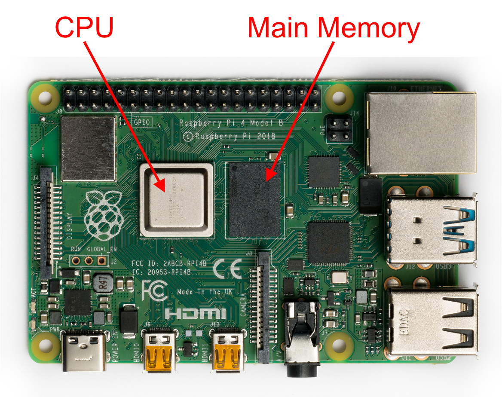
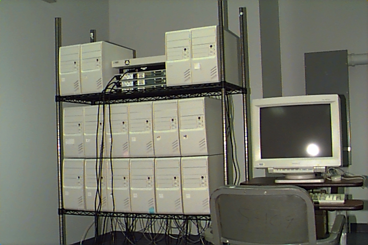
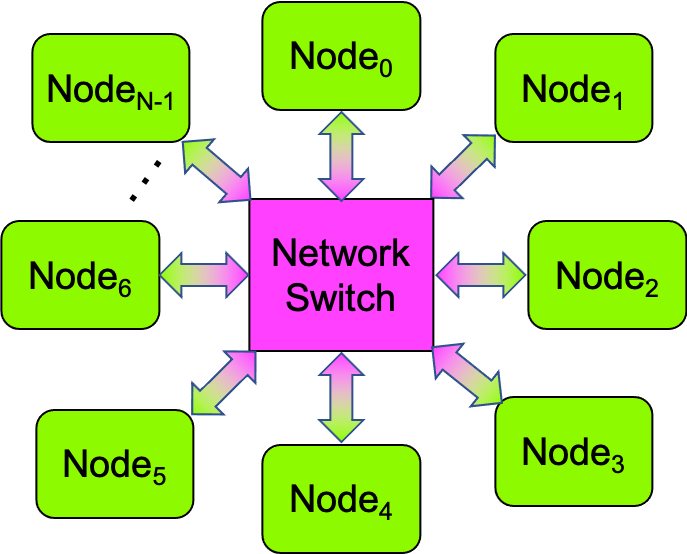
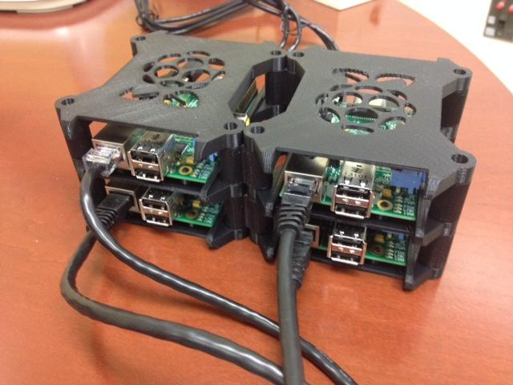
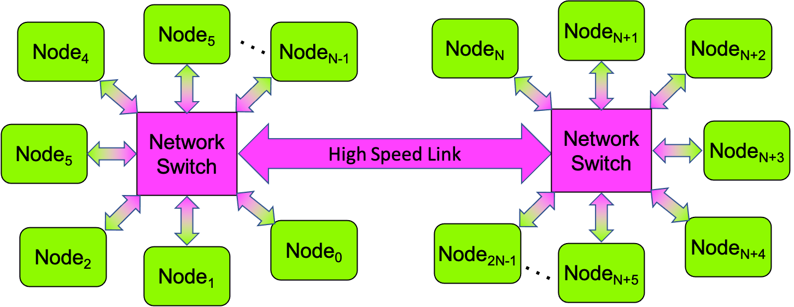

0.5 Parallel Computing Hardware Platforms
----------------------------------------------

To actually experience the speedup parallel computing can offer, parallel software must be run on a multiprocessor. In this section, we explore some of the options that are available.

0.5.0: Shared-Memory Multiprocessors
^^^^^^^^^^^^^^^^^^^^^^^^^^^^^^^^^^^^^

The most common kind of multiprocessor is the shared-memory multiprocessor, so we will first explore some of the available options for running parallel software on such systems. Thankfully, there are many options!

**Laptop or Desktop**. 
If you own a modern laptop or desktop, it has a multicore CPU, so you own a shared-memory multiprocessor! Many of the programs in this book were actually written on such laptops.

In order for a program to fully utilize all of the cores in a laptop or desktop, the program must be designed and written as parallel software, using one or more of the strategies from Section 0.4. In the rest of this book, we will see example programs that show how to use these strategies.

**Raspberry Pi (or other SBC)**. 
Laptop and desktop systems can be expensive. If owning one of these is beyond your reach, another option is a Raspberry Pi single board computer (R-Pi SBC) or a similar single board computer (SBC). Most current SBCs have multicore CPUs that share a main memory, making them shared-memory multiprocessors.

Aside from affordability, an advantage of an SBC like the R-Pi is that the various components of the computer are easily visible and can even be touched, without fear of damaging the computer. Figure 0-43 shows a R-Pi model 4B, with its multicore CPU and main memory clearly indicated:

  Figure 0-43: A Raspberry Pi Single Board Computer

  (Photo Credit: Michael  Henzler / `Wikimedia Commons`_ / `CC BY-SA 4.0`_)

  .. _`Wikimedia Commons`: https://commons.wikimedia.org/wiki/Main_Page
  .. _`CC BY-SA 4.0`: https://creativecommons.org/licenses/by-sa/4.0/

**Shared-Memory Scalability**. 
The primary limitation of a shared-memory multiprocessor is its **limited scalability**—a parallel program’s speedup is ultimately limited by the number of cores the multiprocessor contains. For example, if a laptop (or R-Pi) has a quad-core processor, then it can only perform 4 different statements simultaneously. To run in parallel, each of a program’s PEs must be run on a different core at the same time. Because of this, running a parallel program on a quad-core computer with more than 4 PEs will not reduce the program’s execution time, since only 4 of the PEs will be able to operate in parallel. Put differently, no matter how many PEs we use, we should never expect a parallel program running on a quad-core computer to produce a speedup greater than 4, because each of the program’s PEs needs to run on a separate core and the computer has just 4 cores. 

**Shared-Memory Software**. 
There are a variety of ways that parallel software can be written for a shared-memory multiprocessor. One of the simplest ways is by using a library called **OpenMP**, which lets a developer transform a sequential C/C++ program into a parallel program by inserting compiler directives called *pragmas* into the program’s source code. These pragmas provide easy ways to implement several of the parallel strategies discussed in Section 0.4. Chapter 1 presents several example programs that illustrate the use of OpenMP.

0.5.1: Distributed-Memory Multiprocessors
^^^^^^^^^^^^^^^^^^^^^^^^^^^^^^^^^^^^^^^^^^

One way to circumvent the scalability limitations of a shared-memory multiprocessor is to instead use a **distributed-memory multiprocessor**. As described in Section 0.1, such multiprocessors consist of multiple normal computers connected together using a network. To acquire such a multiprocessor, you have two choices:

  0. Purchase a multiprocessor from a commercial vendor. These tend to be very expensive, but they arrive ready to use, so they require the least work on your part.

  1. Build your own multiprocessor. The cost of these systems is the cost of the computers, plus the cost of the network, plus the time it takes you to assemble the multiprocessor’s hardware, install the system software,  and then configure that software to make the collection of computers work as a multiprocessor.

In the rest of this section, we examine some of the distributed-memory multiprocessor options.

**Local Beowulf Cluster**. 
In 1994, NASA scientists Thomas Sterling and Donald Becker pioneered the “build your own multiprocessor” approach, using off-the-shelf PC hardware (which they could replace whenever necessary), a standard Ethernet network, the free operating system Linux, and other open source software (which they could modify as necessary). Because they used these components, the result was a multiprocessor *they could maintain themselves*, instead of being dependent on a commercial vendor. Sterling and Becker called their design a **Beowulf cluster** because they saw it as freeing themselves and other scientists from being at the mercy of commercial vendors, just as Beowulf freed the Danes from being at the mercy of the monster Grendel in the Beowulf saga. Figure 0-44 shows *Hrothgar*, the second NASA Beowulf cluster:

  Figure 0-44: Hrothgar, an Early Beowulf Cluster

  (Photo Credit: Phil Merkey, Goddard Space Flight Center, NASA)

In a Beowulf cluster, the individual computers that make up the multiprocessor are called **nodes**. One of the computers is designated as a special **head node** where users login and run programs; the others are called **worker nodes**. 

In order for the nodes to communicate with one another, they are connected together using a network, often in a logical “star” topology like the one shown in Figure 0-45:

  Figure 0-45: A Star Topology Network

:math:`Node_0` is commonly designated as the head node, and the other nodes are the worker nodes. Any node can communicate with any other node via the network switch, which allows up to half of the nodes to simultaneously communicate with the other half (i.e., in parallel).

Beowulf clusters often use current Ethernet technology for their networks. Such networks commonly have all of the nodes connected to a central networking switch, as shown in Figure 0-45. Hrothgar’s switch can be seen in Figure 0-44, in the middle of the top shelf.

PCs like those visible in Figure 0-44 are commonly used for a Beowulf cluster’s nodes, but the availability of SBCs like the Raspberry Pi creates new possibilities. More precisely, one can build a Beowulf cluster using R-Pi computers (or other SBCs) as the nodes instead of PCs. Figure 0-46 shows the nodes of a 4-node R-Pi cluster, which is almost small enough to carry in one’s hand:

  Figure 0-46: A 4-Node Raspberry Pi Beowulf Cluster

  (Photo Credit: Suzanne Matthews)

Beowulf clusters with SBCs as their nodes are perhaps the least expensive way to build a distributed-memory multiprocessor. In some universities’ courses, each student buys a kit containing the SBCs and other hardware needed to build their own personal Beowulf cluster, which they then use to learn about parallel computing. 

The price of a cluster depends mainly on the number of nodes and the cost of each node [#]_.  Accordingly, people have built clusters from new PCs, 
`old-but-still-working PCs`_, 
new SBCs, old-but-still-working SBCs, and combinations of these. If you are interested in building your own cluster, search the web and you will find numerous tutorials and videos to guide you through the process.

.. _`old-but-still-working PCs`:   https://www.extremelinux.info/stonesoup/

One can also purchase a Beowulf cluster from a commercial vendor, rather than build it yourself. This is simpler than building your own, because the vendor does all of the work to set up and configure the cluster, but since they are doing the work for you, that approach is accordingly much more expensive.

Regardless of whether you build a Beowulf cluster or buy one from someone else, we describe a Beowulf cluster to which you have physical access as a *local Beowulf cluster*.

**Remote/Cloud Clusters**. 
One of the drawbacks to a local cluster is that someone must *maintain* it: the operating systems on each node must be kept patched, updates to applications and libraries must be installed across the nodes, and so on. Owning and maintaining a local cluster is a great way to learn about computer systems administration (sysadmin) work, but if your goal is to learn about parallel computing, maintaining a local cluster can consume much of your time.

Another drawback is that a local cluster’s hardware eventually wears out and must be replaced. Depending on the number and cost of the nodes, such replacement can be expensive.

To avoid these drawbacks, an alternative approach is to use a **remote Beowulf cluster**, typically one provided by a "cloud" service. Like a local Beowulf cluster, a remote Beowulf cluster is a distributed-memory multiprocessor intended for high performance computing (HPC). Unlike a local cluster, a cloud cluster is owned and maintained by someone else, somewhere else; you access it via the Internet, usually through a web browser. There are a variety of options available for this approach; we list a few of them here, in alphabetical order:

- `AWS Parallel Cluster`_ is a ready-made HPC cluster computing system from Amazon.com, available as a part of their `Amazon Elastic Compute Cloud`_ (EC2) web service.

- `Azure`_ is Microsoft’s cloud computing service, which 
  `can be configured for HPC`_.

- `Chameleon`_ is a U.S. public HPC research cluster with over 15,000 CPU cores, physically distributed between the University of Chicago and the University of Texas.

- `Google Cloud`_ is Google’s cloud computing service, which offers 
  `Compute Engine configurations for HPC`_.

- `XSEDE`_ (the Extreme Science and Engineering Discovery Environment) is a HPC cloud cluster with hundreds of thousands of CPU cores, distributed across five U.S. states.

.. _`AWS Parallel Cluster`: https://docs.aws.amazon.com/parallelcluster/index.html
.. _`Amazon Elastic Compute Cloud`: https://aws.amazon.com/ec2/
.. _`Azure`: https://docs.microsoft.com/en-us/azure/
.. _`can be configured for HPC`: https://docs.microsoft.com/en-us/azure/architecture/topics/high-performance-computing
.. _`Chameleon`: https://www.chameleoncloud.org
.. _`Google Cloud`: https://cloud.google.com
.. _`Compute Engine configurations for HPC`: https://cloud.google.com/architecture/deploying-slurm-cluster-compute-engine
.. _`XSEDE`: https://www.xsede.org

None of these has student-learners as their primary audience: The Chameleon and XSEDE clusters are designed for research use; the others are commercial systems designed for corporate users.

However, all of these have *academic programs*: a university faculty member can apply for an educational-use grant that provides a fixed number of hours of free computing time for the faculty member and her students to run programs on the cloud cluster. The details of these grants differ from one service to another, so explore the links above for further information.

**Distributed-Memory Scalability**. 
Recall that the scalability of a shared-memory multiprocessor was ultimately limited by the number of cores in that computer’s CPU. By contrast, there are two hardware factors that affect the scalability of programs on a distributed-memory multiprocessor: 

- The *core-count* (the combined total number of cores in all of the nodes) of the cluster, and

- The *speed of the network* through which the nodes are connected.

Since a Beowulf cluster has multiple nodes, the total number of cores in the cluster is determined by the number of nodes. A local Beowulf cluster may offer tens, hundreds, or even thousands of cores. By comparison, the number of cores available in a remote/cloud cluster—tens of thousands to hundreds of thousands of cores—can seem almost unlimited. 

Unlike a laptop or SBC, one can *increase a cluster’s core-count by adding more nodes*; the main limitation is the number of ports on the cluster’s network switch, as this number determines the maximum number of computers that can be connected together. For example, a 16-port switch allows up to 16 computers to be connected; a 48-port switch allows up to 48 computers to be connected, and so on.

If there are unused ports on the switch, it is easy to increase a local cluster’s core count by adding a new node—just run an Ethernet cable from the new node to an unused port on the switch. If all of the ports on a switch are in use, then to add a new node, you can either replace that too-small switch with a bigger switch (i.e., one that has more ports), or you can combine multiple smaller switches to form a single larger logical switch, as shown in Figure 0-47:

  Figure 0-47: A Multi-Switch Star-Topology Network

Network switches typically have one or more special high-speed ports specifically for linking to other switches. In such a multi-switch network, any node can still communicate to any other node; but where two nodes connected to the same switch can communicate “quickly”, it will take slightly longer for a node connected to one switch to communicate with a node connected to a different switch, since the communication must pass through two switches instead of one.

With respect to the core-count, a cluster is amazingly flexible; it is relatively easy to add more cores to such a multiprocessor. As a result, if a cluster’s core-count is limiting a parallel program’s scalability, that core-count can be increased by adding more nodes.

With respect to network speed, network standards such as Ethernet are continually evolving. The very first Beowulf cluster *Wiglaf* used 10Mbps Ethernet; the second cluster *Hrothgar* used 100Mbps Ethernet. At the time of this writing, 1000Mbps (Gigabit) Ethernet is the commodity standard, though 10000 (10-Gigabit) Ethernet is increasingly common. Faster versions of Ethernet (100-Gigabit, 400-Gigabit) are also available, though they are comparatively expensive.

If using a remote cluster, it is important to be aware that the network speeds in cloud clusters can vary significantly. At the time this was written, research clusters like Chameleon and XSEDE used 100Gbps networks. Unless they are specifically configured for high performance computing, the commercial cloud systems may use much slower networks (e.g., Gigabit Ethernet). For a communication-intensive parallel application, a slow network may be the key factor limiting the application’s performance and scalability.

**Distributed-Memory Software**. 
To use a Beowulf cluster, a user logs onto the head node and builds their SPMD parallel program there. After the program has built successfully, the user can run their parallel program on the cluster. To use the cluster effectively, the program must be written specifically to run on a distributed-memory multiprocessor by having the PEs communicate with one another by *sending and receiving messages* across the network. The **Message Passing Interface** (MPI) is an open standard library commonly used by parallel software developers to write SPMD programs for any multiprocessor—shared-memory or distributed-memory. The library provides a rich set of efficient functions that the PEs in such a program can use to communicate with one another as needed to implement a parallel algorithm. These functions also provide support for many of the parallel strategies presented in Section 0.4.

MPI also provides a mechanism for *running* SPMD programs on a multiprocessor. When a user runs her program, she can tell the system to launch one or more copies of that program on the multiprocessor. Each copy of the program acts as a different PE, gets a different id, and performs the program’s instructions to carry out its actions, as specified by the parallel program. The PEs can communicate with one another by invoking MPI functions to send and receive messages, as specified in the program. 

If an MPI program is run on a shared-memory multiprocessor, the PEs are all running on that computer, and the send-receive operations may communicate through its shared-memory. If it is run on a distributed-memory multiprocessor, the PEs may be running on different nodes of the cluster, and the send-receive operations communicate through the cluster’s network. MPI programs thus offer *generality*, in that they can run on either a shared-memory or distributed-memory multiprocessor. By contrast, programs written using OpenMP or similar software libraries can only run on shared-memory multiprocessors. Chapter 2 presents example programs written using MPI.

.. [#] A cluster's network also contributes to its cost, but commodity Ethernet switches are relatively inexpensive and most nodes have built-in Ethernet. As a result, the cost of a Beowulf cluster’s network is often a small fraction of the cost of the cluster’s nodes.